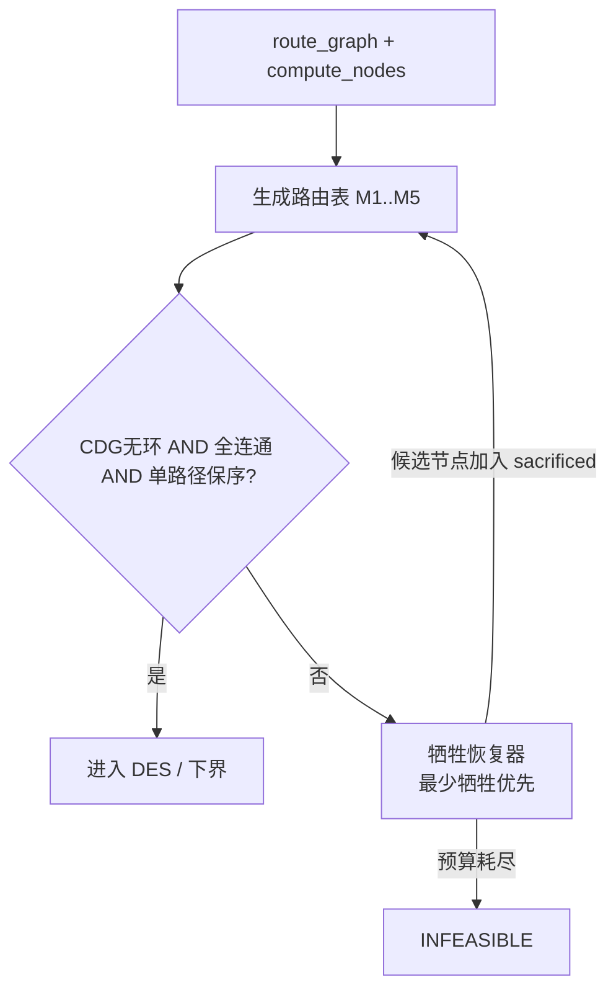

# 8×6 分组交换 NoC 的 Partial-Good 解决方案与性能劣化率

## 背景与已确认的前提

- 几何沿用仓库既有 8×6 常量（[`utils/dse_tree_allgather_6x8.py`](utils/dse_tree_allgather_6x8.py)）：`MX,MY,H,V = 8,6,7,9`，`N=48`，**`RAMP=2`**（注入/弹出 ramp 延迟；`RAMP_BW=2`）。横向链路 7 拍、纵向 9 拍的长线延迟是本研究的关键物理量。
- 故障模型**只**照搬 [`utils/hamilton_ring.py`](utils/hamilton_ring.py) 的枚举器语义（`link_fault_scenarios` / `node_fault_scenarios` / `quadrant_fault_scenarios`），不引入 Hamilton 环相关的任何算法。8×6 下 `cx=4, cy=3`（即 `mx//2, my//2`，用于 edge/center 锚点），三类故障共 22 个场景（link 9 + node 9 + quadrant 4）。
- PG 语义做两套对照：`dead`（PE+router+链路全失效，严格照搬 ring_report）与 `transit`（PE 不参与 alltoall，router/链路仍可转发，对应仓库 `dse_holes_40_allgather.py` 的 PG 定义）。
- **硬性要求：所有进入性能对比的解决方案必须同时满足无死锁 + 保序**（每 (src,dst) 单一固定路径的确定性路由；5-flit 按 wormhole 单包，路径唯一即天然保序；DES 中仍加断言）。
- **牺牲 good 硬件恢复**：若某方案在给定故障图上无法同时满足无死锁 / 保序 / `compute_nodes` 全连通，则允许额外禁用若干原本健康的节点（必要时整行/整列），直到该方案验证通过；被牺牲节点退出本次 alltoall（不参与注入/弹出）。这对应 ring_report 的 node sacrifice rebalancing 思想，但目标从「恢复 Hamilton 环」改为「恢复无死锁保序路由」。

## 引擎选择

不用 BookSim C++：8×6 不是 k-ary n-cube，走 `anynet` 还要改 traffic manager 才能做一次性 alltoall makespan，成本远高于收益。改为新写一个自包含 Python DES，直接复用 [`utils/dse_portbuf_area_makespan.py`](utils/dse_portbuf_area_makespan.py) 里 `simulate()` 已验证过的 credit / in-port FIFO / oldest-first 仲裁 / `link_lat` 结构，把「树多播 + 路由 LUT」换成「单播 + 路由表 + 5-flit wormhole」。该文件的 docstring 已给出关键定标：`Q >= 2L+1` 才能跑满速率（H=7 → 15，V=9 → 19），所以缓冲深度必须显式参数化，否则测到的是 credit 饥饿而不是路由劣化。

## 交付物

- [`utils/pg_faults_8x6.py`](utils/pg_faults_8x6.py) — 8×6 故障目录 + PG 语义展开
- [`utils/pg_routing.py`](utils/pg_routing.py) — 路由生成器 + 死锁验证 + 牺牲恢复器 + alltoall 解析下界
- [`utils/dse_pg_alltoall_8x6.py`](utils/dse_pg_alltoall_8x6.py) — DES + 扫描驱动 → `results/pg_alltoall_8x6.json`
- [`utils/gen_pg_alltoall_report.py`](utils/gen_pg_alltoall_report.py) → `results/report_pg_alltoall_8x6.html`
- [`docs/phase-7-exploration/pg-alltoall-8x6.md`](docs/phase-7-exploration/pg-alltoall-8x6.md) — 结论

## 一、故障目录（`pg_faults_8x6.py`）

按 `hamilton_ring.py` 的同名函数复刻到 8×6，返回同构 dict `{name, fault_class, region, detail, dead_nodes, dead_links, desc}`：

- **link**：`corner` = (1,0)-(1,1) / (2,0)-(2,1) / (1,1)-(2,1)；`edge` 以 cx=4 起；`center` 以 (4,3) 起。取前 1/2/3 条。
- **node**：1×1/2×2/3×3 方块，anchor 为 `corner=(0,0)`、`edge=(cx-(s-1)//2, 0)`、`center=(cx-(s-1)//2, cy-(s-1)//2)`。3×3 center 落在 x∈[3,5], y∈[2,4]，合法。
- **quadrant**：`hw,hh = 4,3`，Q0(0,0)/Q1(4,0)/Q2(0,3)/Q3(4,3)，各 12 节点。原实现要求方阵，这里改成 `mx//2, my//2`。

PG 语义展开成两个派生量：`compute_nodes`（参与 alltoall 的端点集合）与 `route_graph`（可用于转发的节点/链路集合）。`dead` 语义下二者一致；`transit` 语义下 node 类故障只从 `compute_nodes` 移除、`route_graph` 保留（link 类故障两种语义相同）。

## 二、路由方案与牺牲恢复（`pg_routing.py`）

每个方案输出 `paths[(s,d)] = [链路序列]`、`sacrificed: list[node]`、`compute_nodes_used`，并强制通过统一验证后才进入 DES。

### 硬性验证（全部通过才可用）

1. 通道依赖图（VC 方案上是 `(channel, VC)` 二元组）DFS 检测无环 → **无死锁**；
2. 剩余 `compute_nodes_used` 两两可达；
3. 每对 `(s,d)` 恰好一条确定性路径 → **保序充分条件**。

任一失败：不直接放弃，进入牺牲恢复器。

### 牺牲恢复器（统一，所有方案共用）

目标：用最少额外牺牲恢复「无死锁 + 保序 + 全连通」。

1. **候选池**：仍存活且原本是 good 的节点；优先与故障节点/故障链路相邻的边界节点，其次按到故障区域的曼哈顿距离升序；整行/整列屏蔽作为粗粒度候选（一次牺牲一行 8 节点或一列 6 节点）。
2. **搜索**：按牺牲规模 `k = 0,1,2,...` 递增；对每个 `k` 尝试边界优先的候选组合（启发式：先单点边界，再扩到整行/整列），每试一次重跑该方案的路径生成 + 验证。
3. **预算**：`k_max = min(8, |compute_nodes| // 4)`；超预算仍失败才标 `INFEASIBLE`。
4. **语义**：被牺牲节点从 `compute_nodes_used` 移除（不参与 alltoall）；在 `dead` 语义下同时从 `route_graph` 移除；在 `transit` 语义下默认仍可作转发 Steiner（与 holes_40 一致），除非该方案本身要求规整子矩形（M2）才连同 router 一起摘掉。
5. **记录**：`sacrificed`、`n_sacrificed`、`n_compute_used`，报告 SVG 用橙色标出（对齐 ring_report）。

### 路由方案

- **M1 XY**：基线。XY 路径被故障打断时走牺牲恢复（例如牺牲到剩余集合上 XY 全通），而不是立刻 `INFEASIBLE`；若恢复代价过大再失败。用于说明「坚持 XY 硬件要付多少牺牲」。
- **M2 规整化**：屏蔽含故障的整行/整列，使存活集合成为规则矩形，router 硬件完全不变仍跑 XY。这是牺牲恢复的粗粒度特例（一次可牺牲较多 good 节点），作为「最大规整、最小硬件改动」对照。
- **M3 Up\*/Down\***：以度最大节点为根做 BFS 树标定 up/down，合法路径 = 若干 up 后若干 down，取最短；CDG 天然无环。若连通性因故障破裂，再牺牲恢复。
- **M4 Segment-based Routing**：把拓扑分解为 segment（starting / regular / unitary），每段放一个双向转向限制，再在限制下取最短路。比 up\*/down\* 负载更均衡。
- **M5 XY + fault-ring + 2 VC**：保留 XY 硬件，把故障区域外扩成矩形 fault block，沿其边界 ring 绕行；用 VC0/VC1 分离绕行方向以打破环依赖。只对 node/quadrant 类故障有意义；若 ring 不闭合或 CDG 有环，允许牺牲边界节点使 fault block 规整后再建环。
- **P2 负载均衡**：在 M3/M4 的合法路径集合内，用「按对随机序 + 负载感知 Dijkstra + 局部重路由」迭代最小化最大链路负载；与下界差距 >15% 时用 CP-SAT（`.venv-ortools`）收紧。

**解析下界**（不跑 DES 也能算，用于全网格扫描和 DES 交叉校验；使用最终 `compute_nodes_used`）：
`LB = max(最大有向链路负载 × m, (|A|-1) × m / RAMP_BW, 最长路径线延迟 + 2·RAMP)`，其中链路负载 = 经过该链路的 `(s,d)` 对数，`RAMP=2`，`RAMP_BW=2`。

## 三、DES（`dse_pg_alltoall_8x6.py`）

在 `dse_portbuf_area_makespan.simulate()` 骨架上改造：

- 流量：t=0 时每个 `compute_nodes_used` 节点把发往其余所有 compute 节点的消息全部就绪（一次性 alltoall），makespan = 最后一个 flit 被 eject 的周期。
- 消息：m ∈ {1, 5}，wormhole，同包 flit 连续占用链路；每 `(s,d)` 一条路径 ⇒ 保序。
- 几何：`RAMP=2`；路由查 `paths` 表；in-port FIFO 深度 Q 参数化，默认 `Q = 2·V+1 = 19`（跑满速率），另扫 Q ∈ {4, 8, 19}。
- 注入序：每源对目的地做 round-robin，避免人为热点。
- credit 流控 + oldest-first 输出仲裁 + HOL 阻塞；`STALL_LIMIT` 触发即报死锁（与 CDG 验证互为交叉检查——已通过验证的表不得在 DES 里死锁）。

**规模**：22 场景 × 2 PG 语义 × 6 路由配置 × 2 消息长度 ≈ 528 次 DES。先用解析下界扫全网格，DES 跑全量；若单次 >5 s 则 DES 只跑 Q=19 这一档。

## 四、劣化率定义（同时报三个，并显式报告牺牲代价）

- `raw_slowdown` = mk_fault / mk_golden(48 节点健康 XY, RAMP=2) − 1 —— 与 ring_report 口径一致，但会混入工作量减少。
- `irregularity_penalty` = mk_fault / LB(同一 `compute_nodes_used`、无死锁约束的最小最大链路负载路由) − 1 —— **主指标**，隔离「拓扑不规则 + 路由受限」的真实代价。
- `throughput_ratio` = (总交付 flit / makespan) 相对 golden —— 有效带宽视角。
- `sacrifice_cost` = `n_sacrificed` 与 `n_sacrificed / n_originally_good` —— 为换取无死锁保序付出的 good 硬件比例。

## 五、报告

`gen_pg_alltoall_report.py` 仿 [`utils/gen_ring_report.py`](utils/gen_ring_report.py) 的结构：故障目录说明、每方案 × 每场景的 makespan / 劣化率 / 牺牲代价表、m=1 vs m=5 对比、Q 敏感度曲线、以及每个场景的 mesh SVG（红=故障节点、橙=牺牲的 good 节点、红虚线=故障链路、热力色=链路负载）。

## 验证清单

1. 健康 8×6 XY，m=1，RAMP=2：DES makespan 与解析下界差距应在合理区间（预期 10–25%，来自 HOL 与长线 credit）；差太远说明 DES 有 bug。
2. 每个进入 DES 的路由表：CDG 无环断言通过，且 DES 从不触发 `STALL_LIMIT`。
3. m=5 的 makespan ≈ 5 × m=1 的带宽项 + 一次流水填充；偏离过大需解释。
4. 保序断言：DES 记录每 `(s,d)` 的包完成序，必须与发出序一致。
5. `transit` 语义的 makespan 恒 ≤ 同场景 `dead` 语义（router 保活只会更好或相等）；违反即建模错误。
6. 牺牲恢复：对至少一个已知「XY 被打断」的场景（如 center 链路故障），M1/M2 必须通过牺牲恢复出可行表，且 `n_sacrificed ≥ 1` 被正确记录。
