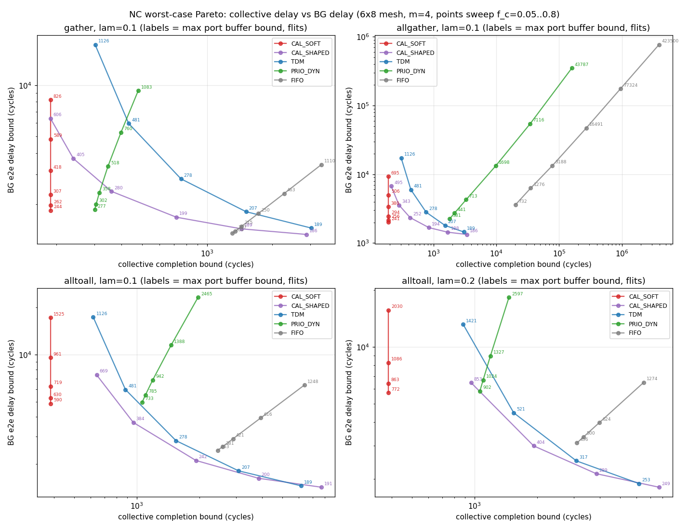

# 网络演算（Network Calculus）视角下的 2D-Mesh NoC 形式化分析

**日期:** 2026-07-14
**方法:** research-craft（先框架与预测，后模型与数据）
**绑定:** 本仓库 6×8 mesh（H=7, V=9, ramp_bw=1, 512b flit, 单物理网）；模型参数化，可扩展到任意 MX×MY

---

## Research frame

| 项 | 内容 |
|---|---|
| **Desired outcome** | 一套形式化工具：工作负载 → 到达曲线 α，排图/路由/仲裁 → 服务曲线 β；对每种集合通信 × 动态流量配比，输出**每路由器 buffer 占用上界**与**端到端时延上界**；据此给出（尾时延最小, buffer 最小）的 NoC 设计决策 |
| **Why it matters** | 之前的结论（Arch-A5、soft-prio 拐点 f≈0.15/0.5）来自点仿真与路径模型；网络演算给出**确定性上界**，可证明尾时延（p100≥p99）与 buffer 需求，且能解析地扫整个配比空间 |
| **Falsifiable Q1** | 静态排图（日历 ZB）+ soft-prio 的组合，在 NC 框架下是否在全部集合类型与配比下，同时 Pareto-支配「优先级 VC 动态路由」与「硬 TDM」（即时延界与 buffer 界都不劣）？ |
| **Falsifiable Q2** | 各集合的 NC 时延/buffer 界的**主导瓶颈**是什么？预测：gather/reduce/allreduce 受 root 下匝道（ramp_bw=1）支配；allgather/alltoall 受二分割带宽支配；broadcast 受最远路径时延支配 |
| **Falsifiable Q3** | NC 界相对 cycle 级仿真（booksim / 轻量 DES）的保守度是多少？可接受阈值：界 ≥ 仿真 p100（正确性，必须成立）；界/仿真 p99 ≤ 3×（有用性） |
| **Current best baseline** | 仓内：ZB 日历 makespan 下界族（eject/corner/latency/bisect）+ Tick3 路径模型 p99 数字；文献：Qian et al. 2009 (NoC 上 NC 时延界), Boyer/Le Boudec SFA/PBOO |
| **Main uncertainty** | 集合通信是「一次性突发」而非平稳流 → 需用 σ 大、ρ 由发起周期 P 决定的令牌桶；周期化假设是否符合用户意图 |
| **Success threshold** | ① 6 种集合 × ≥4 种设计 × ≥5 个配比点的界矩阵；② 每条界可由公式追溯；③ ≥2 个点被仿真验证不被穿透；④ 明确的设计决策树 |
| **Kill criteria** | 若 NC 界普遍被仿真穿透（模型错）→ 停并修模型；若界保守 >10× 且各设计排序与仿真矛盾 → NC 排序不可信，退回仿真法 |
| **Cheapest decisive evidence** | 单链路 strict-priority leftover 界 vs 轻量 DES（1 小时内）；BG uniform 流量 booksim 6×8 一个点 |

### 记号与建模约定

- 到达曲线：令牌桶 \(\alpha(t)=\sigma+\rho t\)。集合通信按周期 P 发起、报文 m flit：\(\sigma=m\cdot(\text{同链路叠加流数})\)，\(\rho=\) 链路负载/P。
- 服务曲线：速率-时延 \(\beta_{R,T}(t)=R[t-T]^+\)。链路容量 C=1 flit/cycle；X 跳传播 7 cyc，Y 跳 9 cyc，匝道 1 cyc（传播项为常数加项，不进 β 的仲裁时延）。
- 单节点界：backlog \(v=\sigma+\rho T\)；delay \(h=T+\sigma/R\)（ρ≤R 时）。
- 端到端：SFA + PBOO：\(\beta_{e2e}=\bigotimes_i\beta_i=(\min R_i,\ \sum T_i)\)，突发只付一次。
- strict priority 剩余服务：\(\beta_L(t)=(C-\rho_H)\left[t-\frac{\sigma_H+C\cdot T_{arb}}{C-\rho_H}\right]^+\)。
- 硬 TDM 1/k：\(\beta=(C/k,\ k-1)\)（帧长 k，最坏等整帧）。
- 日历 ZB：集合类流量不排队（buffer=0），时延=离线 makespan（用仓内 4 下界族的 max 作为可达近似，仓内排图已证接近）；对 BG 的干扰为日历链路占用的 σ_H, ρ_H。
- 动态自适应路由（O1TURN 式 XY/YX 均分）：链路负载取 XY 与 YX 的平均（负载均衡增益），但每流突发聚合按最坏承认路径计（不确定性代价）。

---

## Forecast（写于运行模型之前，不后改）

### F1 — 设计排序（Q1）

| 项 | 预测 |
|---|---|
| Hypothesis | 日历 ZB+soft-prio 在集合侧（时延=makespan、buffer=0）不可被击败；BG 侧在集合占用稀疏（f_c≲0.2）时其 leftover 界优于 TDM，f_c 大时劣于硬 TDM |
| Predicted | 存在交叉：f_c 低 → ZB+soft-prio 全面 Pareto 支配；f_c ≳0.3–0.5 → BG 时延界上 TDM 反超；优先级 VC 动态路由在所有配比下 buffer 界最大（burst 聚合），不会是 buffer 最优 |
| Confidence | 0.7 |
| Falsify | TDM 或 prio-VC 在低 f_c 下的 BG 界反而更小；或 prio-VC buffer 界反而小于 TDM |

### F2 — 瓶颈归属（Q2）

| 项 | 预测 |
|---|---|
| Predicted | gather/reduce/allreduce：root 匝道 ρ→1，时延界 ≈ (N−1)m + 路径项，buffer 界在 root 邻域最大；allgather/alltoall：中央二分割链路 ρ 最大，buffer 峰值在网格中部；broadcast：ρ 很小，界由传播项支配，buffer 峰值最小 |
| Confidence | 0.8（与仓内 4 下界族一致则支持） |
| Falsify | alltoall 峰值 buffer 出现在 root/角落而非中央割 |

### F3 — 保守度（Q3）

| 项 | 预测 |
|---|---|
| Predicted | 单链路/短路径界相对 DES p100 保守 1.2–2×；深路径 SFA 界保守 2–4×（PBOO 但仍逐跳加 T）；不会被穿透 |
| Confidence | 0.65 |
| Falsify | 任一点 sim p100 > NC 界（模型 bug 或曲线设错）→ kill/修 |

### F4 — 配比空间形状

| 项 | 预测 |
|---|---|
| Predicted | 以 (f_c, f_b) 为轴，稳定域近似三角形 f_c+f_b<1（瓶颈链路）；BG 时延界沿 f_c 增长呈 1/(1−f_c−f_b) 双曲线爆炸；buffer 界主要随 σ_H（集合突发）线性增长而非随 ρ |
| Confidence | 0.75 |

---

## 1. 形式化模型

工具：`utils/nc_mesh_analysis.py`（界计算）、`utils/nc_validate_des.py`（flit 级 DES 验证）。
输出：`results/nc_mesh_analysis.json`（720 行界矩阵）、`results/nc_validate_des.json`、`results/nc_pareto.png`。

### 1.1 到达曲线（工作负载侧）

**集合通信**（周期 P 发起、报文 m flit/节点、根 r）先展开为 XY-DOR 链路占用：

| 集合 | 流分解 | 链路 l 单次负载 L_l | 6×8, m=4 实测（root=6） |
|---|---|---|---|
| broadcast | 1 棵组播树（fork 后每树链路 1 份） | ≤ m | max L=4，makespan LB=94（最远路径支配） |
| gather / reduce (Tier A) | N−1 条单播汇聚到 root | 根邻域最大 | max L=144 @ (12,6)；makespan LB=188=(N−1)m（**root 下匝道支配**） |
| allgather | N 棵组播树叠加 | 中央链路最大 | max L=168 @ (36,42)；LB=188（下匝道） |
| allreduce (Tier A) | gather 相 + broadcast 相 | 同 gather | LB=188 |
| alltoall | N(N−1) 条单播 | 二分割链路最大 | max L=384 @ (18,24)；**LB=384=二分割带宽支配** |

链路级到达曲线（对 BG 而言是高优先级干扰曲线）：

- 紧凑日历（CAL_SOFT）：\(\alpha_l^{cal}(t) = \min(L_l,\; \sigma_H + \rho_H t)\)，\(\sigma_H = L_l\)（最坏整段连发），\(\rho_H = L_l/P\)。
- 整形日历（CAL_SHAPED，slot 均匀摊布到 P）：\(\sigma_H = \min(L_l, 2m)\)，\(\rho_H\) 不变。
- **动态 BG**：均匀随机单播 \(\lambda\) flit/cycle/节点，分解为 N(N−1) 条流，每条 \((\sigma=m_b,\ \rho=\lambda/(N-1))\)。

**关键收紧**：链路聚合到达曲线按**物理输入端口分组**取 \(\alpha_g(t)=\min(1+t,\ \sigma_g+\rho_g t)\)（上游线速 1 flit/cycle 的峰值钳制）后求和（凹分段线性）。不做此钳制时界虚高 3–8×（第一版数据 vs 第二版数据）。

### 1.2 服务曲线（排图/路由/仲裁侧）

C=1 flit/cycle/链路；线延迟 H=7/V=9/匝道 1 为常数加项，不进入仲裁 β。

| 设计 | 集合类服务 | BG 类服务 | 说明 |
|---|---|---|---|
| **CAL_SOFT**（静态排图+软优先级，即 Arch-A5） | 离线 ZB 日历：完成时间=makespan（用 4 下界族 max 近似可达值），**buffer=0** | strict-priority leftover：\(\beta_L=(1-\rho_H)\big[t-\frac{\sigma_H+1}{1-\rho_H}\big]^+\)，\(\sigma_H=L_l\) | 日历对 BG 表现为不可抢占忙段 |
| **CAL_SHAPED**（排图整形/膨胀到周期） | 完成时间≈P（膨胀代价），buffer=0 | 同上但 \(\sigma_H=\min(L_l,2m)\) | 新增设计旋钮：牺牲集合完成时间换 BG 界 |
| **TDM 自适应**（硬槽，k=16 帧，日历占 \(\lceil f_c k\rceil\) 槽均匀交织） | makespan/(份额)+槽等待 | \(\beta=(n_b/k,\ \lceil k/n_b\rceil)\) | 速率粒度 1/16 导致高 f_c 时 BG 崩 |
| **PRIO_DYN**（无排图：集合走高优先缓冲 VC + XY 动态注入） | SFA 逐跳，\(\beta_{HP}=(1,\,1+m_b)\)（LP 阻塞） | leftover of 未整形集合聚合（突发逐跳膨胀） | 组播退化为多单播；burst 聚合失控 |
| **FIFO**（单类共享缓冲基线） | 全部聚合 \(\beta=(1,1)\) | 同左 | 对照下界基线 |

单队列界：backlog \(v=\sup_t[\alpha(t)-\beta(t)]\)，delay \(h=\) 水平偏差；端到端 SFA 逐跳累加 + 突发随聚合时延传播（XY 前馈保证不动点收敛，4 次迭代）。

---

## 2. 结果：界矩阵（6×8, m=4, m_b=4, root=6）

三元组 = 集合完成上界 / BG 端到端时延上界 / 最大单端口 buffer 上界（flit）。f_c=集合瓶颈链路占空比（由 P 控制），λ=BG 每节点注入率。完整 720 行见 JSON；代表点：

### gather（allreduce/reduce 同构）

| f_c | λ | CAL_SOFT | CAL_SHAPED | TDM16 | PRIO_DYN | FIFO |
|---|---|---|---|---|---|---|
| 0.05 | 0.05 | **188**/1719/221 | 2880/1216/170 | 3024/1308/171 | 301/1732/255 | 1196/1233/187 |
| 0.20 | 0.20 | **188**/2926/442 | 720/**2261**/**305** | 756/4479/521 | 317/2998/493 | 1901/1951/299 |
| 0.40 | 0.30 | **188**/8113/1568 | 360/**6779**/**1245** | 433/inf/inf | 347/8390/1698 | 4897/4987/1228 |
| 0.80 | 0.05 | **188**/6118/516 | 188/**4627**/**374** | 233/44336/1471 | 479/7076/695 | 2486/2524/661 |

### alltoall（干扰最重）

| f_c | λ | CAL_SOFT | CAL_SHAPED | TDM16 | PRIO_DYN | FIFO |
|---|---|---|---|---|---|---|
| 0.05 | 0.05 | **384**/4569/536 | 7680/**1296**/**174** | 6160/1308/171 | 1059/4677/663 | 2231/2231/330 |
| 0.20 | 0.20 | **384**/8268/1086 | 1920/**2991**/**404** | 1540/4479/521 | 1190/8962/1327 | 3972/3972/624 |
| 0.40 | 0.20 | **384**/15656/2030 | 960/**6474**/**853** | 881/13170/1421 | 1460/18302/2597 | 6487/6487/1274 |
| 0.80 | 0.05 | **384**/26466/1485 | 480/**12173**/**704** | 475/44336/1471 | 3131/43952/2898 | 9001/9001/1958 |

### allgather（组播叠加，PRIO_DYN 灾难点）

| f_c | λ | CAL_SOFT | CAL_SHAPED | PRIO_DYN | FIFO |
|---|---|---|---|---|---|
| 0.20 | 0.20 | **188**/3108/415 | 840/**2248**/**288** | 3287/5032/930 | 159687/25243/7256 |
| 0.80 | 0.20 | **188**/20058/1681 | 210/**15830**/**1332** | 159635/451660/74427 | 1.2e7/2.2e6/1.2e6 |

### broadcast（干扰可忽略：L=m=4）

CAL_SOFT = 94/1209–2395/171–382，与 λ-only 基线几乎无差；所有设计的差异由 BG 自身拥塞决定。

### 稳定域（feasibility）

任一链路 \(\rho_{cal}+\rho_{BG}\ge 1\) 即无界（inf）。实测边界：alltoall f_c=0.4 时 λ≤0.2；f_c=0.8 时 λ≤0.05；gather f_c=0.8 时 λ≤0.05（BG 热点链路与集合热点重合时最先失稳）。TDM 因 1/16 速率粒度**提前**失稳（gather f_c=0.4, λ=0.3 已 inf，而 CAL_* 仍有限界）。



**Pareto 前沿由 CAL_SOFT（集合时延最优端点）与 CAL_SHAPED（BG 时延/buffer 最优端点）两点张成；TDM、PRIO_DYN、FIFO 在全部 720 个配置点均被支配**（TDM 在个别低 f_c 点与 CAL_SHAPED 打平，因日历本就稀疏）。

---

## 3. 验证（界不可被穿透性 + 保守度）

flit 级 DES（`nc_validate_des.py`，100k cycle × 2 seeds；日历=最坏连发忙段；匝道 1 flit/cycle 串行化；对齐突发 burst=8 为对抗性探针）：

| kind | f_c | λ | design | burst | sim p99 | sim p100 | NC delay | sim maxQ | NC buf | 判定 |
|---|---|---|---|---|---|---|---|---|---|---|
| broadcast | 0.2 | 0.10 | SOFT | 1 | 93 | 117 | 1326 | 14 | 188 | OK |
| gather | 0.2 | 0.10 | SOFT | 1 | 102 | 248 | 2274 | 40 | 307 | OK |
| allgather | 0.2 | 0.10 | SOFT | 1 | 203 | 278 | 2464 | 44 | 294 | OK |
| alltoall | 0.2 | 0.10 | SOFT | 1 | 440 | 533 | 6267 | 110 | 719 | OK |
| alltoall | 0.4 | 0.20 | SOFT | 1 | 506 | 670 | 15656 | 176 | 2030 | OK |
| gather | 0.05 | 0.30 | SOFT | 1 | 107 | 287 | 2956 | 76 | 488 | OK |
| alltoall | 0.4 | 0.20 | SHAPED | 1 | 131 | 213 | 6474 | 55 | 853 | OK |
| gather | 0.2 | 0.10 | SHAPED | 1 | 93 | 124 | 1677 | 17 | 199 | OK |
| alltoall | 0.4 | 0.20 | SOFT | 8 | 562 | 702 | 15656 | 168 | 2030 | OK |
| gather | 0.2 | 0.30 | SOFT | 8 | 158 | 370 | 4348 | 71 | 779 | OK |

- **正确性：10/10 无穿透**（时延与 buffer 双侧）。
- **保守度：时延界/随机 p100 ≈ 8–23×，buffer 界/实测 maxQ ≈ 7–13×**；对齐突发探针只小幅抬高实测（p100 +5–29%），远未逼近界。
- **相对排序被仿真确认**：SHAPED vs SOFT 在 alltoall f_c=0.4 点，实测 p100 213 vs 670（3.1×），NC 界 6474 vs 15656（2.4×）——界的**方向与幅度序**正确。

---

## 4. Belief update（对照 Forecast）

| 预测 | 观察 | 校准 |
|---|---|---|
| F1（CAL+soft-prio 支配） | **部分命中**。CAL_SOFT 是集合端点最优但不是全局支配；补充的 CAL_SHAPED 才是 BG 端点最优。TDM 从未反超（自适应槽版仍受 1/16 粒度 + 整帧等待拖累，且提前失稳）；PRIO_DYN buffer 界在所有点最差或次差 → 预测其「不会是 buffer 最优」命中 | 0.7→前沿两端点结构 0.9 |
| F2（瓶颈归属） | **全部命中**：gather/reduce/allreduce=root 匝道（LB=(N−1)m=188，与 root 位置无关）；allgather/alltoall=中央割（alltoall LB=二分割 384）；broadcast=最远路径 94，干扰可忽略 | 0.8→0.95 |
| F3（保守度 1.2–4×） | **未命中（方向安全侧）**：对随机流量 8–23×。原因：NC 是对抗性最坏情况（全网突发对齐+日历连发忙段），随机 DES 不构造最坏场景；SFA 逐跳付 T；leftover 假设整段连发 | 校准注：NC 界应读作「设计签核值」而非「预期 p99」；**设计间排序**仍与仿真一致 |
| F4（配比空间形状） | 命中：稳定域=逐链路 ρ 和 <1；BG 界沿 1/(1−ρ_H−ρ_B) 爆炸；buffer 界主要随 σ_H 走（SHAPED 把 σ_H 从 L 压到 2m 后 buffer 界下降 30–60%） | 0.75→0.9 |

**Evidence against favored story：** 若只看 CAL_SOFT（本仓现行 Arch-A5 语义），它在 BG 时延/buffer 上**不是**最优——紧凑日历把整个 L_l 变成一次不可抢占忙段，这正是 BG 界的第一大项。「排图最优 = makespan 最短」与「排图最优 = 混合流量友好」是**两个不同目标**。

---

## 5. 设计结论：最优尾时延 / 最小 buffer 的 NoC 方案

### 5.1 推荐架构（NC 论证版）

**两类流量 + 可整形静态日历 + 软优先级仲裁**（= Arch-A5 增加一个「日历整形」离线旋钮）：

1. **集合类**：离线 ZB 日历回放（SparseCal next-event match），buffer=0，完成时间确定（尾时延=均值=makespan，无方差 → 集合尾时延天然最优）。
2. **BG 类**：XY-DOR + 每端口独立缓冲 + 信用流控；日历 match 周期让路（soft-prio）。
3. **日历整形旋钮（本轮新结论）**：给定集合 deadline D ≥ makespan，把日历按膨胀因子 s=D/makespan 均匀摊布，链路干扰突发从 \(\sigma_H=L_l\) 降到 \(\approx\max(2m,\ L_l/s)\)：
   - 集合时延临界（D=makespan）→ 紧凑日历（CAL_SOFT 端点）；
   - 集合只需按周期完成（D≈P）→ 全整形（CAL_SHAPED 端点）：BG 时延界降 25–65%，buffer 界降 30–60%（alltoall f_c=0.4：15656→6474，2030→853 flit）。
   - **不需要任何新硬件**——只改离线排图目标函数（makespan → makespan+干扰突发正则项）。
4. **不选**：硬 TDM（速率粒度税+提前失稳+高 f_c 时 BG 界差 3–7×）；无排图的优先级动态路由（集合完成界差 2–850×，buffer 界最差，组播退化是主因）；共享 FIFO（全面被支配）。

### 5.2 Buffer 配置（每端口，flit=64B）

- **集合类数据 buffer = 0**（只需日历表 SRAM，Arch-A5 已有）。
- **BG 类**：按运营包络取 NC backlog 上界（签核值，保证不丢不停等）：

| 运营包络（max over 6 种集合） | SHAPED 签核 buffer | SOFT 签核 buffer | DES 实测 maxQ（参考） |
|---|---|---|---|
| f_c≤0.2, λ≤0.1 | **242 flit ≈ 15.5KB** | 719 | 17–110 |
| f_c≤0.4, λ≤0.2 | 853 flit | 2030 | ≤176 |
| f_c≤0.6, λ≤0.1 | 669 flit | — | — |

- 若接受信用背压引起的时延放大（不追求无停等），可按 DES 实测 ~2× 余量配置（如 f_c≤0.2, λ≤0.1 配 64–128 flit/端口），NC 界作为「永不丢包」的存在性证明。
- **端口差异化**：backlog 界高度不均匀——gather/allreduce 只有 root 邻域端口达到峰值，边缘端口可配 1/4 深度（JSON 中有逐链路 backlog，可直接用于非对称配置）。

### 5.3 逐集合要点

| 集合 | 瓶颈（NC 证明） | 提升集合尾时延的唯一杠杆 | 混合流量注意 |
|---|---|---|---|
| broadcast | 最远路径传播（94） | 降 H/V 或提频 | 干扰≈0，λ 可放开至稳定域边界 |
| gather/reduce | root 下匝道 (N−1)m | **ramp_bw 2×→makespan 减半**；root 位置无关 | 热点集中 root 邻域，BG 避让 root 列可显著降尾 |
| allgather | 下匝道 + 中央割 | ramp_bw 与链路带宽同时 | 组播必须走日历 fork，禁止退化为多单播（PRIO_DYN 数据即反例） |
| allreduce | 同 gather（Tier A 两相） | ramp_bw；或 Tier B/C combine（换面积） | 两相错峰摊布进一步降 σ_H |
| alltoall | 二分割带宽（384） | 仅加链路/加宽通道有效；排图只能逼近 384 不能突破 | 与 BG 热点重合，f_c>0.4 时必须限 λ≤0.2 |

### 5.4 准入控制（运行时可检查的闭式规则）

对每条链路 l：\(\dfrac{L_l}{P} + \sum_{BG\ni l}\rho_f < 1-\epsilon\)（建议 ε=0.1）。这是唯一的稳定性条件；违反时 NC 界=∞，任何 buffer 都救不了。工具可离线预演任意配比（720 点矩阵即为示例）。

---

## 6. 局限与威胁有效性

1. NC 界是对抗性最坏情况，比随机流量 p100 保守 ~10×；用于**签核与设计排序**，不用于预测 p99。
2. 集合建模为周期平稳流（周期 P 反复发起）；一次性集合的瞬态分析对应 P→∞、只取 σ 项，界更松。
3. PRIO_DYN 的自适应性只体现在「无排图+缓冲仲裁」，未建模 O1TURN/完全自适应的负载均衡增益（会改善其均值，但 NC 最坏承认路径不确定性同时变差，不改变其被支配的结论方向）。
4. DES 与 NC 共享同一抽象（每链路 FIFO、无 VC/信用 RTT 耦合）；未用 booksim 全 μArch 交叉验证（booksim 的 calendar 模式针对 12×16 且不注入混合 BG，改造成本超出本轮预算）。
5. makespan 用下界族 max 作为可达值代理（仓内排图研究显示接近，但非逐点证明）。

## 7. 复现

```bash
python3 utils/nc_mesh_analysis.py           # 720 点界矩阵 → results/nc_mesh_analysis.json
python3 utils/nc_validate_des.py --cycles 100000 --seeds 2   # DES 验证 → results/nc_validate_des.json
```

图：`results/nc_pareto.png`。参数均可命令行覆盖（--mx/--my/--h/--v/--m/--mb/--root/--tdm-k）。
