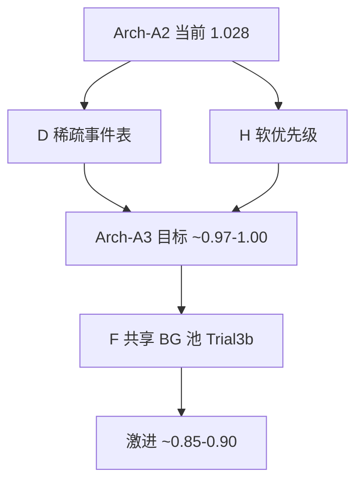

# DSE Trial 2 中文报告与微架构再思考

- 日期：2026-07-10
- 当前基线：Arch-A2 CalSlot-Hybrid-ZB-NoCombine（commit `1139655` / `b8c3b96`）
- 约束：无 router 内归约（Tier A）、压面积、不进 Phase 4

---

## 1. Trial 1 → Trial 2 结论（中文）

| 维度 | Trial 1 | Trial 2（当前基线） |
|---|---|---|
| 架构名 | Arch-A CalSlot-Hybrid-ZB | **Arch-A2 …-NoCombine** |
| 归约 | Tier B（router 2-input combine） | **Tier A（仅 PE 本地算）** |
| 相对 IQ-XY 面积 | 1.065× | **1.028×（−3.5%）** |
| 相对 IQ-XY 功耗 | 0.98× | **0.96×（−2%）** |
| combine / DCA | 有 / stub | **均删除** |
| 架构图 / 微架构图 | 无专用文件 | **有**（见下） |

**图路径**

- 架构图：`docs/phase-2-architecture/architecture-diagram.md`
- 微架构图：`docs/phase-3-uarch/uarch-diagram.md`
- 英文对比：`.rat/scratch/trial-comparison.md`

**Arch-A2 面积拆解（归一化）**

| 部件 | 相对面积 | 说明 |
|---|---:|---|
| 5×5×512b 交叉开关 | 0.380 | 难动（位宽由链路决定） |
| BG/escape VC 缓冲 | **0.365** | **第二大头**（5×20 flit） |
| 控制 / TDM / watchdog | 0.185 | 已略减 |
| 多播 fork | 0.058 | FlooNoC 校准 |
| Calendar SRAM 2×1024×13 | 0.040 | 稠密表 |
| combine/DCA | 0.000 | Trial 2 已去掉 |
| **合计** | **1.028** | 相对基线 +2.8% |

Trial 2 的面积收益几乎全来自「去掉 combine」。**交叉开关 + BG 缓冲仍占 ~0.75**，继续抠 combine 已无空间；要再明显降面积，必须动缓冲组织或 calendar 存储形态。

---

## 2. 为什么还要再想更好的微架构？

当前导出日历（`results/calendars/*_m1.json`）显示：**稠密 1024 槽表极度浪费**。

| 语义 | 全网有效条目 | 单 router 平均条目 | 相对 48×1024 密度 | max_slot |
|---|---:|---:|---:|---:|
| broadcast | 48 | 1.0 | 0.10% | 99 |
| allgather | 192 | 4.0 | 0.39% | 699 |
| gather/reduce | 336 | 7.0 | 0.68% | 851 |
| allreduce | 384 | 8.0（最忙 router 49） | 0.78% | 951 |

结论：时间轴仍可能到 ~1024，但**每 router 有效事件 ≪ 64**。Arch-A2 用双银行稠密 SRAM 是为热切换与实现简单，**不是面积最优**。

同时 BG 缓冲按满速 RTT（H=16 / V=20）配 100 flit，在「集合通信占主导、BG 仅保底」的场景下偏保守。

---

## 3. 候选微架构再评估（含粗估面积）

在 **P0（可回放排图、XY 保底、不丢包、可降级）+ Tier A（无网内归约）** 下，比 Arch-A2 更值得想的方向：

### 候选 D：SparseCal-EventList（稀疏事件表）— **最值得 Trial 3**

- **做法**：每 router 存有序事件列表 `(slot, in_port, out_mask, opcode)`，深度例如 **64～128**，单银行或双银行小表；全局 `cycle` 计数器仍 10-bit。
- **面积**：calendar 项 0.040 → 约 **0.005～0.010**（按 2×128×(~20b) 量级）；总面积粗估 **~0.99～1.00**。
- **优点**：直接吃掉稀疏度红利；仍保持确定性零缓冲回放；与现有 export schema 兼容（本来就是稀疏 `slots[]`）。
- **风险**：CAM/比较器或「下一事件指针」逻辑；热更新时双缓冲仍要两份小表；需证明最忙 router 条目上界（当前合成 allreduce 最忙 49，取 64 有余量，真实排图需再扫一遍）。

### 候选 E：SrcRoute-CalHeader（日历流源路由头）

- **做法**：集合通信 flit 头携带下一跳/fork 指令；router **不存** per-slot 表，只做「当前时隙是否允许该流」的轻量门控（或完全依赖编译器保证 + watchdog）。
- **面积**：calendar SRAM → ~0；控制略增；粗估 **~0.97～1.01**（接近或优于 Arch-B 的 1.008，但可保留原子 fork）。
- **优点**：面积与可扩展性好（大 mesh 不涨表）。
- **风险**：头开销吃 512b 有效载荷；多播原子性与「违规仍投递」更难；与现有「每 router 槽表」工具链要改。

### 候选 F：SharedPool-BG（共享 BG 缓冲池）

- **做法**：5 端口不各绑 20 flit，改为 **共享 32～48 flit 池** + 每口小预留（2～4）；calendar 仍零缓冲。
- **面积**：buffers 0.365 → 约 **0.15～0.22**；总面积粗估 **~0.85～0.92**（最大头可砍）。
- **优点**：面积潜力最大。
- **风险**：BG 最坏时延/死锁证明变难；集合通信高峰时 BG 饥饿需更强 TDM/优先级；与「12-hop ≤328 cycle」界可能要放宽或重证。

### 候选 G：Epoch-Quiesce-BG（集合通信期 BG 降配）

- **做法**：collective epoch 内 BG 仅保留极浅缓冲（如 5×2），epoch 间隙再恢复满配；或 epoch 内硬暂停 BG。
- **面积**：动态/可配置时平均功耗降明显，静态面积若仍实例化满配则 **不降**；若综合按浅配则同 F。
- **优点**：匹配「排图窗口内 BG 很少」的使用模型。
- **风险**：产品语义要接受「集合通信时 BG QoS 下降」；模式切换毛刺。

### 候选 H：SoftPrio-NoHardTDM（取消硬 1-in-16 窗口）

- **做法**：合法 calendar 永远优先；BG 仅在空槽发送；去掉硬 BG 窗口状态机。
- **面积**：控制 0.185 → 约 **0.16**；总 **~1.00**。
- **优点**：控制更简单。
- **风险**：需形式化/仿真证明 BG 不饿死；密集排图下 BG 界可能变差。

### 仍不推荐

| 方案 | 原因 |
|---|---|
| 恢复 Tier B/C combine/DCA | 与「不要 router 归约」冲突；短消息 m≤5 时 DCA 还不划算 |
| Arch-B 共享 IQ 抢占日历 | 破坏零缓冲确定性回放（P0） |
| 双物理窄+宽网 | 已排除；面积通常更高 |
| 把 calendar 深度砍到 512 仍用稠密表 | max_slot=951，P0 不安全；应改稀疏而非砍深度 |

---

## 4. 组合建议（若再开 Trial 3）

**推荐主路径：Arch-A3 = SparseCal + SoftPrio（D+H）**

1. 稠密 1024 表 → **稀疏事件表（64/128）**
2. 硬 1-in-16 → **软优先级**（calendar 合法即赢，空槽给 BG）
3. 保持：零缓冲日历、原子 mask fork、watchdog→XY、Tier A、单 512b 网

粗估：**面积 ~0.97～1.00**（相对 Arch-A2 再降约 **3～6%**），P0 风险可控（有现成稀疏 export 证据）。

**激进路径：再加 SharedPool-BG（F）** → 面积有望 **~0.85～0.90**，但必须重做 BG 死锁/时延证明，适合作为 Trial 3b，不宜与稀疏表一次全改。

---

## 5. 合规与未闭环项（如实）

Trial 2 相对 Trial 1 违规更少，但合规仍为 FAIL：

- REQ-F-012：规格写 SystemC BFM，现实现为可移植 C BFM
- REQ-P-003：缺正式 makespan/开销对照表
- REQ-F-002：broadcast/allgather 的 REQ-U 分解需补

这些不否定 Arch-A2 选型，但进 Phase 4 前应先修或正式豁免。

---

## 6. 建议你怎么选

| 选项 | 含义 |
|---|---|
| **接受 Arch-A2** | 结束 DSE；图与 Tier A 已齐；面积 1.028× |
| **Trial 3：SparseCal（推荐）** | 吃稀疏度，再降面积，工具链改动中等 |
| **Trial 3b：SparseCal + SharedPool** | 面积更猛，验证更重 |
| **只改文档/图** | 不改架构，把本中文报告升为正式交付 |

**判断**：Arch-A2 在「去掉 combine」约束下是合理基线，但**还不是面积最优微架构**——日历稀疏度与 BG 缓冲是两块明显未吃掉的红利。若目标仍是 power/area 最优，建议至少做 **SparseCal Trial 3**。
