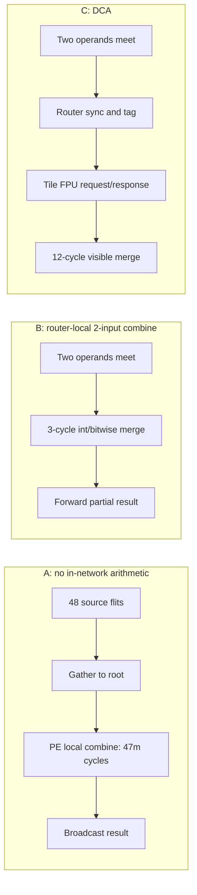

# DCA Tier Analysis — Reduce and Allreduce on the 6×8 Mesh

## Decision being made

This document compares three implementation tiers for 48-tile reduction. It does
not assume that a fast floating-point result can be obtained by reusing an integer
router combine unit: floating-point addition needs an explicit ordering, rounding, and
exception contract. **Trial 2 selects Tier A, USER_CONFIRMED, under an area-first
objective; router-local combine and DCA are comparison-only and are not part of the
Trial 2 router.** Trial 1 selected Tier B.

## Method and assumptions

* Mesh timing is H=7, V=9, `ramp_bw=1`, 64 B/flit, and the reference root is `(0,1)`.
* A values use the exact `Gather` and `Broadcast` endpoints in
  `results/superpose_6x8.json`.
* B and C values come from the existing conflict-free 6×8 model
  (`utils/sim_allreduce_scale.py`) with root ID 6.  B sets `inc_lat=3` cycles for an
  in-router 2-input merge.  C uses the model's `node_red_lat=12` cycles for
  synchronize → DCA request/return → FPU pipeline visibility.
* `Reduce` is a root-result tree reduction.  `Allreduce` may use a different,
  faster reduce-scatter/allgather schedule; therefore its number is not required to
  exceed the single-root `Reduce` number.
* All estimates include network/ramp effects; they exclude software launch,
  calendar-load, and epoch handoff time.  A post-window hybrid isolation schedule
  can add up to 6.25% before recompaction.

For Tier A:

`T_reduce_A(m) = T_gather(m)`

`T_allreduce_A(m) = T_gather(m) + 47m + T_bcast(m)`

The `47m` term is a conservative single-PE sequential combine of 48 source vectors
after gather.  It is deliberately favorable to Tier A: it assumes one result flit per
cycle, no PE launch delay, and no FPU contention.

## Quantitative makespan comparison

| Tier / mechanism | Reduce, m=1 | m=2 | m=3 | m=4 | m=5 | Allreduce, m=1 | m=2 | m=3 | m=4 | m=5 |
|---|---:|---:|---:|---:|---:|---:|---:|---:|---:|---:|
| A. Gather + local PE + bcast | 91 | 104 | 151 | 198 | 245 | 229 | 290 | 385 | 480 | 575 |
| B. Router 2-input int/bitwise merge | 124 | 126 | 128 | 130 | 132 | **101** | **107** | **151** | **197** | **228** |
| C. DCA to tile FPU, 12-cycle merge model | 223 | 225 | 227 | 229 | 231 | 315 | 318 | 321 | 324 | 327 |

All values are cycles.  For Tier B allreduce, the model's lowest result uses
reduce-scatter plus allgather where advantageous; it avoids funneling all 48 inputs
through one root.  For Tier C, the 12-cycle DCA visibility on dependent tree merges
dominates at `m≤5`; its near-flat response is a warning that latency, not flit
bandwidth, is binding.

## Area, power, and functional comparison

| Tier | Router datapath and storage | Relative router area / power | Tile impact | Operation coverage | P0/P1/P2 conclusion |
|---|---|---|---|---|---|
| A | No arithmetic; ordinary gather/broadcast only | +0% arithmetic area; highest network and PE active time | No new hardware, but PE must wake/execute | Any PE-supported operation, including FP | **Selected for Trial 2**: meets P0 while maximizing area headroom |
| B | Two input holding registers, opcode/tag, 512-bit lane-wise integer/bitwise combiners, result mux | **~+2.7% class** calibrated to FlooNoC parallel reduction; low dynamic cost versus DCA | None | Associative integer/bitwise only: AND/OR/XOR, add with specified width, min/max | Trial 1 selection; rejected for Trial 2 to remove router arithmetic area |
| C | Two-input sync, header/tag buffer, DCA request/result queues, FPU backpressure and ordering | **up to +16.9% collective-wide class**; higher control toggle and queue cost | <1% only if an already-present FPU exposes DCA safely | FP/vector arithmetic plus any supported FPU operation | Architecturally valuable, but fails P1 and loses P2 for m=1..5 under this timing model |

The +16.9% anchor is an aggregate FlooNoC wide-reduction/DCA-class extension, not a
claim that every DCA implementation has exactly that cost.  It should be treated as a
PPA guardrail: a proposed DCA block that approaches this class needs an explicit
workload benefit before acceptance.

## DCA correctness and throughput conditions

DCA should not be modeled as a free FPU call.  A viable later implementation needs:

1. **Atomic operand pairing.**  Two operands with the same `(epoch, collective,
   element-index, reduction-order)` tag may enter the FPU together; a lone operand
   remains credit-accounted in a bounded holding register.
2. **Deterministic FP contract.**  The compiler fixes the reduction tree and IEEE
   rounding/NaN/exception handling.  Reordering an FP tree changes results.
3. **FPU arbitration.**  Core and DCA requests are tagged and ordered.  The calendar
   must reserve FPU service or DCA backpressure invalidates its slot.
4. **No circular wait.**  A full DCA return queue must backpressure before accepting
   a calendar merge, while the BG XY escape VC remains independently creditable.
5. **Amortization evidence.**  DCA is plausible for long vectors or an FPU pipeline
   that sustains one 512-bit result/cycle after fill.  Trial-1 messages have only
   1–5 flits, so they cannot amortize the 12-cycle visible merge.

## Recommendation

Adopt **Tier A for Trial 2 (USER_CONFIRMED, area-first)**: reduce is calendar-scheduled
gather to a PE followed by local compute; allreduce adds a calendar-scheduled broadcast
of that PE result. The router contains no arithmetic/combine datapath, operand holding
registers, reduction opcode/tag path, or DCA interface.

Trial 1 selected Tier B for its lower modeled allreduce makespan. Trial 2 explicitly
trades that makespan advantage for lower router area and the binding relative-area target
below 1.065×. Tier B and C remain in this document solely as quantitative comparison
evidence. A future proposal may revisit them only with a new user decision and a revised
area/makespan analysis.
