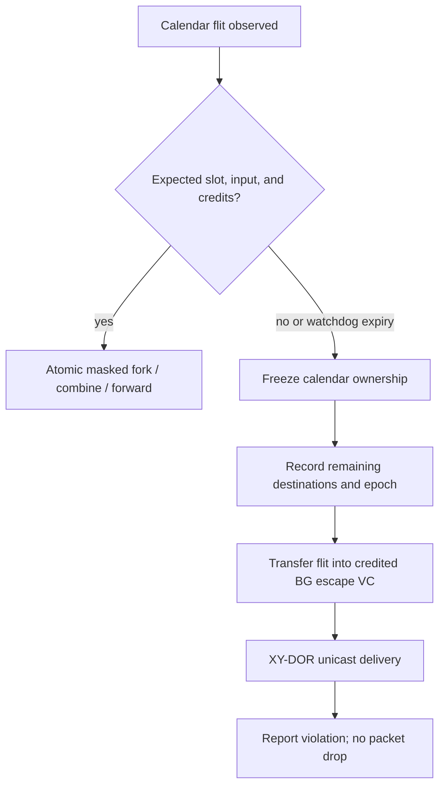

# DSE Trial 1: Domain Analysis — 6×8 Calendar-Collective NoC

## Scope and analytic basis

This analysis applies only to the specified 6×8, single-512-bit-link mesh.  A flit is
64 B, links have 7-cycle horizontal and 9-cycle vertical latency, and each tile ramp
accepts/emits one flit/cycle.  Values are analytic estimates, not synthesis results.

The reference schedules are conflict-free, zero-buffer schedules.  Their measured
single-collective endpoints from `results/superpose_6x8.json` are:

| Payload, `m` flits/source | Broadcast | Gather to `(0,1)` | Best allgather |
|---:|---:|---:|---:|
| 1 | 91 | 91 | 170 |
| 2 | 92 | 104 | 215 |
| 3 | 93 | 151 | 217 |
| 4 | 94 | 198 | 430 |
| 5 | 95 | 245 | 653 |

Area is normalized to a baseline five-port, 512-bit XY router with its required
crossbar and credit control.  FlooNoC-derived figures are calibration anchors, not
directly portable synthesized numbers: multicast is +5.8%, lightweight parallel
reduction +2.7%, and wide reduction plus DCA is +16.9%.

### Common assumptions

* Port encoding uses five ports (N/S/E/W/local): `in_port` is 3 bits and
  `out_port_mask` is 5 bits.
* A 1,024-slot calendar covers the longest current 898-cycle superposed schedule
  with 14% headroom.  An entry is 13 bits: valid, input, output mask, opcode.
* The calendar is double-banked for load/replay handoff; the reported calendar store
  is therefore `2 × 1,024 × 13 = 26,624 bits/router` (3.25 KiB).
* A background VC that must sustain one flit/cycle needs at least the credit round
  trip: 16 flits on H links and 20 on V links.  This includes a conservative two
  router/control cycles beyond 2× wire latency.
* Calendar correctness means a flit appears at the intended output in its scheduled
  slot.  A candidate that adds unmodelled arbitration or replay bubbles is not
  schedule-faithful even if it eventually delivers.

## 1. Calendar storage and replay

| Candidate | Storage / router | Lookup latency | Flexibility | Makespan fidelity | Relative area order | Assessment |
|---|---:|---|---|---|---|---|
| A. Slot table: `slot → {in, out_mask, opcode}` | 26,624 bits, double-bank | 1 registered SRAM read | New schedule at epoch boundary; arbitrary tree/fork pattern | Exact: no route/arbitration decision in replay | low–medium; SRAM dominates control | **Preferred** |
| B. Per-flow tag match | about 1,344 bits for 48 resident flow records; substantially more if per-flow timing sequences are retained | 1–2 cycles CAM/compare + arbitration | Good for dynamic flow membership | Weak unless it grows into a timetable; concurrent matches require an arbiter | medium; comparators and match fanout | Useful only for a future dynamic-control plane |
| C. Source-routed fork/turn header | 0 calendar SRAM; about 28–40 route/fork bits carried per flit for a 12-hop path | 0–1 cycle header decode per hop | Path changes per packet; source must construct every branch program | Moderate: header can express a path, but cannot reserve conflicting link slots | low router storage, higher link/header energy and NI complexity | Poor fit for offline rigid schedules |

**Recommendation: A — double-buffered per-router slot table.**  The schedule already
exists offline and includes collision avoidance.  A 3.25 KiB/router control SRAM is
small beside even the background payload buffering below, while preserving the
zero-buffer makespan model exactly.  Store a calendar epoch/CRC in the bank header;
switch banks only after all old-epoch calendar flits retire.

## 2. Calendar/background isolation

| Candidate | Deadlock freedom argument | Background progress | Calendar overhead | Area / power | Assessment |
|---|---|---|---|---|---|
| A. Dedicated calendar VC + strict priority | Separate resource class prevents calendar/BG buffer dependency; BG XY escape VC remains acyclic | Not bounded: a dense calendar can starve BG indefinitely | 0 when calendar wins | VC state, buffers, priority arbiters; calendar can toggle every slot | Fails REQ-BG's permanent-starvation prohibition |
| B. Hard TDM reservation | Slot ownership removes cross-class waits; BG uses XY only in its slots | Deterministic service if slots reserved | Calendar expands whenever an unused slot is reserved for BG | Small control, but idle reserved slots waste dynamic energy and bandwidth | Safe but too rigid for P2 |
| C. Hybrid: calendar windows + BG VC | Calendar never requests a BG-reserved slot; BG remains in an XY-DOR credit VC whose channel dependency graph is acyclic | Guaranteed at least one BG service opportunity per configured window, even under continuous calendar epochs | Bounded by reserved windows; `ceil(T/K)` lost slots for one BG slot every `K` cycles | Slot-class bit/counter plus one BG VC; no calendar payload queue | **Preferred** |

**Recommendation: C — hybrid isolation.**  Compile calendar transmissions only into
calendar windows, reserving a periodic BG window (initial Trial-1 setting: one of every
16 slots, 6.25%).  An idle BG window may be borrowed by calendar only if it remains
preemptible until the slot boundary; it is not counted in the guaranteed schedule.
Thus BG receives a finite service bound and calendar overhead is at most 6.25% before
offline recompaction.  Verify the actual calendar after inserting windows; do not claim
the old zero-buffer makespan unchanged.

## 3. Buffering strategy

| Candidate | Payload buffer capacity / router | Hang risk | Schedule fidelity | Relative area | Assessment |
|---|---:|---|---|---|---|
| A. Zero-buffer calendar + buffered BG VC | Calendar: 0 queued flits. BG: `2×16 + 2×20 + 2` = 74 flits worst-case interior, 37,888 bits (4.6 KiB) | Low: credit counters prevent overwrite; calendar has no queue dependency | Exact for calendar; BG can absorb RTT | medium, only where BG needs it | **Preferred** |
| B. Shallow shared buffers | Typical 8–16 flits total, 4–8 Kib | Medium: depth is below 20-cycle V credit RTT, causing avoidable bubbles/backpressure | Low: calendar may arrive behind BG or require credits not present in schedule | low SRAM but arbitration and replay stalls | Cannot meet full-rate BG and exact calendar concurrently |
| C. Full input-queued VC buffers | Example 5 inputs × 2 VCs × 20 = 200 flits, 102,400 bits (12.5 KiB) | Low if VC allocation is proven | Medium: calendar contention/VA-SA stages add variable delay | highest SRAM, allocator, leakage, and crossbar activity | General-purpose but unjustified for static calendar traffic |

**Recommendation: A.**  Calendar flits must see a cut-through, slot-owned path; use at
most an elastic timing register that is modeled as part of the slot.  Give only the BG
VC payload storage sized for its link-credit RTT.  Edge routers provision fewer link
buffers; 4.6 KiB is an interior upper bound, not a uniform requirement.

## 4. Multicast fork

| Candidate | Router mechanism | Area calibration | Makespan against broadcast/allgather baseline | Limits / assessment |
|---|---|---:|---|---|
| A. Calendar `out_port_mask` fork | Copy one accepted input flit to every credited output selected in this slot | +5.8% multicast class; no address-mask decode | 0 added replay cycles; retains 91–95 cycle bcast and 170–653 cycle AG reference | **Preferred**: schedule already identifies legal branches |
| B. XY address-mask fork | Decode a coordinate mask and derive legal X/Y branch(es) dynamically | +5.8% class plus NI mask translation/control | Near baseline for power-of-two aligned regions; may add decode/register cycle if not bypassed | More general, but 6×8 is not a single power-of-two region and no dynamic region requirement exists |
| C. Software multi-unicast | Source sends one copy per destination | No fork hardware | At least 47 root injections for a one-flit bcast; cannot approach 91-cycle tree baseline under ramp=1 | Functional baseline only; rejects P2 |

**Recommendation: A.**  Implement a per-output fork-valid/credit check and make the
slot fire only when every selected output can accept.  The offline compiler must avoid
selecting an unavailable port; a partially emitted fork is forbidden.  Candidate B
remains a compatible future packet format, but is not required to replay Trial-1
calendars.

## 5. Reduction and DCA

The detailed A/B/C numbers and assumptions are in
[`dca-tier-analysis.md`](dca-tier-analysis.md).  In summary:

| Candidate | Router area class | Supported operation | 6×8 allreduce estimate, m=1..5 (cycles) | Recommendation |
|---|---:|---|---|---|
| A. Gather + PE compute | +0% | Any operation supported by the PE | 229, 290, 385, 480, 575 | Correct fallback only |
| B. Router-local 2-input combine | about +2.7% | Integer add/min/max and bitwise operations; no IEEE FP | 101, 107, 151, 197, 228 | **Preferred base feature** |
| C. DCA to tile FPU | +16.9% collective-wide class; tile <1% | Wide FP/vector arithmetic when an idle compatible FPU is exposed | 315, 318, 321, 324, 327 | Optional, not selected for this trial |

**Recommendation: B, restricted to associative integer/bitwise opcodes.**  It achieves
the required reduce semantics without duplicating a wide FP datapath.  Do not silently
apply it to floating point: IEEE addition is non-associative and requires an explicitly
specified ordering and rounding contract.  DCA is retained as an optional interface
point only; Trial-1's 1–5-flit messages do not amortize its 12-cycle offload/return
model and P1 dominates.

## 6. Violation and robustness handling

| Candidate | Hang freedom | Complexity | Packet-loss risk | Assessment |
|---|---|---|---|---|
| A. Watchdog → demote to buffered XY unicast | Bounded: expired calendar ownership is released; each surviving branch enters the XY BG VC | Modest: per-slot age, violation record, replay/demotion FSM | **Zero**, provided credit transfer is atomic and destination branch list is retained | **Preferred** |
| B. NACK/retry at source | Eventual only if source/NACK paths and retry budget stay live; can amplify congestion | High: sequence IDs, duplicate suppression, source retention, reverse-path priority | Zero only with end-to-end retention/ack protocol | Unnecessary protocol expansion for an on-chip bounded fault |
| C. Stall for calendar resynchronization | No finite progress bound if peer/epoch is wrong | Low local logic, high system recovery burden | Zero while retained, but deadlocks service indefinitely | Violates REQ-ROB hang freedom |

**Recommendation: A.**  Watchdogs are armed only after the expected slot and must
exceed the calibrated control/credit margin, not the one-cycle data slot.  On expiry,
atomically remove the calendar reservation, preserve the flit, and enqueue it in the
buffered BG escape VC.  For a multicast, the NI or calendar context retains the
unserved leaf set and emits one XY packet per remaining leaf; already-accepted branches
are never duplicated.  Demotion is rate-limited and logged, but never drops data.

## Recommended algorithm stack

| Functional block | Selected mechanism | Why it wins under P0 → P1 → P2 |
|---|---|---|
| Calendar replay | Double-buffered 1,024-slot local table | Exact schedule replay with bounded 3.25 KiB/router control store |
| Calendar/BG isolation | Hybrid windows plus buffered XY BG VC | Proves finite BG service while limiting calendar loss to configured windows |
| Buffers | Zero-buffer calendar; RTT-sized BG VC | Preserves schedule fidelity and avoids full IQ buffering |
| Multicast | Calendar output-port-mask atomic fork | Uses the schedule directly and retains multicast’s +5.8% area class |
| Reduction | Router-local 2-input integer/bitwise combine | +2.7% class and lowest tested allreduce cycles; FP DCA remains optional |
| Robustness | Watchdog demotion to BG XY escape VC | Finite recovery and zero packet loss |

The resulting router is deliberately not a general dynamic collective router.  Its
static calendar datapath is small and deterministic; the BG escape VC is the correctness
backstop for all calendar violations.
