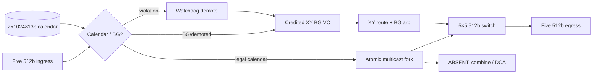

# DSE Trial 2 Architecture Candidates: 6×8 Mesh Calendar-Collective Router

## Scope and evaluation method

Trial 2 re-evaluates ≥3 P0-capable candidates under **USER_CONFIRMED** constraints:

1. **Area-first (P1):** relative area **below Trial 1’s 1.065×** vs IQ-XY baseline.
2. **DCA Tier A only:** no in-router combine; no DCA datapath.
3. Physical params unchanged: 6×8, 64 B flit @ 2 GHz, H=7, V=9, `ramp_bw=1`, single network.

Baseline IQ-XY area/power = **1.00**. Composition: crossbar 0.380, VC buffers 0.450,
credit/control 0.170. Trial 1 audited Arch-A total **1.065** =
`0.380 + 0.365 + 0.040 + 0.058 + 0.027 + 0.195`.

Common assumptions:

- Calendar candidates: two banks × 1,024 × 13 bits = 26,624 bits (retained; max_slot in
  m=1 exports reaches 951 — depth cut to 512 is **not** P0-safe without schedule proof).
- Multicast calibration +5.8%; Tier-B combine +2.7% (comparison only); Tier-C DCA +16.9%
  (rejected).
- BG credit RTT: 16 H / 20 V; interior BG/escape provision 100 flits (5×20).

## Comparison matrix

| Candidate | Area | Power | Combine/DCA | Calendar fidelity | BG bound | Verdict |
|---|---:|---:|---|---|---|---|
| **Arch-A2 CalSlot-Hybrid-ZB-NoCombine** | **1.028** | **0.96** | None (Tier A) | Deterministic ZB replay | 328 cy | **Selected** |
| Arch-A (Trial 1) | 1.065 | 0.98 | Tier B +2.7% | Deterministic ZB replay | 328 cy | Superseded |
| Arch-B SrcRoute-VCPrio-Shared | ~1.008 | ~1.08 | None | Weak (shared IQ arb) | Soft | Rejected (P0 replay) |
| Arch-C CalSlot-HardTDM-DCA | ~1.237 | ~1.23 | Tier C | High | Hard TDM | Rejected (area + Tier C) |

### Arch-A2 area breakdown

| Component | Rel. area | Notes |
|---|---:|---|
| Crossbar | 0.380 | Unchanged 5-port 512b |
| VC buffers | 0.365 | 100-flit BG/escape (same as Trial 1 audited) |
| Calendar SRAM | 0.040 | Keep 2×1024×13 (hot-swap + depth evidence) |
| Multicast fork | 0.058 | FlooNoC +5.8% |
| Combine / DCA | **0.000** | **Removed (−0.027 vs Trial 1)** |
| Credit / isolation / watchdog | **0.185** | Lean control (−0.010 vs Trial 1; drop combine pipeline control) |
| **Total** | **1.028** | **−0.037 (−3.5%) vs Trial 1; +2.8% vs IQ-XY** |

Lean rationale: stripping combine is mandatory. Further calendar bank/depth cuts lack
schedule evidence (max_slot 951). BG FIFO depth is credit-RTT bound — cutting breaks
full-rate progress. Control lean (−0.010) removes combine opcode/pipeline FSM only.

## Arch-A2 definition (selected)

Per-router double-buffered calendar SRAM, hybrid TDM (1-in-16 BG) + dedicated BG XY VC,
zero-buffer calendar forwarding, RTT-credit BG buffers, atomic `out_port_mask` fork,
**Tier-A PE reduce only**, watchdog demotion to XY escape. **No combine_unit. No DCA.**

## Arch-B (rejected despite lower nominal area)

Source-routed headers + shared IQ + priority. Estimated ~1.008× area and Tier A already,
but shared buffering/priority arbitration **breaks deterministic zero-buffer calendar
replay** (P0/P2). Not selected under area-first **when P0 is binding**.

## Arch-C (rejected)

Hard-TDM + DCA: ~1.237× area, Tier C violates Trial 2 binding feedback.

## Recommendation

**Select Arch-A2 CalSlot-Hybrid-ZB-NoCombine.** Meets area target (<1.065), preserves
Trial 1 robustness/calendar fidelity, and implements USER_CONFIRMED Tier A.
