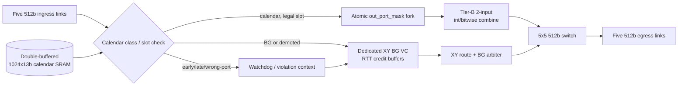
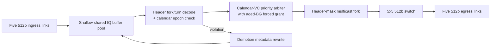
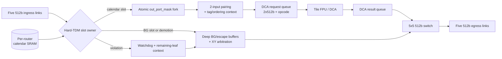

# DSE Trial 1 Architecture Candidates: 6×8 Mesh Calendar-Collective Router

## Scope, assumptions, and evaluation method

This document compares exactly three P0-capable router architectures.  Each preserves a
single 512-bit physical mesh link, one flit/cycle per granted direction at 2 GHz, and
the specified 7-cycle horizontal, 9-cycle vertical, and 1-cycle PE-ramp delays
([REQ-P-001], [REQ-P-002]).  There is one `noc_clk` domain; therefore none of the
candidates introduces a CDC.

All candidates support calendar replay, XY-DOR background unicast, calendar multicast,
and no-drop recovery ([REQ-F-001] through [REQ-F-009]).  The estimates are analytic,
not synthesis results.  Baseline area and dynamic power are a five-port, 512-bit
input-queued (IQ) XY router normalized to **1.00**.  Baseline area composition is
crossbar 0.380, VC payload buffering 0.450, and credit/control 0.170.

Common model assumptions:

- Calendar-table candidates use two banks of 1,024 entries × 13 bits:
  `{valid, in_port[2:0], out_port_mask[4:0], opcode[3:0]}` = 26,624 bits (3.25 KiB)
  per router.  Exact opcode and epoch encodings remain open.
- The calendar path is zero queued-flit storage; it may use an elastic timing register
  that is included in the compiled slot model.
- Credit round-trip provisioning is 16 flits on horizontal links and 20 flits on
  vertical links, including a two-cycle router/control allowance.  The stated
  74-flit (37,888-bit) interior background capacity is a conservative aggregate
  upper bound, not a uniform edge-router allocation.
- The multicast estimate is calibrated to the FlooNoC **+5.8%** router class.
  A Tier-B two-input integer/bitwise combine adds the **+2.7%** class; a Tier-C
  wide-reduction/DCA extension adds the **+16.9%** class.  These are calibration
  anchors, not portable post-layout numbers ([REQ-P-004]).
- Makespan overhead is relative to unchanged zero-buffer calendar theory.  The
  reference `ag_bcast` baselines are 167/267/310/524/708 cycles and `ag_gather`
  baselines are 170/310/368/628/898 cycles for m=1..5 ([REQ-P-003]).

Unresolved items are intentionally not treated as settled: calendar loading and epoch
format (REQ-F-001), background service bound and destination encoding (REQ-F-005),
mask encoding (REQ-F-006), exact VC/credit parameters (REQ-F-007/008), watchdog,
multicast-demotion representation, and credit-reclaim semantics (REQ-F-009), and DCA
FPU arbitration/latency/format (REQ-F-004/010/011).

## Arch-A: CalSlot-Hybrid-ZB (recommended lean)

**Definition.** Per-router double-buffered calendar SRAM, hybrid TDM windows plus a
dedicated BG XY VC, zero-buffer calendar forwarding, RTT-credit buffers only for BG,
calendar `out_port_mask` fork, Tier-B two-input integer/bitwise combine with Tier-A
fallback for FP, and watchdog demotion to the XY escape VC.  This is the accepted
ADR-001 default.

### PPA and makespan estimate

| Area component | Relative area | Basis |
|---|---:|---|
| Crossbar | 0.380 | Same five-port 512-bit switch as baseline |
| VC buffers | 0.270 | BG/escape only; removes general calendar IQ buffering |
| Calendar SRAM | 0.040 | Double-bank 26,624-bit control store |
| Multicast fork | 0.058 | FlooNoC multicast calibration |
| Combine | 0.027 | Tier-B parallel-reduce calibration |
| Credit/isolation/violation control | 0.195 | BG credit counters, window counter, watchdog and demotion context |
| **Total** | **0.970** | **3.0% below baseline** |

Estimated relative dynamic power is **0.98**.  Calendar forwarding avoids payload SRAM
read/write and general VC allocation; calendar SRAM and the fork toggle only for
scheduled work.  The 1-in-16 reserved BG window adds control activity but avoids
unbounded BG contention.

Calendar makespan overhead is **0–5% after recompiling calendars with the hybrid
windows**; an unmodified dense calendar can see a conservative 6.25% slot tax.
This is schedule-fidelity preserving when the compiler models both the SRAM-read/slot
contract and non-borrowable BG windows.  A legal calendar has no replay arbitration
bubbles.

### Robustness and timing

- **Deadlock:** Calendar flits hold only their pre-reserved slot-owned resources and
  never wait on BG buffers.  BG and demoted traffic use one credit-controlled XY-DOR
  escape VC whose X-before-Y channel-dependency graph is acyclic.
- **Hang/progress:** Reserve at least one non-borrowable BG service opportunity per
  16 slots.  Thus any continuously requesting BG flow receives a service opportunity
  per hop within 16 slots plus downstream credit delay; the exact end-to-end bound
  must be derived once packet length and credit-return transport are fixed.
- **No loss/demotion:** A calendar fork fires only when every selected output is
  creditable; it is atomic.  On mismatch or watchdog expiry, release the calendar
  reservation once, retain the unserved leaf set, and enqueue one XY packet per
  remaining leaf in the credited BG VC.  Accepted branches are not replayed.
- **Critical path/pipeline:** Calendar datapath is a two-stage registered path:
  `calendar SRAM/slot qualification → masked switch traversal (ST)`.  BG is a
  three-stage `RC → SA → ST` path; it has no general VA because the escape class is
  fixed.  Both sustain one flit/cycle after fill.  The two-input combine has a
  three-cycle visible merge contract from the current Tier-B model and must be
  calendar-reserved, rather than placed combinationally in ST.

## Arch-B: SrcRoute-VCPrio-Shared

**Definition.** Calendar fork/turn opcodes are carried in the flit header, so the
router has only a minimal epoch/control table.  Calendar traffic uses a dedicated VC
and priority, while shallow shared IQ buffers serve all traffic.  Multicast is a
header-mask fork.  Reduction is Tier A only.  Violations demote into the same
credit-controlled XY BG VC.

### PPA and makespan estimate

| Area component | Relative area | Basis |
|---|---:|---|
| Crossbar/header decode | 0.405 | Baseline switch plus route-program decode fanout |
| VC/shared IQ buffers | 0.340 | Shallow shared pool, but calendar also consumes storage |
| Calendar/control table | 0.005 | Epoch/legality metadata only; route program is in header |
| Multicast fork | 0.058 | FlooNoC multicast calibration |
| Combine/DCA | 0.000 | Tier A only |
| Credit/prioritization/violation control | 0.200 | Shared-pool accounting, priority aging, and demotion handling |
| **Total** | **1.008** | **0.8% above baseline** |

Estimated relative dynamic power is **1.08**.  The storage reduction versus the
baseline is partially offset by every-hop header decode, shared-buffer read/write,
and more frequent arbitration.  Its source-routing header also consumes payload/link
switching energy that the normalized router-only area model does not include.

Calendar makespan overhead is **4–9%**.  A priority winner may proceed promptly, but
shared-buffer availability, header decode, and forced aged-BG service introduce
data-dependent bubbles.  The force-grant threshold required for permanent BG
progress is not a hard TDM schedule, so the precise overhead must be measured by BFM
replay rather than inferred from static zero-buffer schedules.

### Robustness and timing

- **Deadlock:** The dedicated calendar VC separates nominal traffic from XY BG.
  BG and demoted traffic use XY-DOR.  To satisfy the no-permanent-starvation part of
  REQ-F-005, priority must be bounded: an aged BG request forces a grant (initial
  architectural parameter: at least one grant after 16 denied eligible arbitrations).
  This forced service breaks a strict calendar-only wait cycle, but makes calendar
  delivery non-deterministic.
- **Hang/no loss/demotion:** Credits gate every shared-pool admission; a flit is
  removed only after its selected copy/copies have been accepted.  A violation
  rewrites the header into an XY escape packet and competes in the BG VC.  For
  multicast, the header/context must retain an unserved-destination representation;
  its width and expansion policy are unresolved.
- **Critical path/pipeline:** Four stages are required:
  `header decode/RC → class/VC priority decision → SA → ST`.  The shared-IQ read and
  header-mask fork make decode and arbitration timing-sensitive at 2 GHz.  Throughput
  can still be one flit/cycle after fill only if the shared pool has independent
  read/write bandwidth; this is an implementation risk rather than a schedule
  guarantee.

## Arch-C: CalSlot-HardTDM-DCA

**Definition.** A per-router calendar table reserves calendar slots exclusively
(hard TDM).  Calendar forwarding is zero-buffer; background and escape traffic use
deep buffers.  Multicast is calendar-mask fork.  A Tier-C DCA interface pairs
operands and offloads wide arithmetic to the tile FPU.  Watchdog demotion is retained,
but a demoted flit may wait until an eligible BG/escape opportunity and therefore
miss its original TDM window.

### PPA and makespan estimate

| Area component | Relative area | Basis |
|---|---:|---|
| Crossbar | 0.380 | Same five-port 512-bit switch |
| VC buffers | 0.400 | Deep BG/escape queues and DCA request/result elasticity |
| Calendar SRAM | 0.040 | Single active table model; double banking is recommended for safe loads |
| Multicast fork | 0.058 | FlooNoC multicast calibration |
| Combine/DCA | 0.169 | FlooNoC wide-reduction/DCA class |
| Credit/TDM/violation control | 0.190 | Hard-slot ownership, deep credits, watchdog, DCA tags |
| **Total** | **1.237** | **23.7% above baseline** |

Estimated relative dynamic power is **1.23**.  Deep queues, DCA request/result
movement, FPU-facing handshakes, and the wide-reduction control plane dominate.
The router estimate excludes the cited tile delta, which is below 1% only if an
already-present FPU exposes a safe DCA service ([REQ-P-005]).

Normal calendar broadcast/allgather makespan overhead is **0–2%** when the hard-TDM
table exactly reserves the compiled calendar slots; BG cannot steal them.  That
fidelity comes with unused calendar-slot waste when the calendar is sparse.  Tier-C
reduce/allreduce does **not** inherit this result: the current 12-cycle visible
offload/return model yields 315/318/321/324/327 cycle allreduce for m=1..5, so DCA
is latency-dominated for this workload.

### Robustness and timing

- **Deadlock:** Hard ownership eliminates calendar/BG cross-class contention in a
  calendar slot.  BG and escaped traffic remain in credit-controlled XY-DOR resources.
  The DCA request queue may accept a pair only if request and result capacity are
  reserved; otherwise accepting an operand could create a DCA-return dependency.
- **Hang/no loss/demotion:** Watchdog expiry atomically removes slot ownership and
  transfers the retained flit/remaining leaf list to a deep BG escape buffer.  The
  transferred traffic is lossless but can miss the original calendar window; it is
  subsequently delivered by XY.  FPU arbitration must guarantee a bounded DCA
  service or report backpressure before calendar operand acceptance.
- **Critical path/pipeline:** Nominal calendar forwarding is two stages
  `calendar lookup/TDM qualification → ST`.  Integer bypass is therefore schedule
  faithful.  DCA reductions add at least three router-visible control stages
  `pair/tag → request enqueue → result dequeue/ST`, plus the unresolved FPU latency
  (12 cycles in the present model).  A practical DCA path is thus 3 router stages
  plus FPU service, rather than an RC/VA/SA/ST-only pipeline.

## DCA tier impact comparison

The DCA tier is an orthogonal reduction choice; the three named candidates select
different points from this table.  Values include network/ramp effects under the
specified 6×8 model and exclude calendar load/epoch handoff.  Tier-B's allreduce
uses reduce-scatter/allgather when advantageous; it is not a claim that a root gather
is faster than the corresponding gather endpoint.

| Tier | Mechanism | Router area / dynamic power class | Reduce m=1..5 (cycles) | Allreduce m=1..5 (cycles) | Readiness and constraints |
|---|---|---|---|---|---|
| A | Gather to PE; local compute; optional broadcast | +0.0% / ~+0.0% arithmetic | 91, 104, 151, 198, 245 | 229, 290, 385, 480, 575 | Any PE-supported operation, including FP; re-injection and PE energy are required |
| B | Router-local two-input lane-wise integer/bitwise combine | +2.7% / ~+2–3% | 124, 126, 128, 130, 132 | 101, 107, 151, 197, 228 | AND/OR/XOR, fixed-width add, min/max only after ordering/identity are specified; no IEEE FP |
| C | Two-input sync plus 512b DCA FPU offload | +16.9% / ~+15–20% | 223, 225, 227, 229, 231 | 315, 318, 321, 324, 327 | Requires tag/opcode widths, deterministic FP contract, bounded FPU arbitration, and result buffering; tile <1% is conditional |

Arch-A selects B with A fallback; Arch-B selects A; Arch-C selects C.  Thus the
comparison neither assumes that DCA makes short reductions faster nor treats FP
associativity as resolved.

## Cross-candidate trade-off matrix

| Dimension | Arch-A: CalSlot-Hybrid-ZB | Arch-B: SrcRoute-VCPrio-Shared | Arch-C: CalSlot-HardTDM-DCA |
|---|---|---|---|
| Relative router area | **0.970** | 1.008 | 1.237 |
| Relative dynamic power | **0.98** | 1.08 | 1.23 |
| Calendar makespan fidelity | 0–5% after window-aware recompilation | 4–9%, arbitration/interference dependent | **0–2%** for legal normal calendar traffic |
| BG QoS | Bounded: one protected opportunity / 16 slots | Bounded only by priority-aging force grant; contention dependent | Deterministic in assigned BG slots, but calendar slots cannot be borrowed |
| P0 robustness | Atomic fork; isolated escape VC; bounded watchdog demotion | Credit-safe but shared-buffer and multicast-demotion representation are more complex | Credit-safe with DCA queue reservations; demotion may miss TDM window |
| Implementation complexity | Medium | Medium-high | Highest |
| Reduction readiness | Tier B now; A fallback; C interface deferred | Tier A only | Tier C depends on FPU ownership and ordering contract |
| Primary risk | Window insertion must be represented in compiled schedules | Cannot preserve zero-buffer schedule theory under shared IQ interference | P1 loss and poor m=1..5 DCA latency amortization |

## Recommendation

Select **Arch-A, CalSlot-Hybrid-ZB**, for Trial 1.  It meets P0 with a concrete
channel-dependency and no-loss recovery argument, is the only candidate below the
normalized IQ-XY baseline area estimate (0.970) and lowest-power estimate (0.98), and
keeps calendar replay close to zero-buffer theory.  Its Tier-B reduction captures the
small +2.7% calibrated class while retaining Tier-A for unsupported/FP operations.

Arch-C wins normal-calendar fidelity but contradicts P1: its DCA class raises router
area to 1.237 and the current 12-cycle offload model loses to Tier B for m=1..5.
Arch-B avoids calendar SRAM but converts an offline conflict-free schedule into
per-hop header decode and shared-buffer arbitration; satisfying non-starving BG
requires forced grants, so it cannot offer deterministic replay.

Before Phase 3 commits an implementation, instantiate the frozen Phase-2 numeric
contracts (calendar load/epoch, 328-cycle BG bound, 32-cycle watchdog, Tier-B
identities) in RTL and BFM.  Phase 3 must replay post-window calendars, inject
early/late/wrong-port cases, and measure the stated makespan and progress bounds
rather than treating these analytic estimates as acceptance evidence.
