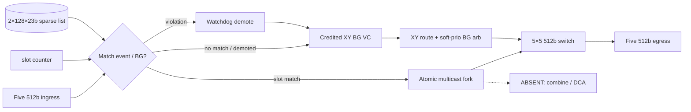

# DSE Trial 4 Architecture Candidates: SharedPool-BG on SparseCal

## Scope and evaluation method

Trial 4 evaluates SharedPool-BG variants on the **Arch-A3 SparseCal** base under
**USER_CONFIRMED** constraints:

1. **Area-first:** total area target **~0.85–0.92×** vs IQ-XY; buffer **0.15–0.22**.
2. Keep SparseCal `2×128×23`, soft-prio, Tier A, zero-buffer calendar, demote→XY.
3. Replace dedicated 5×20=100 BG FIFOs with shared pool + per-port reserve.
4. Physical params unchanged: 6×8, 512b @ 2 GHz, H=7, V=9, `ramp_bw=1`.

## Comparison matrix

| Candidate | Area | Power | BG buffers | Calendar | Verdict |
|---|---:|---:|---|---|---|
| **Arch-A4 SparseCal-SharedPool-ZB-NoCombine (40+2)** | **0.822** | **0.92** | Shared 40 + res 5×2=50 | Sparse ZB | **Selected** |
| Arch-A4b SharedPool 48+2 | ~0.852 | ~0.93 | Shared 48 + res 10=58 | Sparse ZB | Alt if progress needs more pool |
| Arch-A3 (Trial 3) | 1.000 | 0.95 | Dedicated 100 | Sparse ZB | Superseded (buffers) |
| Arch-A2 (Trial 2) | 1.028 | 0.96 | Dedicated 100 | Dense | Superseded |
| Zero-reserve shared pool | <0.82 | — | Shared only | Sparse ZB | Rejected (starvation/deadlock risk) |

### Arch-A4 area breakdown

| Component | Rel. area | Notes |
|---|---:|---|
| Crossbar | 0.380 | Unchanged |
| VC buffers | **0.182** | **50 flits SharedPool** |
| Calendar SRAM | 0.009 | Sparse 2×128×23 |
| Multicast fork | 0.058 | Unchanged |
| Combine / DCA | 0.000 | Tier A |
| Control | **0.193** | +0.005 pool accounting |
| **Total** | **0.822** | **−0.178 vs Trial 3** |

## Deadlock / progress (selected 40+2)

- XY-DOR acyclic; per-port reserve=2; calendar never takes pool credits.
- Soft ~160 (reserve-covered); soft+pool ~200; hard 328.

---

# Appendix: Trial 3 candidates (historical)

Trial 3 re-evaluated ≥3 P0-capable candidates under **USER_CONFIRMED** constraints:

1. **Area-first (P1):** relative area **at or below IQ-XY baseline (1.000×)**.
2. **DCA Tier A only:** no in-router combine; no DCA datapath (carried from Trial 2).
3. **Sparse calendar:** replace dense `2×1024×13` SRAM with sparse ordered event lists.
4. Physical params unchanged: 6×8, 64 B flit @ 2 GHz, H=7, V=9, `ramp_bw=1`, single network.

Baseline IQ-XY area/power = **1.00**. Composition: crossbar 0.380, VC buffers 0.450,
credit/control 0.170. Trial 2 Arch-A2 total **1.028** =
`0.380 + 0.365 + 0.040 + 0.058 + 0.000 + 0.185`.

Common assumptions:

- SparseCal: two banks × 128 × 23 bits = 5,888 bits (vs dense 26,624 bits).
- Sparsity evidence from `results/calendars/*_m1.json`: allreduce max 49 entries/router,
  max_slot 951; depth 128 per bank is P0-safe.
- Multicast calibration +5.8%; Tier-B combine +2.7% (comparison only); Tier-C DCA +16.9%
  (rejected).
- BG credit RTT: 16 H / 20 V; interior BG/escape provision 100 flits (5×20) in Trial 3.

## Comparison matrix (Trial 3)

| Candidate | Area | Power | Combine/DCA | Calendar fidelity | BG bound | Verdict |
|---|---:|---:|---|---|---|---|
| **Arch-A3 SparseCal-Hybrid-ZB-NoCombine** | **1.000** | **0.95** | None (Tier A) | Deterministic ZB replay | soft ~160 / hard 328 cy | Selected in T3; buffers superseded in T4 |
| Arch-A2 (Trial 2) | 1.028 | 0.96 | None (Tier A) | Dense slot table | hard 328 cy | Superseded |
| Arch-A (Trial 1) | 1.065 | 0.98 | Tier B +2.7% | Dense slot table | 328 cy | Superseded |
| Arch-B SrcRoute-VCPrio-Shared | ~1.008 | ~1.08 | None | Weak (shared IQ arb) | Soft | Rejected (P0 replay) |
| Arch-C CalSlot-HardTDM-DCA | ~1.237 | ~1.23 | Tier C | High | Hard TDM | Rejected (area + Tier C) |

### Sparsity evidence (`results/calendars/*_m1.json`)

| Collective | Total entries | Avg/router | Max/router | Max slot |
|---|---:|---:|---:|---:|
| broadcast | 48 | 1 | 1 | 99 |
| allgather | 192 | 4 | 4 | 699 |
| gather / reduce | 336 | 7 | 48 | 851 |
| allreduce | 384 | 8 | **49** | **951** |

## Arch-A3 definition (selected)

Per-router **sparse ordered event list** (dual-bank, depth 128, 23-bit entries),
**soft-priority** hybrid (calendar on match; BG on idle cycles), zero-buffer calendar
forwarding, RTT-credit BG buffers, atomic `out_port_mask` fork, **Tier-A PE reduce only**,
watchdog demotion to XY escape. **No combine_unit. No DCA.**

## Arch-A2 (Trial 2 — superseded comparison)

Dense `2×1024×13` slot table, hard 1-in-16 BG window, area **1.028×**. Retained as
the immediate prior trial for delta tracking (−0.028 area, −0.01 power).

## Arch-B (rejected despite lower nominal area)

Source-routed headers + shared IQ + priority. Estimated ~1.008× area and Tier A already,
but shared buffering/priority arbitration **breaks deterministic zero-buffer calendar
replay** (P0/P2). Not selected.

## Arch-C (rejected)

Hard-TDM + DCA: ~1.237× area, Tier C violates binding feedback.

## Recommendation

**Select Arch-A3 SparseCal-Hybrid-ZB-NoCombine.** Meets area target (1.000× IQ-XY parity),
preserves Trial 2 robustness/calendar fidelity with dramatically lower calendar storage,
and implements USER_CONFIRMED Tier A + soft-priority BG service.
