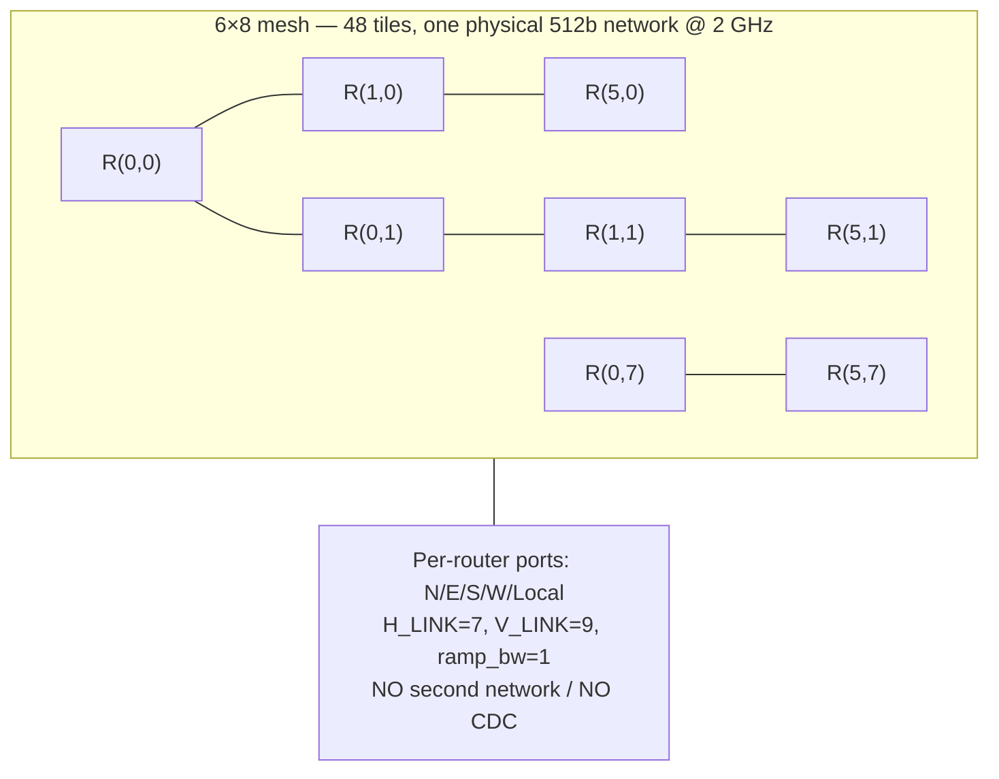
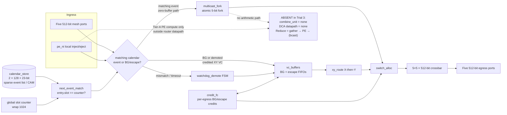
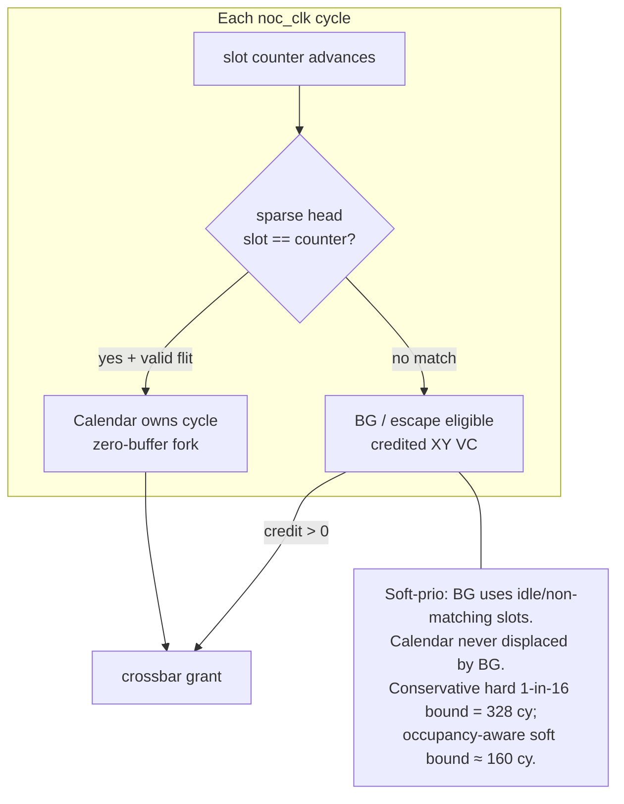
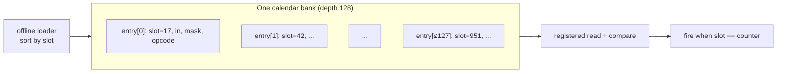
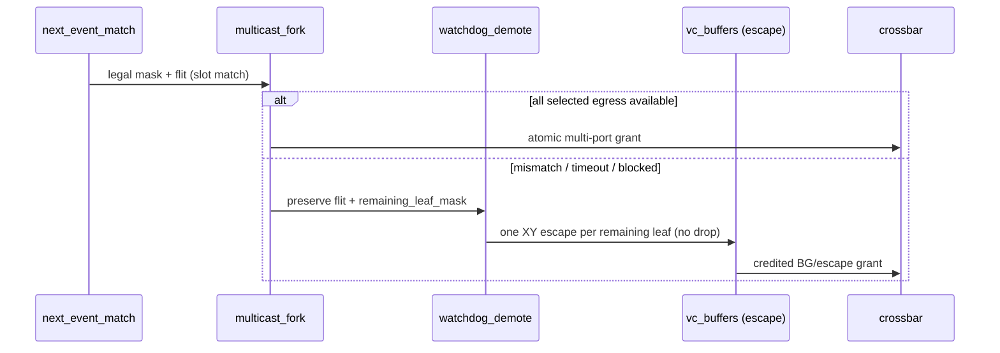

# Arch-A3 Architecture Diagrams (DSE Trial 3)

**Architecture:** Arch-A3 SparseCal-Hybrid-ZB-NoCombine  
**Decision:** USER_CONFIRMED — sparse calendar + soft-prio + DCA Tier A (no in-router combine/DCA)

These diagrams are the dedicated Trial 3 architecture deliverable. The same Mermaid
sources are embedded in [`architecture.md`](architecture.md).

---

## 1. Mesh context (6×8, single 512-bit NoC)

> 中文：6×8 网格，单条 512b 物理 NoC，每 tile 一个路由器，五向端口。

---

## 2. Router block diagram — sparse calendar vs BG, no combine/DCA

> 中文：稀疏事件表（2×128×23b）替代稠密 2×1024×13b SRAM；`next_event_match` 在全局 slot 计数器匹配时触发日历路径。

---

## 3. Soft priority vs hard TDM (selected: soft-prio)

> 中文：**软优先级**已选定——有匹配稀疏事件时日历优先；无匹配时 BG 可用。硬 1-in-16 TDM 仅作保守上界参考。

---

## 4. Sparse event list structure

> 中文：每路由器每 bank 最多 128 条有序事件；allreduce 实测单 router 最大 49 条，max_slot≈951。

---

## 5. Multicast fork + watchdog demote

---

## 6. Explicit non-goals (Trial 3)

| Block | Trial 2 Arch-A2 | Trial 3 Arch-A3 |
|---|---|---|
| Calendar store | Dense 2×1024×13 SRAM | **Sparse 2×128×23 event list** |
| Dispatch | Slot-indexed table read | **Next-event match on counter** |
| BG arbitration | Hard 1-in-16 primary | **Soft priority** (hard bound retained) |
| `combine_unit` | Absent | **Absent** |
| DCA interface | Absent | **Absent** |
| Shared BG buffer pool | — | **Out of scope** (Trial 3b future) |
