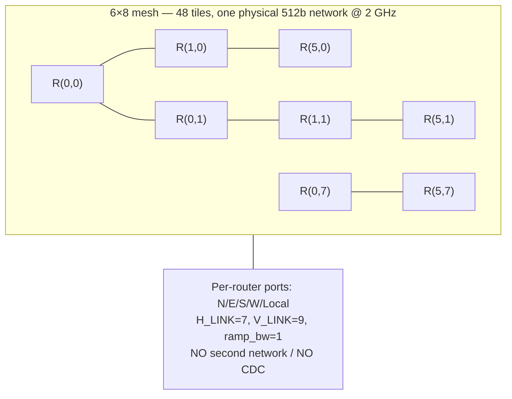
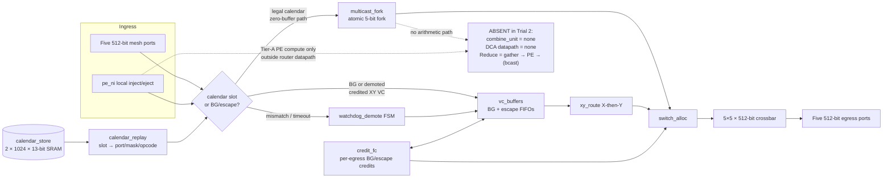
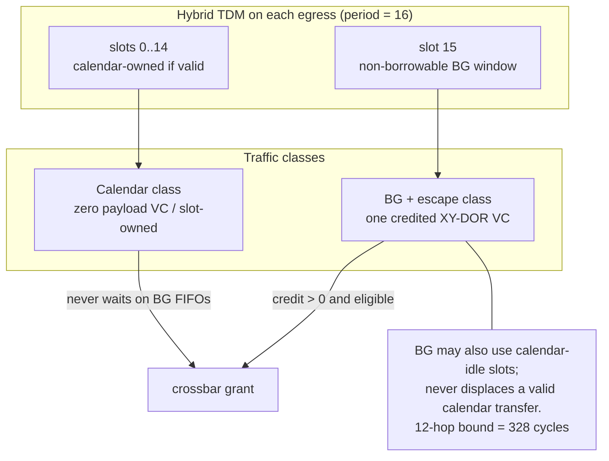
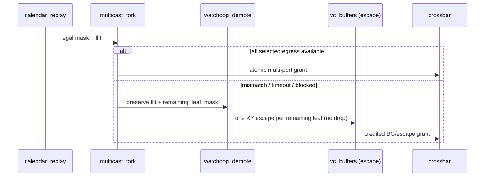

# Arch-A2 Architecture Diagrams (DSE Trial 2)

**Architecture:** Arch-A2 CalSlot-Hybrid-ZB-NoCombine  
**Decision:** USER_CONFIRMED — area-first + DCA Tier A (no in-router combine/DCA)

These diagrams are the dedicated Trial 2 architecture deliverable. The same Mermaid
sources are embedded in [`architecture.md`](architecture.md).

---

## 1. Mesh context (6×8, single 512-bit NoC)

---

## 2. Router block diagram — calendar vs BG, no combine/DCA

---

## 3. VC / TDM isolation

---

## 4. Multicast fork + watchdog demote

---

## 5. Explicit non-goals (Trial 2)

| Block | Trial 1 | Trial 2 Arch-A2 |
|---|---|---|
| `combine_unit` | Tier-B 2-input lane combine | **Absent** |
| DCA interface | Disabled stub | **Absent** (no stub datapath) |
| Reduce semantic | In-router merge | Gather → PE-local compute |
| Allreduce semantic | Reduce + bcast (in-net) | Gather → PE → scheduled broadcast |
