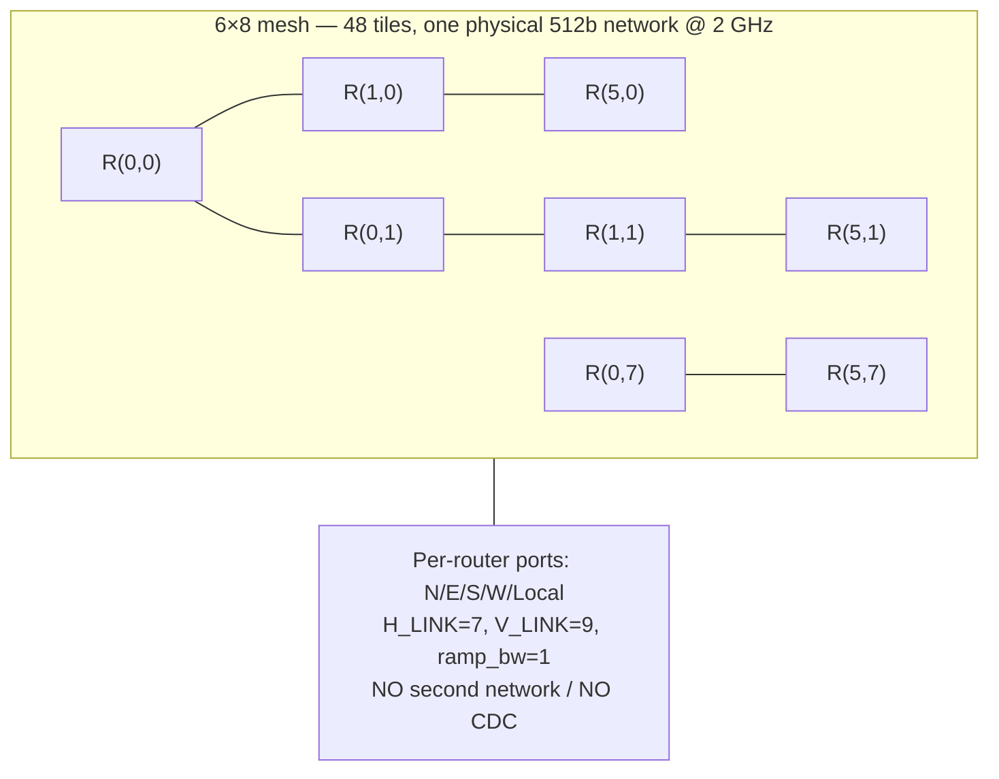
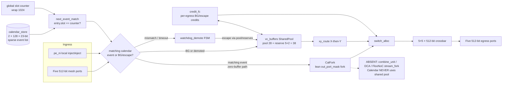
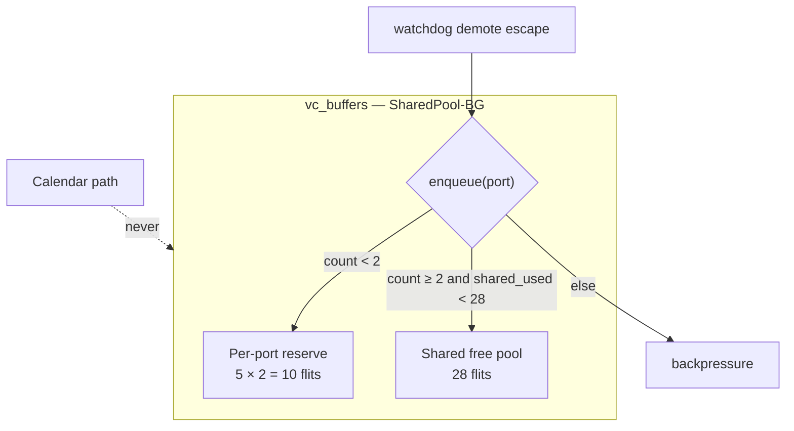
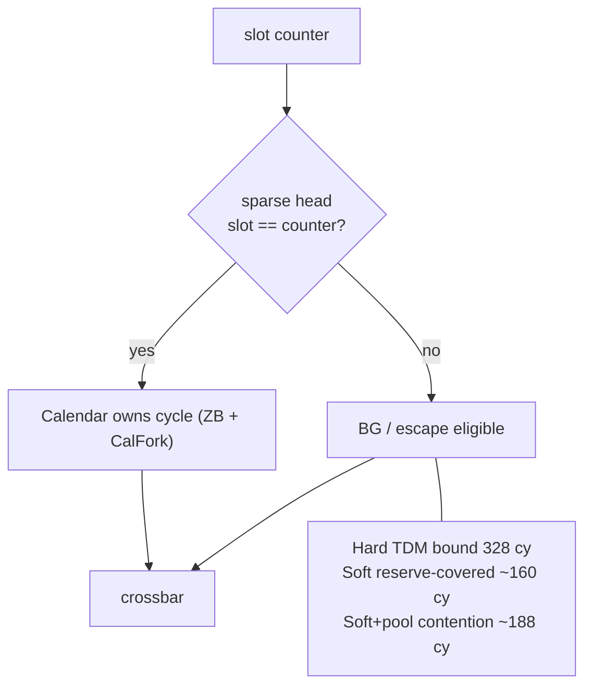
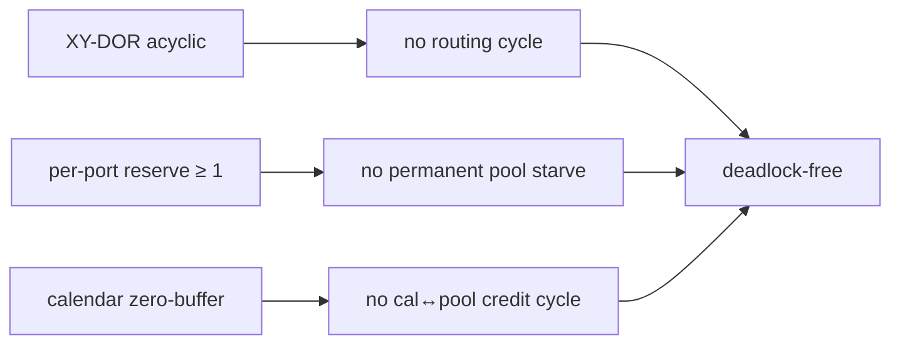

# Arch-A5 Architecture Diagrams (DSE Trial 5)

**Architecture:** Arch-A5 SparseCal-SharedPool-CalFork-ZB-NoCombine  
**Decision:** USER_CONFIRMED — CalFork + aggressive SharedPool on Arch-A4 base (Tier A)

Companion: [`architecture.md`](architecture.md).

---

## 1. Mesh context (6×8, single 512-bit NoC)

> 中文：6×8 网格，单条 512b 物理 NoC（与 Trial 4 相同）。

---

## 2. Router block diagram — SparseCal + CalFork + SharedPool

> 中文：日历经 CalFork 零缓冲分叉；BG/escape 走共享池 28 + 预留 2。

---

## 3. Shared pool + per-port reserve

> 中文：预留保证各端口在共享池耗尽时仍可前进；日历路径不占用池。

---

## 4. Soft priority + BG bounds

---

## 5. Deadlock freedom sketch

---

## 6. Trial 4 → Trial 5 deltas

| Block | Trial 4 Arch-A4 | Trial 5 Arch-A5 |
|---|---|---|
| Calendar | Sparse 2×128×23 | **Same** |
| Multicast | FlooNoC-class MC 0.058 | **CalFork MC 0.025** |
| BG buffers | Shared 40 + reserve 5×2=50 | **Shared 28 + reserve 5×2=38** |
| Area | 0.822× | **0.746×** |
| Power | 0.92× | **0.90×** |
| combine/DCA | Absent | **Absent** |
