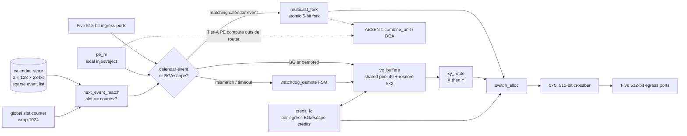

# Arch-A4 SparseCal-SharedPool-ZB-NoCombine Architecture

## Scope and fixed context

This Trial-4 architecture implements one router at each of 48 nodes in a 6×8 mesh.
Each router has north, east, south, west, and local ports on one 512-bit physical
NoC, in the single 2 GHz `noc_clk` domain. A granted direction transfers one flit
per cycle. Analytic inter-router delays are H=7, V=9; PE-router ramp is one cycle
with `ramp_bw=1`. There are no CDCs and no second physical network.

Arch-A4 keeps Trial-3 **Arch-A3 SparseCal** (sparse `2×128×23` event lists,
next-event match, soft-prio BG, Tier A, zero-buffer calendar, atomic multicast,
watchdog demote→XY) and replaces dedicated per-ingress BG FIFOs (5×20=100 flits)
with a **shared BG buffer pool** plus per-port reserves.

Dedicated diagrams: [`architecture-diagram.md`](architecture-diagram.md).

## Router block diagram



## Module decomposition and storage classification

| Block | Boundary and responsibility | Storage / clock-domain classification |
|---|---|---|
| `calendar_store` | Inactive-bank writes / active-bank event reads. Entry `{slot[9:0], valid, in_port[2:0], out_port_mask[4:0], opcode[3:0]}` = 23 bits, slot-sorted. Dual-bank hot-swap at slot 0. | Local SRAM; **2 × 128 × 23** = 5,888 bits. Unchanged from Trial 3. |
| `next_event_match` | `slot == counter` qualify; non-match → BG-eligible (soft priority). | Registers + match control (+0.003). |
| `xy_route` | BG/demoted unicast: X then Y then local. | Combinational + registered metadata. |
| `multicast_fork` | Atomic mask fork; all-or-nothing commit. | Register-only leaf context. |
| ~~`combine_unit`~~ | **Absent (Tier A).** | — |
| `vc_buffers` | **SharedPool-BG:** shared free pool **40** flits + per-port reserve **2** (5×2=10) → **50 flits total** (25,600 bits / 3.125 KiB). Calendar never consumes pool slots. Demote/escape uses pool/reserves. | Same-domain SRAM/regs + free-list / reserve accounting (+0.005 control). |
| `switch_alloc` / `crossbar` | Soft priority: calendar on match; BG on idle. | Register control + 5×5 crossbar. |
| `credit_fc` | Downstream BG/escape credits; calendar uses no payload credits. | H 0–16, V 0–20. |
| `watchdog_demote` | Early/late/wrong-port/missing/blocked → release once → lossless escape into pool. | Register FSM. |
| `pe_ni` | Local inject/eject; Tier-A PE handoff outside router. | Staging registers. |

Flit header (16-bit control in 512-bit flit): `class[1:0]`, `dst_x[2:0]`, `dst_y[2:0]`,
`calendar_id[1:0]`, `opcode[3:0]`, `flags[1:0]`; remaining 496 bits payload.

## SharedPool-BG allocation policy

```
can_enqueue(port):
  if port_count[port] < RESERVE(2): accept   # guaranteed progress
  else if shared_used < POOL(40): accept
  else: backpressure

shared_used = Σ_p max(0, port_count[p] − RESERVE)
```

**Rationale for 40+2 (not 48+2):** analytic buffer area 0.182 lands in the
0.15–0.22 target band; total area **0.822×** meets/exceeds the 0.85–0.92 goal
(lower is better). Alternative 48+2≈58 flits → ~0.212 buffer / ~0.852 total if
deadlock/progress evidence required more shared depth — not needed with
reserve=2 + XY-DOR escape.

## Deadlock freedom (shared pool + XY-DOR)

1. **XY-DOR** on a mesh is acyclic (classic Dally/Seitz) → no routing-induced
   circular wait among routers.
2. **Calendar path is zero-buffer** and never takes pool credits → calendar
   cannot participate in a buffer-credit cycle with BG.
3. **Per-port reserve = 2** guarantees each ingress can always hold at least one
   (typically two) escape/BG flit(s) even when the shared pool is exhausted →
   no port is permanently blocked from making forward progress by pool hogging.
4. **Shared pool free-list** does not create circular wait: a slot is released
   when its flit departs on the DOR next hop; downstream credit_fc bounds
   occupancy independently of the local pool.
5. **Demote→XY** enqueues into pool/reserves (lossless); escape traffic follows
   the same deadlock-free XY class.

Therefore there is no circular wait on pool credits under legal traffic.

## Calendar path unaffected

- Matching sparse events use event-owned zero-buffer forwarding.
- Calendar flits are **never** enqueued into `vc_buffers` / shared pool.
- Soft priority: BG never displaces a firing calendar event.

## Data and control flow

### Calendar event (sparse replay)

Unchanged from Arch-A3: next-event match on wrap-1024 counter; atomic multicast
fork; density evidence max 49 entries/router, depth 128.

### BG XY flit (soft priority + shared pool)

Classified as BG → shared-pool enqueue (reserve or shared) → `xy_route` →
`switch_alloc` on non-matching cycles.

### Demotion

Watchdog release once; emit one escape XY packet per remaining leaf into
**pool/reserves** without drop.

## VC, credit, and progress policy

- Calendar: zero-buffer; never waits on BG pool.
- BG/escape: one credited XY-DOR class; shared pool + reserves.
- End-to-end bounds (12-hop `|dx|=5`, `|dy|=7`):

  | Policy | Bound | Notes |
  |---|---:|---|
  | Conservative hard 1-in-16 | **328** | SA upper bound (unchanged) |
  | Soft-prio reserve-covered | **~160** | Single-flit / ≤2 deep uses reserve; occupancy-aware |
  | Soft + shared-pool contention | **~200** | Soft 160 + ≤40 pool-turnover cycles (adversarial deep bursts) |

## Frozen architecture decisions (Trial 4)

| Decision | Trial-4 value |
|---|---|
| Architecture name | **Arch-A4 SparseCal-SharedPool-ZB-NoCombine** |
| Calendar | Sparse **2 × 128 × 23**; next-event match; dual-bank |
| BG buffers | **Shared pool 40 + reserve 5×2 = 50 flits** |
| BG service | Soft priority; hard bound 328; soft ~160; pool-stress ~200 |
| Watchdog | 32 cycles; lossless demote→XY via pool/reserves |
| Reduction | **Tier A only** — no combine, no DCA |
| Analytic area | **0.822×** IQ-XY (vs Trial 3 **1.000×**) |
| Analytic power | **0.92×** IQ-XY (vs Trial 3 **0.95×**) |

## Analytic constraints

All PPA figures are analytic, not synthesis. Reproducible via
`python3 utils/ppa_analytic_model.py`.
