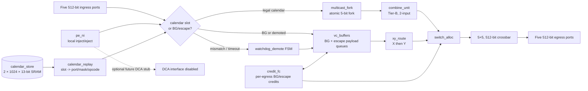

# Arch-A CalSlot-Hybrid-ZB Architecture

## Scope and fixed context

This Trial-1 architecture implements one router at each of 48 nodes in a 6×8 mesh.
Each router has north, east, south, west, and local ports on one 512-bit physical
NoC, in the single 2 GHz `noc_clk` domain.  A granted direction transfers one flit
per cycle.  The analytic inter-router delays are H=7 cycles, V=9 cycles, and the
PE-router ramp is one cycle.  There are no CDCs or a second physical network.

Arch-A is a calendar-first router: conflict-free collective work is replayed from a
per-router slot table without queued payload storage.  Background (BG) and demoted
traffic use an isolated, credited XY-DOR escape VC.  The architecture selects
Tier-B two-input integer/bitwise combine, Tier-A PE compute for unsupported
operations (including IEEE floating point), and leaves DCA uninstantiated.

## Router block diagram

## Module decomposition and storage classification

| Block | Boundary and responsibility | Storage / clock-domain classification |
|---|---|---|
| `calendar_store` | Owns inactive-bank writes and active-bank slot reads.  A bank header holds `calendar_id[1:0]`, `epoch`, and a load-complete CRC/status; active bank changes only at slot 0 after all old-epoch calendar flits retire. | Local same-domain SRAM; two banks, 1,024 entries × 13-bit packed `{valid,in_port,out_port_mask,opcode}` values = 26,624 payload bits (3.25 KiB), plus separately accounted bank headers; one registered read per active slot and one write port to inactive bank. |
| `calendar_replay` | Qualifies current slot and decodes `{valid, in_port[2:0], out_port_mask[4:0], opcode[3:0]}`. | Registers only; no payload queue. |
| `xy_route` | Routes BG and demoted unicast using destination `x[2:0], y[2:0]`: X direction first, then Y, then local. | Combinational route decode plus registered request metadata. |
| `multicast_fork` | Converts a legal replay mask into simultaneous output requests; commits only when all selected outputs have availability. | Register-only accepted-branch and remaining-leaf context. |
| `combine_unit` | Calendar-reserved Tier-B, two-input lane-wise combine. Supports `AND`, `OR`, `XOR`, modulo-2^64 `ADD`, unsigned `MIN`, and unsigned `MAX` over eight 64-bit lanes. A 3-cycle visible merge is reserved in the calendar. | Pipeline registers only; no DCA or FP datapath. |
| `vc_buffers` | Owns payload queues for BG and escape traffic; calendar traffic bypasses them. Escape uses the same XY class but is independently identifiable for observability. | Five per-input BG/escape FIFOs, each 20 flits deep (the maximum H/V credit RTT), for 100 flits × 512 bits = 51,200 bits (6.25 KiB) per interior router. Each FIFO has one enqueue port and feeds the egress arbiter through a one-read-per-cycle mux; egress credit counters are separate. |
| `switch_alloc` / `crossbar` | Arbitrates eligible BG/escape requests in protected BG slots and selects the 5×5 512-bit transfer. Legal calendar work owns its compiled slot; no general VC allocation exists. | Register-only control and 5×5 crossbar; no storage ownership. |
| `credit_fc` | Maintains downstream BG/escape credits and returns one credit when the downstream queue releases a flit. Calendar uses no payload credits; fork eligibility uses downstream availability at the slot boundary. | Counter registers: 5 bits per vertical credit count (0–20), 5 bits per horizontal count (0–16). |
| `watchdog_demote` | Detects early, late, wrong-port, missing, or blocked calendar arrivals; releases the reservation once and produces lossless escape packets. | Register-only FSM and a 5-bit remaining-leaf mask. |
| `pe_ni` | Adapts local inject/eject to the same class/header contract, performs Tier-A PE handoff, and reserves an optional future DCA stub. | Small same-domain injection/ejection staging; DCA signals remain tied inactive in Trial 1. |

The 512-bit logical flit reserves a 16-bit control header:
`class[1:0]`, `dst_x[2:0]`, `dst_y[2:0]`, `calendar_id[1:0]`,
`opcode[3:0]`, and `flags[1:0]`; the remaining 496 bits are payload.  `class`
selects calendar, BG, escape, or reserved.  Calendar replay uses the active-table
slot action; `dst` is used by BG/escape and by multicast demotion.  This is an
architecture contract, not a claim that the existing Phase-1 port list is RTL-final.

## Data and control flow

### Calendar flit

At each slot boundary, `calendar_replay` reads one active-bank entry.  If the entry
is valid and the specified ingress presents the calendar-class flit, the slot-owned
path sends it to `multicast_fork`, optionally reserves `combine_unit`, and issues its
compiled `switch_alloc` transfer.  The two registered replay stages are
`calendar SRAM/qualification` then `masked switch traversal`; the elastic timing
register, if used in Phase 3, is part of the compiled slot model.  No calendar
payload enters `vc_buffers`.

### BG XY flit

`pe_ni` or a mesh ingress classifies the flit as BG.  `vc_buffers` accepts it only
with available storage/credit accounting.  `xy_route` selects X before Y from the
6-bit destination; `switch_alloc` serves it in a protected BG opportunity and only
when downstream credit is nonzero.  The BG pipeline is registered `RC -> SA -> ST`
and sustains one flit/cycle after fill.

### Multicast

`multicast_fork` maps each asserted `out_port_mask` bit to one output request.  It
is atomic: no selected copy launches unless every selected output is available.
After commit, all copies are considered accepted together.  On a fault before
commit, the original flit and complete leaf mask are retained; after a partial
external acceptance is observed, the accepted bits are cleared and only the
remaining leaf mask is demoted.

### Reduce combine

For a calendar opcode that selects Tier B, two operands arrive in calendar-reserved
slots to `combine_unit`.  It combines corresponding 64-bit lanes using the encoded
operation, emits one 512-bit result after three cycles, and forwards it through the
compiled calendar path.  The offline calendar supplies operand order and an
operation-specific identity.  FP and unsupported/non-associative operations route
through Tier-A gather/PE compute and, for allreduce, a calendar broadcast.

### Demotion

`watchdog_demote` immediately detects an early or wrong-port arrival by comparing
the current slot entry; it detects a missing/blocked expected arrival after 32
`noc_clk` cycles from that slot's expected arrival.  On any event it marks the
calendar reservation released exactly once, records the fault, and constructs one
escape-class XY packet for each remaining multicast leaf (or the original unicast
destination).  It may enqueue only with `vc_buffers` capacity; otherwise it holds
the preserved flit/context without dropping it.  Each escape packet is delivered
under the same credit and XY-DOR rules as BG traffic.

## VC, credit, and progress policy

- Calendar is a zero-buffer, slot-owned path, not a payload VC.  Its legal calendar
  never waits on BG buffers.
- BG and escape share the dedicated XY-DOR credited class.  Escape identification
  is retained in the header for counters and fault reporting; it does not add a
  channel dependency.
- A non-borrowable BG opportunity occurs once every 16 slots on every output.
  Calendar owns all other slots. BG/demoted traffic may use its reserved window, or
  a slot for which that output has no valid calendar transfer (calendar idle); it
  never displaces a valid calendar transfer. With a continuously eligible request
  and available downstream credit, any saturated-calendar hop receives a grant
  within 16 slots. The end-to-end bound is measured from source `pe_ni` enqueue to
  destination `pe_ni` eject:

  `T ≤ 2×RAMP + |dx|×(BG_WINDOW + T_router + H_LINK) + |dy|×(BG_WINDOW + T_router + V_LINK)`

  Here `RAMP=1`, `BG_WINDOW=16`, `T_router=3` (RC→SA→ST), `H_LINK=7`, and
  `V_LINK=9`. Credit-return delay sizes the FIFOs (16 H, 20 V) but is not added:
  the bound's eligibility premise requires the outgoing credit to be available.
  On the 12-hop 6×8 worst orientation (`|dx|=5`, `|dy|=7`), this is
  `2 + 5(16+3+7) + 7(16+3+9) =` **328 cycles**.
- H=7 and V=9 imply 16- and 20-flit RTT provisions respectively, including the
  two-cycle router/control allowance.  At least those credits are advertised before
  full-rate injection; counters never permit occupancy above their allocation.
- The dependency graph is acyclic: calendar work holds only its pre-reserved slot
  resources; BG/escape advances only X then Y in one credited class.  A demotion
  releases calendar ownership before requesting the XY class, so it adds no
  calendar-to-BG wait cycle.

## Frozen architecture decisions

| Decision | Trial-1 value | Verification target |
|---|---|---|
| Calendar organization | Double-buffered 1,024 × 13-bit slot table; 2-bit calendar ID and one-bit epoch; atomic inactive-to-active handoff at slot 0. | Replay every legal table entry and prove no active-bank write or mixed-epoch replay. |
| Calendar opcode/mask | 4-bit opcode, 5-bit output mask, 3-bit input port; mask zero is illegal for a valid forwarding opcode. | Check exact requested copies and no unselected egress transfer. |
| BG service | One non-borrowable BG slot per 16; BG/demoted may additionally use calendar-idle output slots; 328-cycle maximum for a one-flit 12-hop eligible request after enqueue. | Saturated calendar/BG BFM demonstrates the per-hop and 12-hop bounds. |
| Watchdog | 32 cycles after expected arrival; immediate detection for early/wrong-port; demotion action starts within 2 cycles once queue capacity exists. | Inject each violation class; observe exactly one no-loss recovery action. |
| Tier-B numeric contract | Eight unsigned 64-bit lanes; operand order is left-to-right as emitted by the offline compiler; lane-wise exact integer results (no rounding). Identity values: ADD=0, AND=all-ones (0xFF…FF), OR=0, XOR=0, MIN=2^64−1, MAX=0. ADD wraps modulo 2^64. | For every supported opcode, compare scheduled combine results to the defined lane-wise operation. |
| DCA | DCA request/result interface is optional and disabled; no DCA transaction is accepted in Trial 1. | Base router passes all required traffic without DCA activity. |

## Analytic constraints and limitations

Calendar schedules must be recompiled with BG windows and combine latency; therefore
the zero-buffer baselines remain comparison references, not a claim of unchanged
makespan.  The architecture estimate expects 0–5% calendar overhead after
window-aware recompilation (6.25% worst case for an unmodified dense schedule).
All stated PPA figures are analytic and must not be substituted for synthesis.
