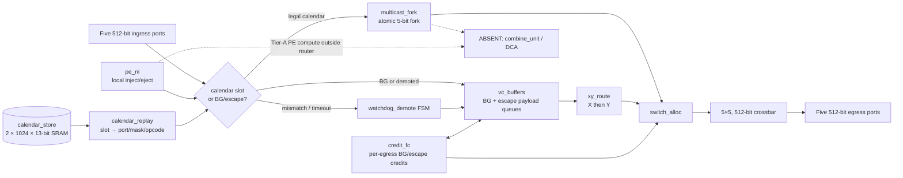

# Arch-A2 CalSlot-Hybrid-ZB-NoCombine Architecture

## Scope and fixed context

This Trial-2 architecture implements one router at each of 48 nodes in a 6×8 mesh.
Each router has north, east, south, west, and local ports on one 512-bit physical
NoC, in the single 2 GHz `noc_clk` domain. A granted direction transfers one flit
per cycle. Analytic inter-router delays are H=7, V=9; PE-router ramp is one cycle
with `ramp_bw=1`. There are no CDCs and no second physical network.

Arch-A2 is the area-first evolution of Trial-1 Arch-A: conflict-free collective work
is replayed from a per-router slot table without queued payload storage; background
(BG) and demoted traffic use an isolated, credited XY-DOR escape VC. **DCA Tier A is
binding:** the router has **no** `combine_unit` and **no** DCA datapath. Reduce is
scheduled gather plus PE-local compute; allreduce is gather → PE compute → scheduled
broadcast.

Dedicated diagrams: [`architecture-diagram.md`](architecture-diagram.md).

## Router block diagram

## Module decomposition and storage classification

| Block | Boundary and responsibility | Storage / clock-domain classification |
|---|---|---|
| `calendar_store` | Owns inactive-bank writes and active-bank slot reads. Bank header: `calendar_id[1:0]`, epoch, load-complete CRC/status; active bank changes only at slot 0 after old-epoch calendar flits retire. | Local same-domain SRAM; two banks, 1,024 × 13-bit packed `{valid,in_port,out_port_mask,opcode}` = 26,624 bits (3.25 KiB) plus headers. Retained double-buffer: m=1 calendars use max_slot up to 951; hot-swap without stall remains P0. |
| `calendar_replay` | Qualifies current slot and decodes `{valid, in_port[2:0], out_port_mask[4:0], opcode[3:0]}`. Opcode `CAL_OP_PE_HANDOFF` is a forward/tag for PE-local Tier-A handoff — **not** arithmetic. | Registers only; no payload queue. |
| `xy_route` | Routes BG and demoted unicast using destination `x[2:0], y[2:0]`: X first, then Y, then local. | Combinational route decode plus registered request metadata. |
| `multicast_fork` | Converts a legal replay mask into simultaneous output requests; commits only when all selected outputs have availability. | Register-only accepted-branch and remaining-leaf context. |
| ~~`combine_unit`~~ | **Absent in Trial 2.** | — |
| `vc_buffers` | Owns payload queues for BG and escape; calendar traffic bypasses them. | Five per-input BG/escape FIFOs, each 20 flits (100 flits × 512 bits = 51,200 bits / 6.25 KiB per interior router). |
| `switch_alloc` / `crossbar` | Arbitrates eligible BG/escape in protected BG slots; selects 5×5 512-bit transfer. Legal calendar owns its compiled slot. | Register-only control and 5×5 crossbar. |
| `credit_fc` | Downstream BG/escape credits; calendar uses no payload credits. | Counter registers: 5 bits H (0–16), 5 bits V (0–20). |
| `watchdog_demote` | Early/late/wrong-port/missing/blocked calendar arrivals → release once → lossless escape packets. | Register-only FSM + 5-bit remaining-leaf mask. |
| `pe_ni` | Local inject/eject; Tier-A PE handoff for reduce/allreduce compute **outside** the router datapath. **No DCA stub datapath.** | Small same-domain staging registers. |

Flit header (16-bit control in 512-bit flit): `class[1:0]`, `dst_x[2:0]`, `dst_y[2:0]`,
`calendar_id[1:0]`, `opcode[3:0]`, `flags[1:0]`; remaining 496 bits payload.

## Data and control flow

### Calendar flit

At each slot boundary, `calendar_replay` reads one active-bank entry. If valid and the
specified ingress presents the calendar-class flit, the slot-owned path sends it to
`multicast_fork` and issues its compiled `switch_alloc` transfer. Pipeline:
`calendar SRAM/qualification` then `masked switch traversal`. No calendar payload
enters `vc_buffers`. There is **no** combine reservation.

### BG XY flit

Classified as BG → `vc_buffers` (with credit) → `xy_route` X-before-Y → `switch_alloc`
in a protected BG opportunity. Pipeline `RC → SA → ST`, one flit/cycle after fill.

### Multicast

Atomic `out_port_mask` fork: no selected copy launches unless every selected output is
available. On fault before commit, preserve flit + leaf mask; after partial acceptance,
demote only remaining leaves.

### Reduce / allreduce (Tier A — no router arithmetic)

- **Reduce:** calendar gather tree to root (or designated PE); PE performs local
  combine; result stays at PE (or is injected as a new calendar/BG message if needed).
- **Allreduce:** gather → PE-local compute → calendar broadcast of the result.
- Router opcodes may tag `CAL_OP_PE_HANDOFF` for observability; the router still only
  forwards. Legacy combine opcode encodings are reserved and have **no** arithmetic.

### Demotion

Watchdog: immediate early/wrong-port; missing/blocked after 32 `noc_clk` cycles from
expected arrival. Release calendar reservation once; emit one escape XY packet per
remaining leaf into `vc_buffers` without drop.

## VC, credit, and progress policy

- Calendar: zero-buffer, slot-owned; never waits on BG buffers.
- BG and escape: one credited XY-DOR class; escape bit is observability only.
- Non-borrowable BG opportunity once every 16 slots per output; BG may use
  calendar-idle slots but never displaces valid calendar work.
- End-to-end bound (source `pe_ni` enqueue → destination eject):

  `T ≤ 2×RAMP + |dx|×(BG_WINDOW + T_router + H_LINK) + |dy|×(BG_WINDOW + T_router + V_LINK)`

  with `RAMP=1`, `BG_WINDOW=16`, `T_router=3`, `H_LINK=7`, `V_LINK=9` → **328 cycles**
  on the 12-hop worst case (`|dx|=5`, `|dy|=7`).

## Frozen architecture decisions (Trial 2)

| Decision | Trial-2 value |
|---|---|
| Architecture name | **Arch-A2 CalSlot-Hybrid-ZB-NoCombine** |
| Calendar organization | Double-buffered 1,024 × 13-bit; 2-bit calendar ID; atomic handoff at slot 0 |
| BG service | 1-in-16 non-borrowable window; 328-cycle 12-hop bound |
| Watchdog | 32 cycles; immediate early/wrong-port; no-loss demotion |
| Reduction | **Tier A only** — no `combine_unit`, no DCA |
| Analytic area | **1.028×** IQ-XY (vs Trial 1 **1.065×**) |
| Analytic power | **0.96×** IQ-XY (vs Trial 1 **0.98×**) |

## Analytic constraints

Schedules must be recompiled with BG windows (no combine latency). Zero-buffer
baselines remain comparison references. All PPA figures are analytic, not synthesis.
