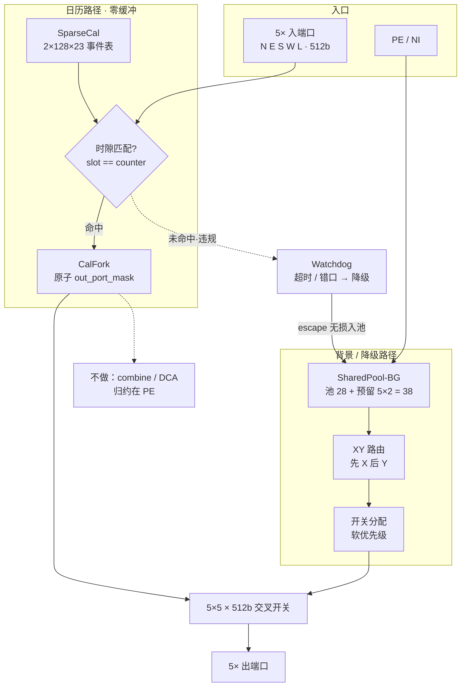
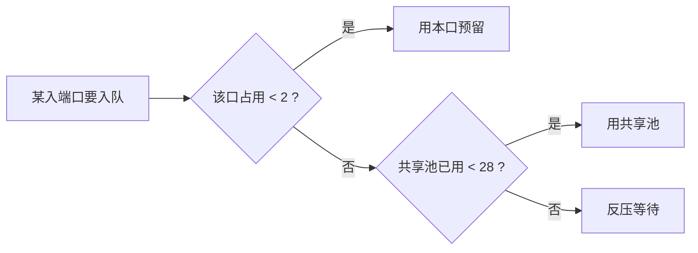

# Arch-A5 微架构图（易读版）

**架构：** Arch-A5 SparseCal-SharedPool-CalFork-ZB-NoCombine  
**要点：** 上蓝路径 = 日历零缓冲；下灰路径 = SharedPool BG；虚线框 = 明确不做。

交互式彩色总览（推荐）：Cursor Canvas `arch-a5-uarch.canvas.tsx`。

---

## 总览（一张图看懂）

**读图顺序：** ① 问「当前时隙有没有日历事件？」→ 有则走上排 CalFork；② 没有则走下排 SharedPool+XY；③ 出错走 Watchdog 降级，仍不丢包。

---

## 共享池怎么分配

日历路径**永不**入池。

---

## 参数速查

| 项 | 值 |
|---|---|
| SparseCal | 双 bank × 128 × 23 bit |
| SharedPool | 28 + 5×2 = **38** flit |
| 多播 | CalFork（非通用 stream_fork） |
| 归约 | Tier A · PE 本地 |
| 面积 / 功耗 | **0.746× / 0.90×** vs IQ-XY |

更细的模块说明见 [`uarch.md`](uarch.md)；架构级图见 [`../phase-2-architecture/architecture-diagram.md`](../phase-2-architecture/architecture-diagram.md)。
