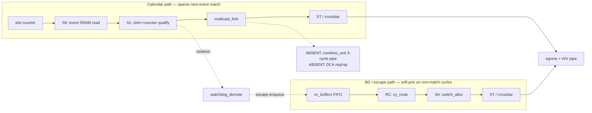
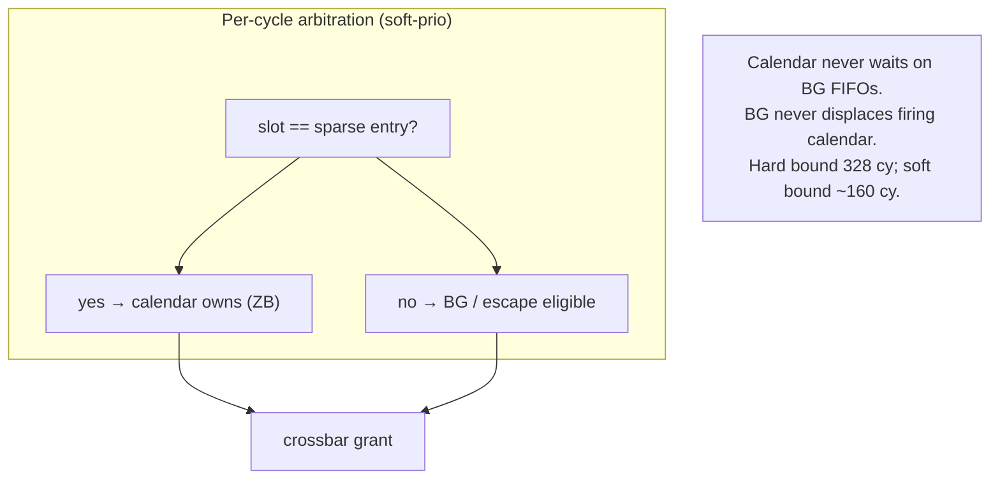
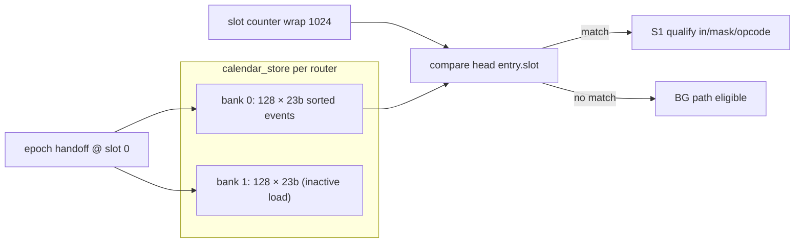
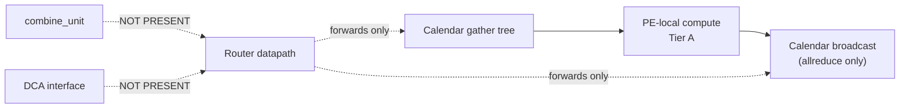

# Arch-A3 Microarchitecture Diagrams (DSE Trial 3)

**μArch:** Arch-A3 SparseCal-Hybrid-ZB-NoCombine  
**Tier:** DCA Tier A — **no combine_unit, no DCA datapath**

Companion to [`uarch.md`](uarch.md). Architecture-level diagrams:
[`../phase-2-architecture/architecture-diagram.md`](../phase-2-architecture/architecture-diagram.md).

---

## 1. Mesh / 5-port router context

> 中文：单 tile 五向路由器，PE 经 1 周期 ramp 接入。

---

## 2. Sparse calendar vs BG pipelines

> 中文：S0/S1 从稀疏表读取并匹配 slot；无匹配时 BG 路径可用（软优先级）。

---

## 3. Soft priority isolation

> 中文：软优先级——匹配事件优先日历；否则 BG 可用。硬 1-in-16 仅作保守上界。

---

## 4. Sparse event list μArch

> 中文：双 bank 热切换保留；每 bank 深度 128，23 bit/条，按 slot 排序。

---

## 5. Multicast fork + watchdog demote

---

## 6. Explicit absence of combine / DCA

| Trial 2 μArch | Trial 3 μArch |
|---|---|
| Dense 2×1024×13 SRAM | **Sparse 2×128×23 event list** |
| Slot-indexed read | **next-event match** |
| Hard 1-in-16 BG | **Soft priority** |
| `combine_unit` removed | **Still absent** |
| DCA removed | **Still absent** |
