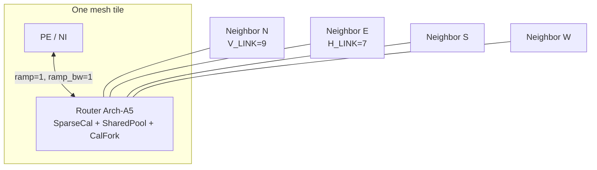
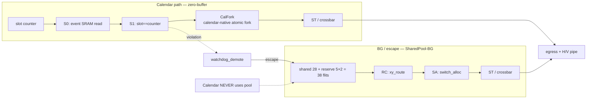
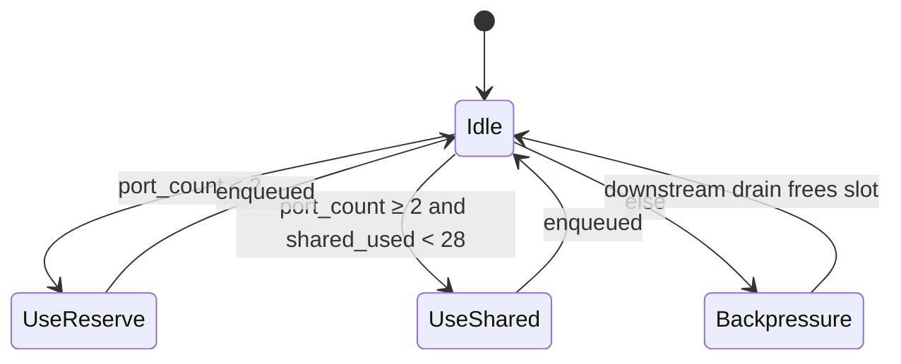
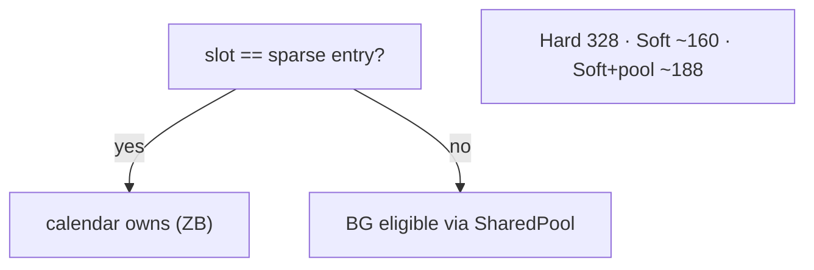
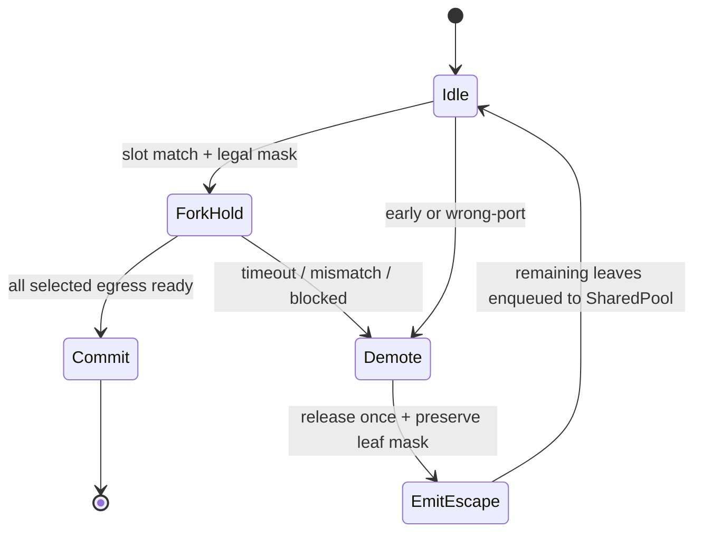

# Arch-A5 Microarchitecture Diagrams (DSE Trial 5)

**μArch:** Arch-A5 SparseCal-SharedPool-CalFork-ZB-NoCombine
**Tier:** DCA Tier A — **no combine_unit, no DCA datapath**  
**Buffers:** Shared pool 28 + per-port reserve 2 (38 flits total)

Companion to [`uarch.md`](uarch.md). Architecture-level diagrams:
[`../phase-2-architecture/architecture-diagram.md`](../phase-2-architecture/architecture-diagram.md).

---

## 1. Mesh / 5-port router context

---

## 2. Sparse calendar vs SharedPool BG pipelines

> 中文：日历零缓冲；BG/demote 走共享池+预留。

---

## 3. Shared pool allocator

---

## 4. Soft priority + bounds

---

## 5. CalFork + watchdog demote

---

## 6. Trial 4 → Trial 5 μArch deltas

| Item | Trial 4 | Trial 5 |
|---|---|---|
| Calendar | Sparse 2×128×23 | **Same** |
| `vc_buffers` | Shared 40 + reserve 2 = 50 | **Shared 28 + reserve 2 = 38** |
| Multicast | FlooNoC-class stream fork, 0.058 | **CalFork, 0.025** |
| BG bounds | 328 / ~160 / ~200 | **328 / ~160 / ~188** |
| combine/DCA | Absent | **Absent** |
| Area / power | 0.822× / 0.92× | **0.746× / 0.90×** |
