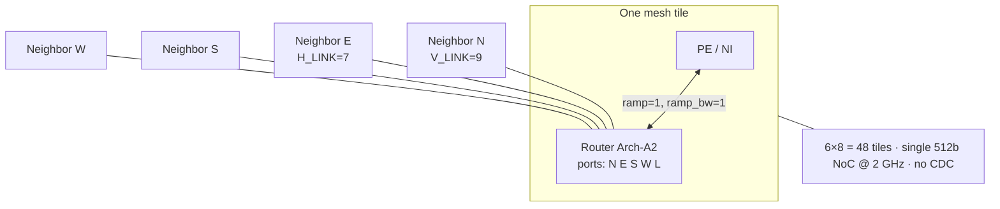
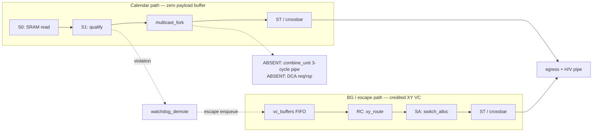
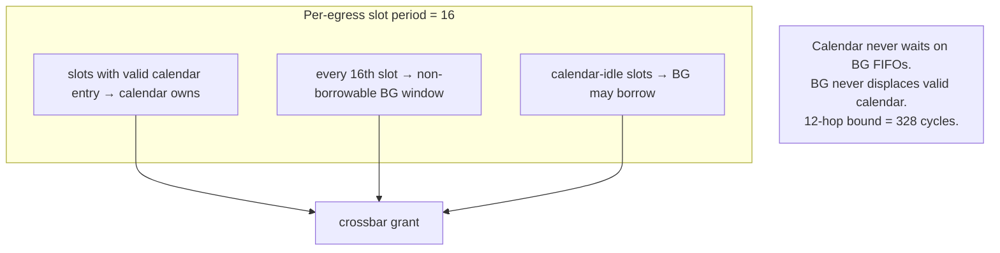
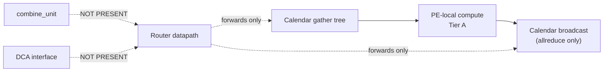

# Arch-A2 Microarchitecture Diagrams (DSE Trial 2)

**μArch:** Arch-A2 CalSlot-Hybrid-ZB-NoCombine  
**Tier:** DCA Tier A — **no combine_unit, no DCA datapath**

Companion to [`uarch.md`](uarch.md). Architecture-level diagrams:
[`../phase-2-architecture/architecture-diagram.md`](../phase-2-architecture/architecture-diagram.md).

---

## 1. Mesh / 5-port router context

---

## 2. Calendar vs BG pipelines

---

## 3. VC / TDM isolation (1-in-16)

---

## 4. Multicast fork + watchdog demote

---

## 5. Explicit absence of combine / DCA

| Trial 1 μArch | Trial 2 μArch |
|---|---|
| `combine_unit` 3-cycle lane ALU | **Removed** |
| DCA stub tied inactive | **Removed** (no stub) |
| Reduce via in-router merge | Gather → PE |
| Allreduce via merge + bcast | Gather → PE → bcast |
