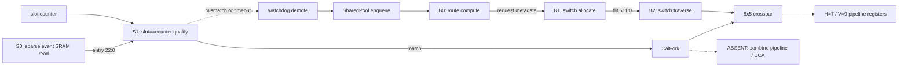

# Arch-A5 SparseCal-SharedPool-CalFork-ZB-NoCombine Microarchitecture

## Fixed implementation parameters

`MESH_X=6`, `MESH_Y=8`, `FLIT_W=512`, `PAYLOAD_W=496`,
`CAL_DEPTH=128`, `CAL_BANKS=2`, `CAL_EVENT_W=23`, `SLOT_WRAP=1024`,
`BG_SHARED_POOL_SIZE=28`, `BG_PER_PORT_RESERVE=2`, `BG_TOTAL_FLITS=38`,
`H_LINK=7`, `V_LINK=9`, `RAMP=1`, and `noc_clk=2 GHz`.

Calendar traffic is a compiled, zero-payload-buffer path driven by **sparse next-event
match**. BG and escape traffic use SharedPool-BG on non-matching cycles (soft priority).
One clock domain. **No `combine_unit`. No DCA.**

Dedicated diagrams: [`uarch-diagram.md`](uarch-diagram.md).

## Module specifications

### `calendar_store`
- **Clock:** `noc_clk` only.
- **Storage:** two SRAM banks, `DEPTH=128`, `WIDTH=23`, 1-cycle registered read.
  Total 5,888 bits. Unchanged from Trial 3.

### `next_event_match`
- Global slot counter wrap 1024; compare against sparse head.
- Match → calendar path; non-match → BG-eligible.

### `xy_route`
- Combinational X-before-Y decode + registered RC request.

### `cal_fork`
- Calendar-native atomic fork on `out_port_mask[4:0]`, represented in RefC by
  `cal_fork_expand()`.
- This is not a general FlooNoC-class `stream_fork`: it has no independent
  multi-stream FSM or combine datapath.
- Analytic multicast component: **0.025** (CalFork), replacing the **0.058**
  FlooNoC stream-fork reference class.

### ~~`combine_unit`~~ — **ABSENT (Trial 5 / Tier A)**

### `vc_buffers` (SharedPool-BG)
- Shared free pool **28** flits + per-port reserve **2** per each of five ports
  → **38** flits / 19,456 bits.
- `shared_used = Σ max(0, port_count − 2)`.
- Enqueue if `port_count < 2` OR `shared_used < 28`.
- **Calendar never enqueues** here.
- Demote/escape uses pool/reserves (lossless when capacity exists).
- Deadlock freedom: XY-DOR + reserves + calendar isolation (see architecture.md).

### `switch_alloc`
- Soft priority: calendar on match; BG on idle.
- Bounds: hard 328; soft ~160; soft+pool ~188.

### `crossbar` / `credit_fc` / `watchdog_demote` / `pe_ni`
- Same roles as Trial 3; demote emits into SharedPool-BG.

## Analytic PPA

| Component | Relative area |
|---|---:|
| Crossbar | 0.380 |
| SharedPool buffers (38 flits) | 0.139 |
| SparseCal | 0.009 |
| CalFork multicast | 0.025 |
| Control | 0.193 |
| **Total** | **0.746** |

Relative power is **0.90×** versus IQ-XY.  Trial 5 improves on Arch-A4's
0.822× area and 0.92× power without changing Tier A, SparseCal, soft priority,
or calendar zero-buffer isolation.

## Pipelines and throughput

| Path | Stages | Rate |
|---|---|---|
| Calendar | S0 → S1 → ST (+ fork) | 1 legal transfer / matched event |
| BG / escape | enqueue(pool) → RC → SA → ST | 1 eligible flit/cycle after fill |
| Combine | — | **N/A (absent)** |

## Signal conventions (future RTL — not written in DSE)

`i_`/`o_`/`io_` prefixes, `noc_clk`/`noc_rst_n`. Phase 3 deliverable remains C BFM only.
