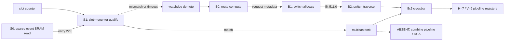

# Arch-A3 SparseCal-Hybrid-ZB-NoCombine Microarchitecture

## Fixed implementation parameters

`MESH_X=6`, `MESH_Y=8`, `FLIT_W=512`, `PAYLOAD_W=496`,
`CAL_DEPTH=128`, `CAL_BANKS=2`, `CAL_EVENT_W=23`, `SLOT_WRAP=1024`,
`H_LINK=7`, `V_LINK=9`, `RAMP=1`, and `noc_clk=2 GHz`.

Calendar traffic is a compiled, zero-payload-buffer path driven by **sparse next-event
match**. BG and escape traffic use the single credited XY-DOR class on non-matching
cycles (soft priority). One clock domain. **No `combine_unit`. No DCA.**

Dedicated diagrams: [`uarch-diagram.md`](uarch-diagram.md).

## Module specifications

### `calendar_store`
- **Clock:** `noc_clk` only.
- **Storage:** two SRAM banks, `DEPTH=128`, `WIDTH=23`, 1-cycle registered read.
  Entry: `{slot[9:0], valid, in_port[2:0], out_port_mask[4:0], opcode[3:0]}`. Entries
  stored in **slot-sorted order** per bank. Total 5,888 bits. Headers: `calendar_id[1:0]`,
  epoch, CRC-good, load-complete.
- **Hazards:** activation only at slot zero after old-epoch retirement; active writes rejected.
- **Depth evidence:** allreduce m=1 max 49 entries/router; depth 128 >2× margin.

### `next_event_match`
- Maintains global slot counter (wrap `SLOT_WRAP=1024`).
- Compares counter against sparse list head (or indexed CAM entry).
- On `entry.slot == counter` and `valid`, qualifies ingress/mask/opcode for calendar path.
- Non-matching cycles: BG-eligible (soft priority).

### `xy_route`
- Combinational X-before-Y decode + registered RC request.
- Route: E/W while `dst_x != x`, then N/S while `dst_y != y`, else local.

### `multicast_fork`
- Atomic commit on `out_port_mask[4:0]`; all-or-nothing at event boundary.
- On partial external acceptance: clear accepted bits; demote `remaining_leaf_mask`.

### ~~`combine_unit`~~ — **ABSENT (Trial 3)**
- Not instantiated. Reduce/allreduce arithmetic is PE-local (Tier A).
- No 3-cycle merge pipeline, no lane ALU, no DCA request/result path.

### `vc_buffers`
- Five ingress FIFO banks for BG/escape only; calendar has no FIFO.
- Interior provision: 100 flits (5×20) / 51,200 bits; H credit 16, V credit 20.

### `switch_alloc`
- **Soft priority:** calendar owns cycles with matching sparse events; BG on idle cycles.
- Conservative hard 1-in-16 bound retained as reference (328-cycle 12-hop).
- Soft-prio occupancy-aware bound ~160 cycles (max occupancy 49, horizon 952).

### `crossbar`
- Registered 5×5 select + `FLIT_W` traverse; one granted flit/cycle after fill.

### `credit_fc`
- H counters 0..16; V counters 0..20. Calendar fork samples availability but does
  not consume payload VC credit.

### `watchdog_demote`
- FSM: `IDLE → ARMED → DEMOTE_WAIT → EMIT → IDLE`.
- Immediate early/wrong-port; 32-cycle timeout for missing/blocked.
- Emit one escape flit per remaining leaf when `vc_buffers` ready; no loss.

### `pe_ni`
- Local ready/valid inject/eject; Tier-A PE handoff for reduce/allreduce compute
  **outside** the router datapath.
- **No DCA stub datapath** in Trial 3.

## Pipelines and throughput

| Path | Stages | Rate |
|---|---|---|
| Calendar | S0 → S1 (slot match) → ST (+ fork) | 1 legal transfer / matched event |
| BG / escape | RC → SA → ST | 1 eligible flit/cycle after fill at grant |
| Combine | — | **N/A (absent)** |

Both granted paths meet `rate_per_cycle * 2 GHz` per direction.

## Signal conventions (future RTL — not written in DSE)

`i_`/`o_`/`io_` prefixes, `noc_clk`/`noc_rst_n`, `u_` instances, `UPPER_SNAKE_CASE`
parameters. Phase 3 deliverable remains C BFM only.
