# 8×6 Mesh Allreduce：时延下界、Reduce 站点与整体最优方案

**几何：** 8×6 mesh，H=7，V=9，直径 = 7·H+5·V = 94  
**接口：** RAMP=5（L1↔router 单向），RAMP_BW=2 flits/cycle（上下独立），COMPUTE=5  
**流量：** 一次性 allreduce；m ∈ {1, 13, 32, 200} flits/node  
**模型：** 零缓冲刚性调度；链路 ≤1 flit/cycle  
**产物：** `results/allreduce_8x6_dse.json`，`results/report_allreduce_8x6.html`

与仓库旧基线差异（不可直接复用旧结论）：

| 来源 | RAMP | RAMP_BW | 归约代价 |
|------|------|---------|----------|
| `dse_tree_allgather_6x8.py` | 1 | 2 | （无 reduce） |
| `sim_allreduce_scale.py` | 1 | 1 | INC=3 / NODE=12 |
| **本研究** | **5** | **2** | **COMPUTE=5**，站点相关 |

## 1. 硬约束

- 有向 mesh 链路冲突自由（≤1 flit/cycle）
- 上下 ramp 容量各 ≤2 flits/cycle，独立
- 每节点最终收到恰好 m 个归约结果 flit
- makespan 报告为**可行刚性打包 / 解析相位模型的上界**，不声称最优性；只有下界是证明性的

## 2. Reduce 硬件位置（三维参数化）

| ID | 键 | ramp_crossings | uses_ramp_bw | 单级代价 (m=1) | 说明 |
|----|-----|----------------|--------------|----------------|------|
| S1 | `l1` | 2 | 是 | 15 | 下 ramp→L1 计算→上 ramp |
| S2 | `nic` | 2 | 否 | 15 | NIC 侧 ALU，不占 L1 端口 |
| S3 | `router` | 0 | 否 | 5 | router 数据通路内联 |
| S4 | `none` | — | — | — | 无网内归约 = allgather + 本地 COMPUTE |

ALU 流水独立扫描：流水 `COMPUTE+m−1`，非流水 `COMPUTE·m`。对 m=200：204 vs 1000。

## 3. 方案一览

| 类 | 名称 | 适用 | 说明 |
|----|------|------|------|
| A | `tree_reduce_bcast` | S1–S3 | 最短路树 reduce → 维序树 bcast；root 扫描中心/近中心/角 |
| B | `dual_tree` | S1–S3，m≥2 | 将 m 拆成两半，两棵树顺序执行（并行上界待边不相交证明） |
| C | `dim_rs_ag` | S1–S3，**m%8==0** | 行向 RS + 列向 RS/树 + 反向 AG；m=1/13 标记不适用 |
| D | `ring_*_rs_ag` | S1–S3 | Hamilton ring RS+AG；带宽基线 / 证否用 |
| E | `allgather_*` | **仅 S4** | 源根维序树 allgather + 本地 COMPUTE |

## 3.1 算法示意图与说明

下列示意图以 8×6 逻辑拓扑抽象；箭头表示 flit 流向，实心节点为 merge / root。

### A · 树 Reduce + 树 Broadcast

两阶段顺序执行：**自底向上归约到 root**，再 **自 root 多播结果**。

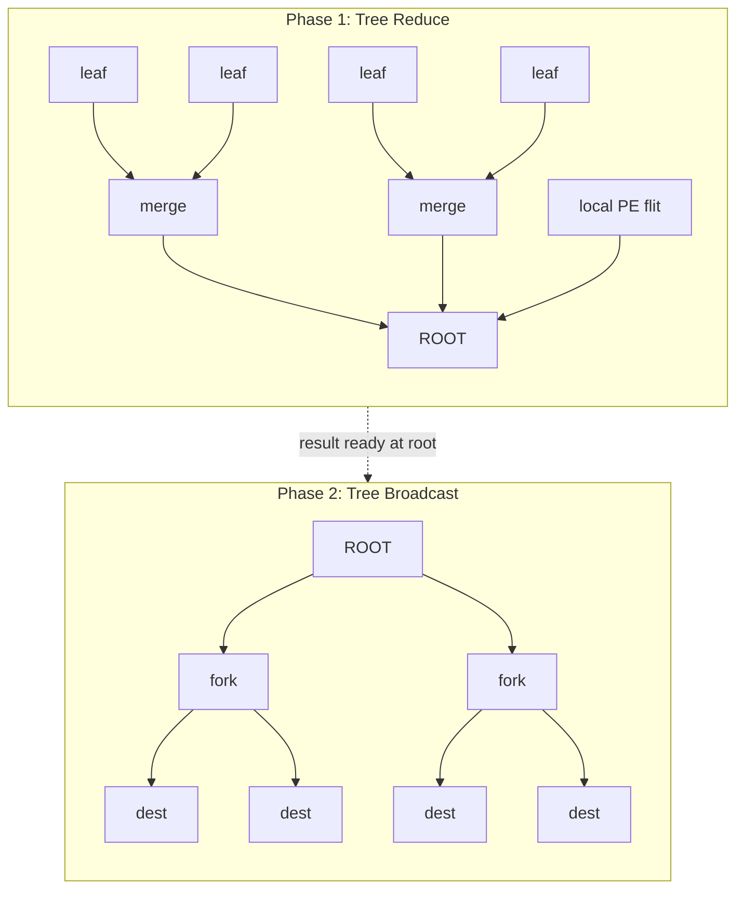

**时序要点**

1. 叶节点于 cycle 0 经上 ramp 注入；中间节点等齐所有子树首 flit + 本地贡献后做一次 merge。
2. Merge 代价由站点决定：S3 = `COMPUTE(+m−1)`；S1/S2 = `2·RAMP + COMPUTE(+m−1)`。
3. Root 结果就绪后进入 bcast；bcast 用维序树（先 X 后 Y）+ CalFork 扇出，每点下 ramp 收 m 个结果 flit。
4. **优势：** 延迟路径 ≈ 树高 × (边延迟 + merge)，适合小–中 m。  
   **劣势：** root 扇入串行；两 phase 之间有间隙。

本研究最优 root 为 mesh 近中心 `r19=(3,2)`（及对称近中心）。

### B · 双树拆分 m

把 m 个 flit 拆成两半，各走一棵（期望边不相交的）树，目标逼近串行化项 `⌈m/2⌉`。

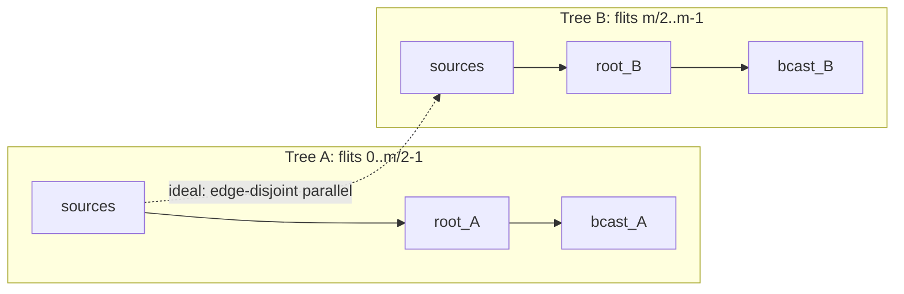

**说明：** 理想情况下两树并行、链路不冲突，makespan ≈ `max(T_A, T_B)`。本次 DSE 以**顺序拼接**作为安全可行上界计入；真正边不相交并行实现留后续（是缩小 vs `T_LB` gap 的主杠杆）。

### C · 维度化 Reduce-Scatter + Allgather

当 `m % MX == 0`（即 m%8==0）时适用。先在行内 RS，再在列上处理，最后反向 AG。

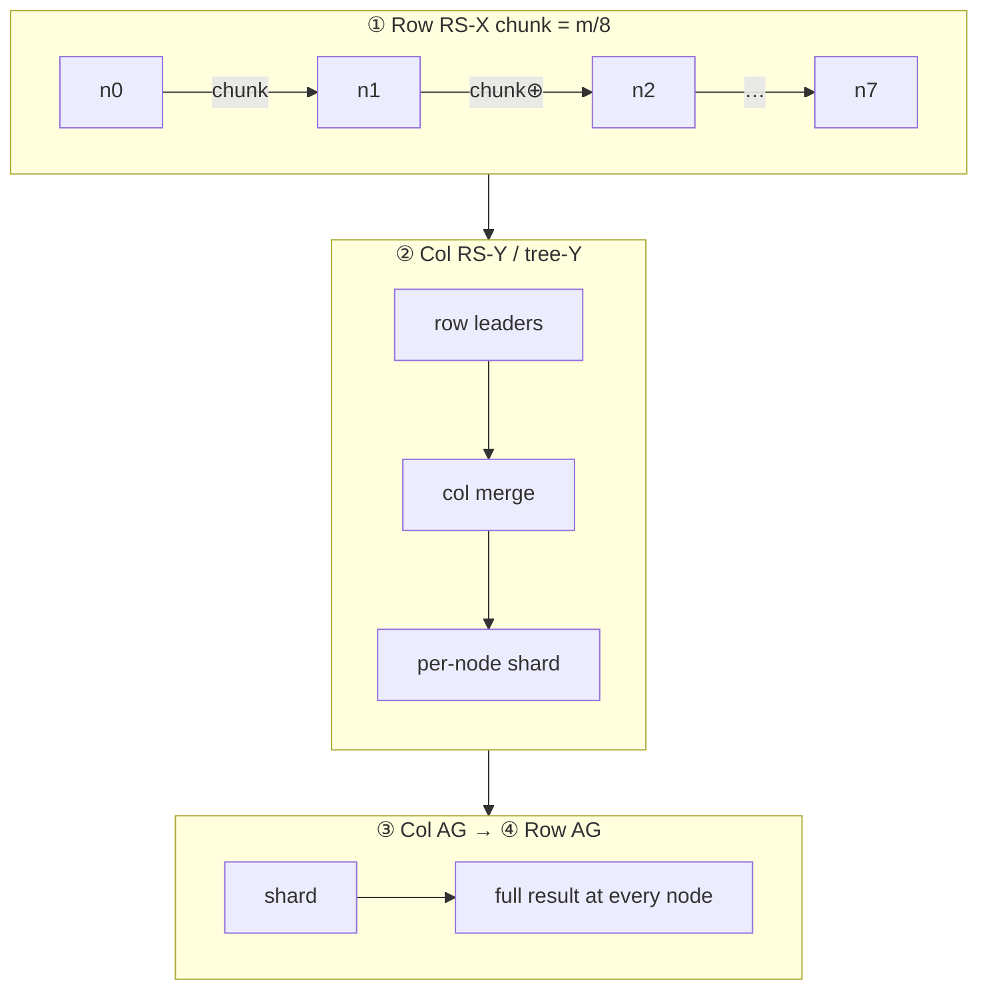

**时序要点**

1. 每一行 8 节点做 ring/流水 RS：每步搬运 `chunk=m/8` flit 并 merge。
2. 若 `m % N == 0`：列上也做等分 RS+AG（满 Rabenseifner）；否则列上退化为树 reduce + bcast，再做行 AG。
3. **优势：** 大 m 时带宽项被切分，击败单 root 树。  
   **约束：** m=1、13 整除失败 → 报告 `applicable=false`，不强行取整。

### D · Hamilton Ring RS + AG

沿蛇形哈密顿环做 reduce-scatter，再 allgather。带宽最优结构，但步数 ≈ N−1。

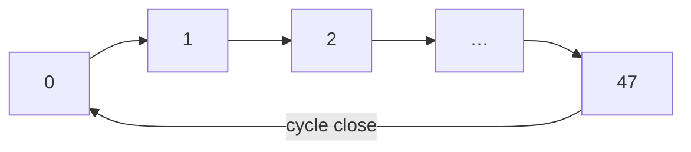

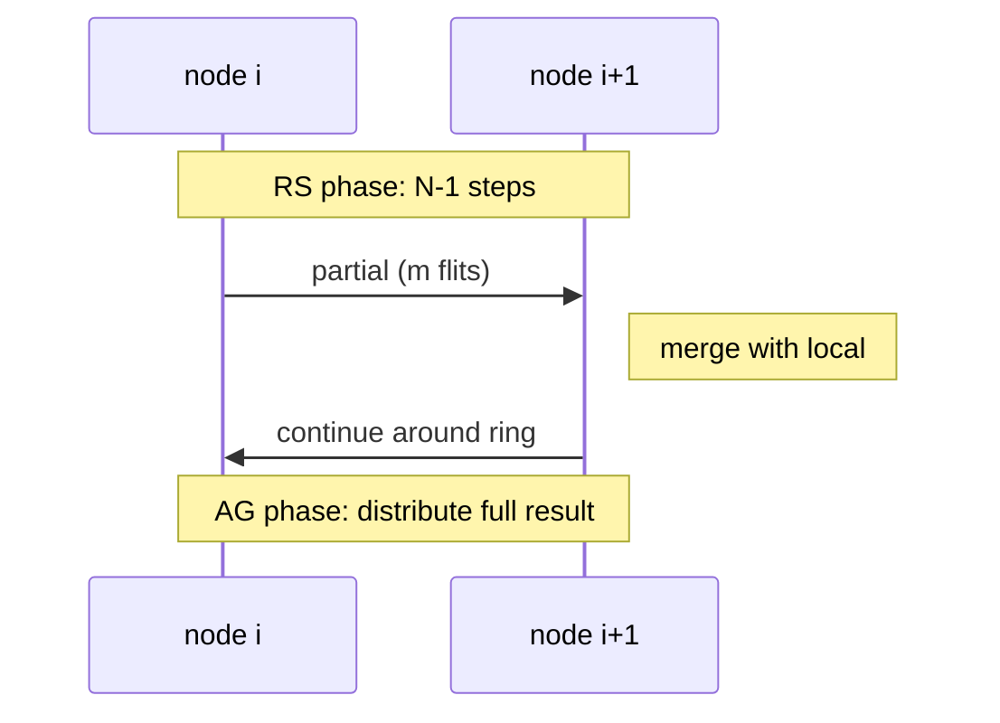

**说明：** 每步至少一次边延迟 + 一次 merge；双向 ring 可把环长大致折半。在 8×6 延迟主导区，D 用作**证否基线**（证明“带宽最优 ≠ 时延最优”），不作为推荐方案。

### E · Allgather 型（无网内归约，S4）

不做网内 merge：每源把自己的 m flit 多播到全体，各 PE 本地做 48 路归约。

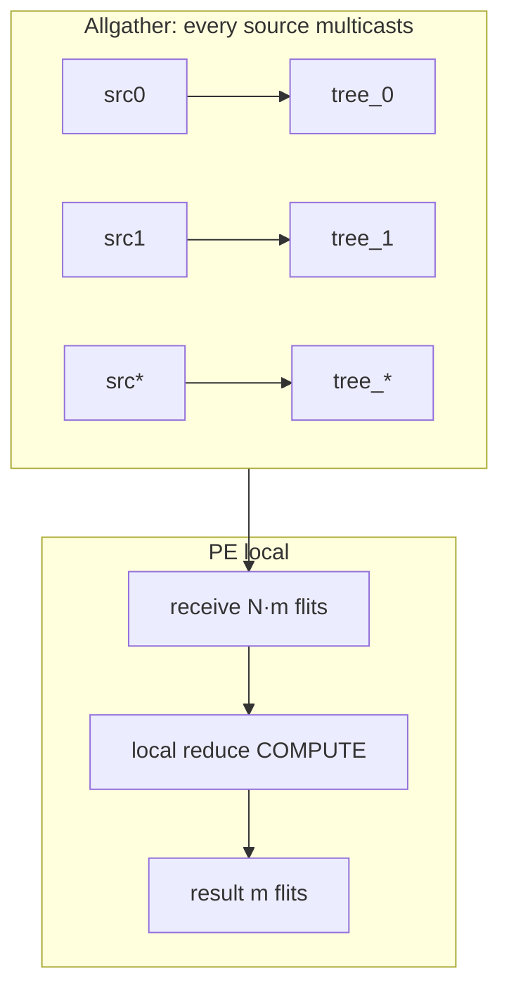

**时序要点**

1. 网络行为 = 标准 allreduce 的 allgather 半边；复用维序树 / axis_ccw 等已验证打包。
2. 每节点下 ramp 必须吸入 `(N−1)·m` flit → L5 = `⌈47m/2⌉`。
3. **m=1 时有竞争力**（单 phase、无 root 串行）；**大 m 被 L5 打爆**。

### 站点对比（同一条 merge）

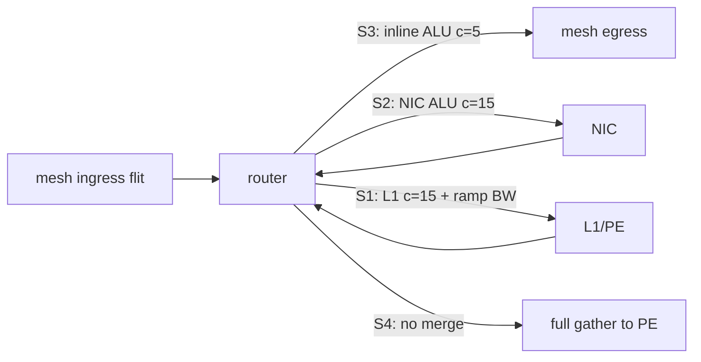

---

## 3.2 Router 内联 ALU（S3）微架构

本节描述 **若采纳 S3** 时，在现有 Arch-A5（SparseCal + CalFork + SharedPool）日历路径上增加 inline reduce 的微架构。这是 DSE 推荐方向的硬件草图，**尚未取代 Tier A ADR**；与 Arch-A5「NoCombine」基线对照阅读。

### 3.2.1 在路由器中的位置

Inline ALU 挂在**日历命中路径**上，位于 CalFork / 交叉开关之前：归约结果作为新 flit 再进入出端口，不进 SharedPool，不经 L1。

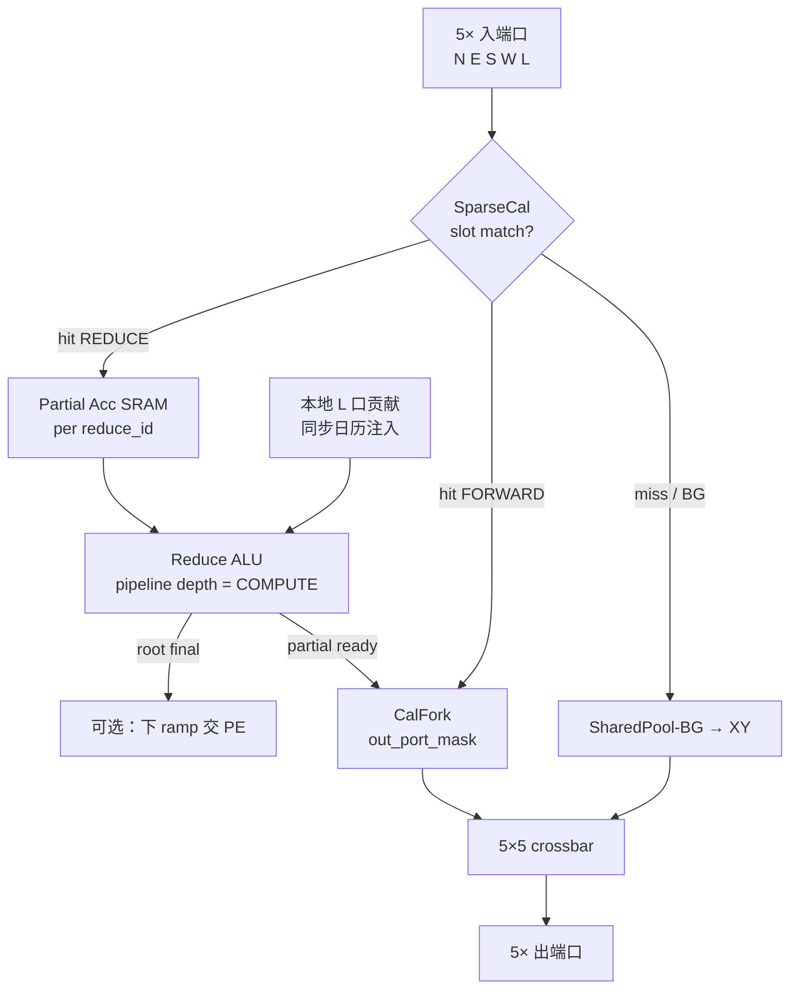

与 S1/S2 的关键差别：S3 **零次 ramp 往返**；操作数驻留在 router 侧 Acc SRAM，延迟 = 线延迟 + `COMPUTE`（流水时再加 `m−1`）。

### 3.2.2 日历事件扩展（概念）

在现有 23-bit sparse 事件上增加 reduce 语义（示意字段，非最终编码）：

| 字段 | 含义 |
|------|------|
| `opcode` | `FORWARD` / `REDUCE_ACC` / `REDUCE_FWD` / `BCAST` |
| `reduce_id` | 本次集合通信 / 树边的归约上下文 |
| `expect_n` | 本节点本 flit-index 期望汇入的操作数个数（扇入） |
| `out_port_mask` | 归约完成后的出方向（通向 parent 或 bcast 扇出） |
| `flit_idx` | 流水时的 flit 序号 0..m−1 |

`FORWARD`：与今日 CalFork 路径相同。  
`REDUCE_ACC`：把入端口 payload 累加进 Acc，不立刻转发。  
`REDUCE_FWD`：累加后若 `count==expect_n`，弹出结果并按 mask 转发。

### 3.2.3 Inline Reduce 流水线（单节点）

以某中间节点扇入 = 2（两子树 + 可选本地）为例：

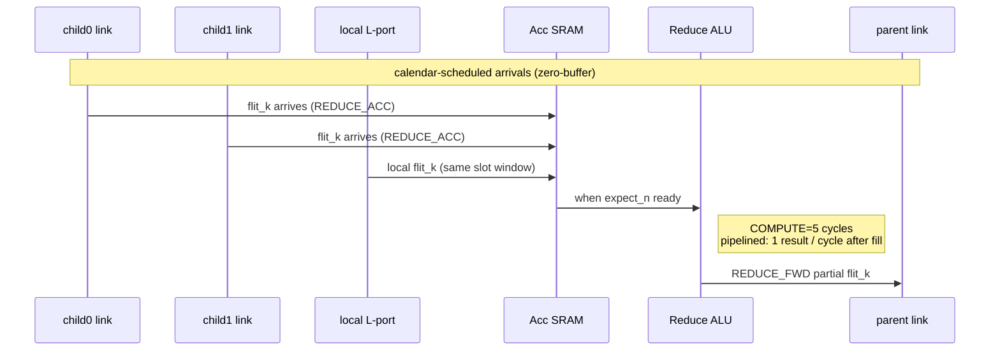

**流水规则（与 DSE 代价模型一致）**

- **非流水：** 每个 flit 独立占满 ALU → 单级代价 `COMPUTE · m`。
- **流水：** ALU 深度 = COMPUTE；填满后每 cycle 吐 1 个结果 flit → 单级代价 `COMPUTE + m − 1`。
- 多输入对齐：日历保证各子树 `flit_k` 在同一节点的到达窗可重叠；Acc 按 `(reduce_id, flit_idx)` 索引，位宽 = payload（496b 量级）。

### 3.2.4 单 router 数据通路详图

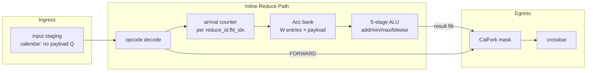

**资源量级（草图）**

- Acc：每 router 同时活跃的 `(reduce_id, flit_idx)` 窗口；树 reduce 下通常 O(扇入×流水深度)，远小于 SharedPool。
- ALU：一条深度 5 的 512b 整数/按位流水线即可覆盖 DSE 的 COMPUTE=5；多 collective 复用同一条。
- 面积相对 Arch-A5：恢复 Trial-1 量级的 combine 类开销（文献锚点约 +2.7% 类），换取 S3 相对 S1 每级 10 cy 的延迟收益。

### 3.2.5 端到端：一棵树上的 inline reduce

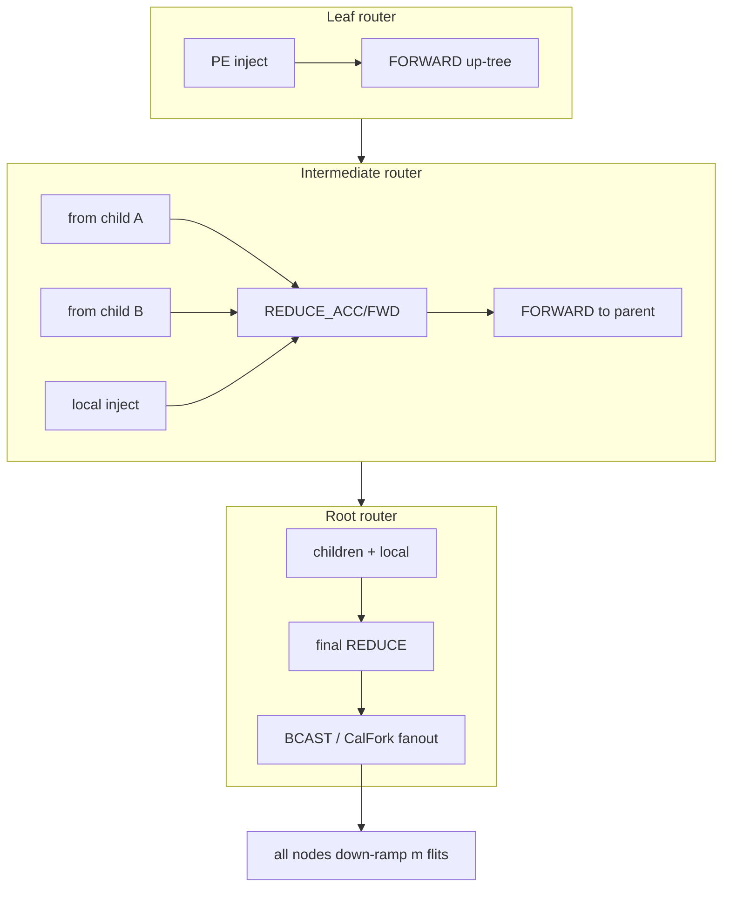

**流程摘要**

1. **Leaf：** 仅 `FORWARD`，无 ALU 激活。  
2. **Intermediate：** 日历在子树到达时刻下发 `REDUCE_*`；Acc 凑齐扇入后 ALU 产出 partial，立即 `FORWARD` 给 parent——**数据不进 PE**。  
3. **Root：** 最终 reduce 完成后切 bcast 日历；CalFork 按树扇出；各节点下 ramp 交付 m flit 结果。  
4. **故障/迟到：** 仍走现有 watchdog → SharedPool escape；reduce 上下文超时则软件回退或重调度（与 Tier A 降级哲学一致）。

### 3.2.6 与四站点代价对照

| 站点 | 单级关键路径 | 是否占 ramp BW | DSE m=13 最优 makespan |
|------|--------------|----------------|------------------------|
| S3 router inline | wire → Acc → ALU(5) → wire | 否 | **257** |
| S2 NIC | wire → ramp 域 → ALU → 回网络 | 否（不占 L1） | 327 |
| S1 L1 | wire → 下 ramp → PE → 上 ramp | 是 | 344 |
| S4 none | 全量 allgather | 弹出 (N−1)m | 887 |

---

## 4. 时延下界

因果链：最远对 A=(0,0)↔B=(7,5)，B 的输出依赖 A 的输入 → 上 ramp + ≥94 线延迟 + ≥1 次归约 + 下 ramp。

| 族 | 公式 | 角色 |
|----|------|------|
| L1 因果 | `2·RAMP + diam + COMPUTE + ⌈m/2⌉ − 1` = **108 + ⌈m/2⌉** | 主导 |
| L2 注入 | `⌈m / RAMP_BW⌉` | 弱 |
| L3 弹出 | `⌈m / RAMP_BW⌉`（网内归约后每点只收 m） | 弱 |
| L4 割 | 角割 `⌈m/2⌉`；纵割 `⌈m/6⌉` | 弱（网内归约带宽廉价） |
| L5 AG 弹出 | `⌈47m/2⌉` | **仅约束 S4** |

理想下界 `T_LB(m) = 108 + ⌈m/2⌉`：

| m | L1 | L2/L3 | L4c | L5 | **T_LB** | S1/S2 LB | S3 LB | S4 LB |
|---|-----|-------|-----|-----|----------|----------|-------|-------|
| 1 | 109 | 1 | 1 | 24 | **109** | 119 | 109 | 109 |
| 13 | 115 | 7 | 7 | 306 | **115** | 125 | 115 | 306 |
| 32 | 124 | 16 | 16 | 752 | **124** | 134 | 124 | 752 |
| 200 | 208 | 100 | 100 | 4700 | **208** | 218 | 208 | 4700 |

**观察：** 到 m=200 仍延迟主导（固定 108 占 52%）。允许网内归约时 allreduce 带宽廉价——探索应缩短关键路径，而非堆 ring。

## 5. Loop 探索协议

沿用 `dse_m1_tree_uarch.py` 约定：

- **tick 0：** A/C/D/E × 4 站点 × {流水,非流水} × 4 个 m
- **tick 1+：** 追加 B（双树）与额外 dual-root 对；连续一轮无 ≥1% 改进 → `converged`

本次结果：`loop_status=converged`，`n_ticks=2`（tick 1 无显著改进）。

## 6. 结果

### 6.1 每 m 整体最优

| m | 最优站点 | 方案 | makespan | T_LB | ratio |
|---|----------|------|----------|------|-------|
| 1 | **S4 none** | allgather_dim_xy | **139** | 109 | 1.275 |
| 13 | **S3 router** | tree_r19（中心树） | **257** | 115 | 2.235 |
| 32 | **S3 router** | dim_rs_ag | **329** | 124 | 2.653 |
| 200 | **S3 router** | dim_rs_ag | **665** | 208 | 3.197 |

### 6.2 Reduce 应在何处做（站点排名，流水优先）

**m=1：** S4 (139) < S3 (161) < S2 (193) < S1 (236)  
→ 单 flit 时 allgather 型无 root 串行，击败树 reduce+bcast。

**m=13：** S3 (257) < S2 (327) < S1 (344) ≪ S4 (887)  
→ router 内联胜；S4 被 L5=306 下界托起后实际 887。

**m=32：** S3 (329) < S1=S2 (449) ≪ S4 (1766)  
→ 维度 RS+AG 在可整除时接管；S1/S2 同代价（解析模型不区分 ramp BW 争用）。

**m=200：** S3 (665) < S1=S2 (785) ≪ S4 (4710)  
→ S4 完全不可用（L5=4700）；router+流水仍是唯一合理路径。

### 6.3 ALU 流水杠杆（S3）

| m | 流水 | 非流水 | 比值 |
|---|------|--------|------|
| 1 | 161 | 161 | 1.00×（m=1 无差） |
| 13 | 257 | 593 | 2.31× |
| 32 | 329 | 473 | 1.44× |
| 200 | 665 | 1817 | 2.73× |

### 6.4 方案取舍要点

- **Ring (D)** 在 mesh 上因 ~47 步串行远劣于下界，仅作证否基线（m=1 S3：ring 193 > tree 161；S1 ring 因 ramp 争用可到 1242）。
- **Dim RS+AG (C)** 仅当 `m % 8 == 0`；m=1/13 明确标记不适用。
- **Dual tree (B)** 本次以顺序上界计入，未闭合 ⌈m/2⌉ 串行化 gap；并行边不相交实现留后续。

## 7. 结论与推荐

1. **硬件：** 若面积允许，优先 **router 内联 ALU（S3）+ 流水**；不要把归约放在 L1（S1）除非面积/验证强制——每级 15 cy 往返在延迟主导区很痛。
2. **小消息 (m=1)：** 可考虑 **不做网内归约**，直接复用已优化的 8×6 allgather + 本地算（139 cy）。
3. **中大消息：** **S3 + 中心树**（m 不可分时）或 **S3 + 维度 RS+AG**（m%8==0）。
4. **与理想界 gap：** 当前最优 ratio 1.27–3.20；主要剩余来自树深度上的多级 merge 与相位间隙，而非带宽。缩小 gap 的下一刀是真正边不相交的多树并行（B 类并行化）。

## 8. 文件索引

| 角色 | 路径 |
|------|------|
| DSE 扫掠 | `utils/dse_allreduce_8x6.py` |
| JSON 结果 | `results/allreduce_8x6_dse.json` |
| HTML 报告 | `utils/gen_allreduce_8x6_report.py` → `results/report_allreduce_8x6.html`（含 §2.1 算法图、§2.2 router ALU） |
| 本文档 | `docs/phase-7-exploration/allreduce-8x6.md`（§3.1 算法、§3.2 微架构） |
| Arch-A5 基线对照 | `docs/phase-3-uarch/uarch-diagram.md`（NoCombine；S3 为探索性扩展） |
| 复用调度器 | `utils/sched_zerobuf_compare.py`（**须** `sz.RAMP=5`） |
| 复用环构造 | `utils/hamilton_ring.py` |
