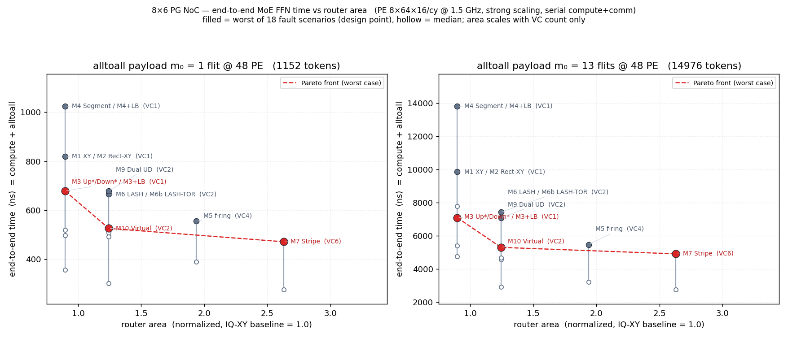

# 8×6 分组交换 NoC：Partial-Good 下 Alltoall 解决方案与劣化率

**几何：** 8×6 mesh，H=7，V=9，RAMP=2，RAMP_BW=2  
**流量：** 一次性 alltoall；m∈{1,5}；同源同目的 wormhole 保序  
**故障模型（端到端）：** ≤4 router + ≤8 无向链路（双向算 1），分层随机抽样，
router 与链路故障不重叠（`utils/pg_faults_budget_8x6.py` → `results/pg_faults_budget_8x6.json`）。
固定 `link_*` / `node_*` 目录已退出 e2e 评估。  
**产物：** `results/pg_e2e_pareto.json`，`results/report_pg_alltoall_8x6.html`

## 1. 硬约束

无死锁（CDG）+ 保序（每对唯一路径，VC 序列为 `(src,dst)` 确定性函数）。不满足时可牺牲 good 节点（升序基数搜索；先剔除度 0 孤立点）。

## 2. 方案

### A 类 · 转向限制（1 VC）

M0 East-first · **M0s1 Super-turn 1VC** · M0s Super-turn（≤2）· M1 XY · M2 Rect-XY · M3 Up\*/Down\*（±LB）· M4 Segment（±LB）

- **M0s Super-turn**：四个 Glass–Ni 最小模型自适应；1 VC 盖不住再开互补第 2 VC，再不行才牺牲。
- **M0s1 Super-turn 1VC**：同上但硬顶 1 VC（只牺牲、不开第 2 层）。

### B 类 · VC 分层

| ID | 方案 | VC 用法 | 典型 VC | 特点 | e2e（VC≤2） |
|----|------|---------|---------|------|-------------|
| M5 | 真 f-ring | 相位×方向（E/W/N/S） | 4 | 矩形块 + XY 全环绕 | 描述保留，**不评** |
| **M5h** | **fault half-ring** | X 相 VC0 / Y 相 VC1 | **2** | 只走朝向目的侧的半环；CDG 靠校验+块膨胀/牺牲 | **评** |
| M6 | LASH | 每对一层，层内 CDG 无环 | 1–2† | 最短路；层数可 >2 | 描述保留，**不评**† |
| M6b | LASH-TOR | 允许中途升层 | 1–2† | 层数已很低时收益有限 | 不评† |
| M7 | 条带 dateline | 跨竖带 VC+1 | 5–9 | 面积换极限性能 | 不评 |
| M9 | 双向 Up\*/Down\* | VC0=UD，VC1=DU | 2 | 易实现 | 描述保留，**不评** |
| M10 | 虚拟规则网格 | 逻辑 XY；X/Y 两 VC | 2 | 上层仍见规则 mesh | 描述保留，**不评** |

† LASH 族在预算故障下实测 VC 常冲到 3，故本轮 e2e 排除。  
**本轮端到端只评 VC≤2 且入选方案**（含 M0s / M0s1 / M3 / M5h 等；**不含 M9/M10**）；
故障一律用预算目录（不再用 link_/node_ corner/edge/center）。

**M0s / M3 / M5h** 细节见 HTML 报告 §2 / §6；M5/M7/M10 描述保留。

### 2.1 三性质核验与排除

**主评估故障集 = 预算模型**（≤4R+≤8L，`utils/pg_budget_probe.py` →
`results/pg_budget_capability.json`）。旧固定目录核验仍保留作对照
（`utils/pg_capability_probe.py`）。HTML 报告 §2.5 两表并陈。

预算模型下（176 场景 dead，零额外牺牲建表；`python3 utils/pg_budget_probe.py`）：

| 方案 | 避障（ok / sac / path） | 无死锁 | e2e |
|------|------------------------|--------|-----|
| M0 East-first | 3 / 0 / 173 | ✓ | 覆盖不全 |
| M0s1 Super-turn 1VC | 14 / 20 / 142 | ✓ | 评（VC1） |
| M0s Super-turn | 111 / 58 / 7 | ✓ | 评（≤2） |
| M1 XY | 0 / 0 / 176 | — | 排除 |
| M2 Rect-XY | 0 / 94 / 82（累计牺牲 3730） | ✓ | 排除 |
| M3 Up\*/Down\* | 174 / 0 / 2 | ✓ | 评 |
| M4 Segment | 1 / 0 / 170 | ✗ 5 CDG | 排除 |
| M5 f-ring | 7 / 63 / 106 | ✓（4 VC） | 描述保留 |
| M5h half-ring | 5 / 96 / 74 | △ 1 CDG | 评（2 VC） |
| M6 / M6b LASH | 174 / 0 / 2 | ✓（VC 可到 3） | 描述保留 |
| M7 Stripe | 174 / 0 / 2 | ✓（VC 5–9） | 描述保留 |
| M9 Dual UD | 174 / 0 / 2 | ✓ | 描述保留（不进 e2e/§3） |
| M10 Virtual | 155 / 0 / 2 | △ 19 CDG | 描述保留（不进 e2e/§3） |

保序：构造保证（唯一路径）。旧目录 36×2 对照仍见 HTML §2.5 第二表。

### 2.2 目录外可达性（不限于 36 场景）

区分 **STRUCT**（残图仍连通但方案建不出表）与 **disc**（图已断开）。
数据见 `results/pg_beyond_catalog_reach.json`（`utils/pg_beyond_catalog_reach.py`），HTML §2.3。

| 方案 | 会 STRUCT？ | 要点 | 补救 |
|------|------------|------|------|
| M0s Super-turn | **偶发** | ≤2 故障 STRUCT=0；混合抽样 8/1000 STRUCT | 断连→牺牲；偶发再牺牲 |
| M0s1 Super-turn 1VC | **会** | 单点 6/48、双点 639/1128 STRUCT；常靠 forced_sac | 抬到 M0s（2 VC）或牺牲 |
| M3 / M6 / M7 | **否** | 双故障全量 + 三节点/混合抽样失败 = 断连 | 牺牲孤立点 |
| M4 Segment | **会** | 单链 72/82、双链 3272/3321 STRUCT | 重牺牲或换方案 |
| M5 f-ring | **会** | 链路 forced_sac；左右边中段块环绕失败 | 端点退休 / 多牺牲 1–2 |
| M5h half-ring | **会** | 单链 82/82 forced_sac；双点 STRUCT 62/1128 | 端点退休；否则换 M0s/M3 |
| M10 Virtual | **会** | ≤2 故障安全；≥3 散落洞 BOTH_CYCLIC | 牺牲（常 sac=1） |

### 2.3 M10 的无死锁是「试出来的」（`utils/pg_m10_cycle_scan.py`）

M10 没有构造性证明：它建两张候选表（去回环版 / 原始拼接版），取 CDG 无环的那张，两张都成环就整体失败。
穷举 8×6 故障空间（`results/pg_m10_cycle_scan.json`）：

| 故障空间 | 规模 | 需去环 | 需退回原版 | **两版都成环** |
|---------|------|-------|-----------|--------------|
| 单链路断 / 单节点死 | 82 / 48（全） | 0 | 0 | 0 |
| 双链路断 | 3321（全） | 104 | 0 | 0 |
| 双节点死 | 1128（全） | 118 | 34 | 0 |
| **三节点死** | 17296（全） | 4293 | 1247 | **380（2.2%）** |
| 随机 3–6 断链 | 6000 抽样 | 1505 | 4 | 6（0.1%） |
| 随机 1–4 死点 + 0–4 断链 | 4000 抽样 | 1353 | 163 | **219（5.5%）** |
| 出厂故障目录 | 36（全） | 0 | 2 | 0 |

两个故障以内怎么摆都安全；三个死节点起才失效，且**死节点**比断链危险得多。
决定性的是形状不是数量：**紧凑的洞（一行/一列/L/2×2/3×3）全部安全，散落错开的洞才致命**
（阶梯对角 `(1,0)(3,1)(5,1)`、错列相邻 `(1,0)(2,2)(4,2)` 均失效）。
这也解释了目录为何一例未触发——目录的节点故障全是规整方块。

最小失效实例 `(1,0)(3,1)(5,1)` 两版成环机理不同：原始版是 2 通道掉头环（一条链路两向同在 VC1），
去回环版是 8 通道矩形环（全在 VC0，绕死节点 (3,1) 闭合）。
根因是 M10 按**逻辑相位**分 VC，而绕路会在逻辑 X 相里走物理竖直跳，使 VC0 同时含横纵通道且无转向限制。
失效时退化为牺牲恢复：该实例牺牲 1 个节点（同故障下 M7/M6/M3 为 0）。

M0/M1/M2/M4 **不进入 §5–6 的 makespan 对比**：它们裸 makespan 常常最快，但那是牺牲一半阵列换来的（A 小 ⇒ 流量按 A² 降）。
端到端评估（§6）仍保留它们，因为那里已把牺牲折算回时间。

### 2.4 M0 East-first 的不可达是可判定的（`utils/pg_east_first_reach.py`）

east-first 禁掉「转向东」的两类转弯（N→E、S→E）+ 禁 180°，两条抽象环各断一处 ⇒
**CDG 无环是构造性的，且不依赖网格完整**（删链路只减少转弯、不创造转弯），1 VC。
代价是路径形状被锁死：**源行内一段向东直线 + 之后只用 N/S/W**。
按这个形状直接构造可达集（`reach_model`，不碰转向搜索）与真实路由器逐例比对，
**4579 个故障集 + 36 个目录格判定分歧 0 例**——所以下面是判据，不是抽样结论。

两种失效模式：

1. **横向切断源行（主因）**：s 以东断一跳，则 s 到断点以东的**全部**目标不可达（绕行要 N→E）。
   单链路穷举中 **42 条横向链路每一条都单独致命**；单节点死只有最西列（x=0）的 6 个洞无害。
2. **最东列被切开**：东边的列离开后回不去，故 x=7 列内断纵向链路会把该列切成两段（5 条）。
   其余 35 条纵向链路全部无害。

| 故障空间 | M0 零牺牲可行 | M1 XY | M0+镜像 2 VC |
|---------|--------------|-------|-------------|
| 单链路断（82 全） | 35（43%） | 0 | **82（100%）** |
| 单节点死（48 全） | 6（12%） | 0 | **48（100%）** |
| 双链路断（3321 全） | 597（18%） | 0 | 3241（98%） |
| 双节点死（1128 全） | 23（2%） | 0 | 1068（95%） |
| 出厂目录（36 全） | 24（67%） | 9 | **36（100%）** |

**不可达的解决方案**：目录 12/36 失败，默认出路是牺牲恢复，中位 30 节点、最坏 A=6/48（与 M1 同量级）。
更划算的是**把镜像模型放到第 2 个 VC**：VC0 跑 east-first、VC1 跑 west-first（禁 N→W/S→W，因此**允许** N→E/S→E），
每对整条路径锁死在一个 VC ⇒ 两层各自无环、层间无依赖、保序不变。实测**目录 36/36 零牺牲可行、CDG 0 例成环**，
只有 1.9–12.8% 的对数用到 VC1。想留在 1 VC 就只能按行选方向，但那会让 N→E 与 S→W 共存、抽象环复活，
退化成「实测无环」。彻底躲开这个问题的最省面积选项是 M3 Up\*/Down\*（1 VC，36/36 零牺牲）。

端到端上 M0 是这族里最好的：中位牺牲 1、中位 A=44（XY 是 28 / 16），中位 e2e 也快过 XY；
但**最差场景与 XY 完全相同**（A=6/48、820 / 9845 ns）——转弯放宽只改善中位，不改善设计点。

## 3. Golden 与规模

- 健康 XY：`m=1 → 188 cy`，`m=5 → 770 cy`
- 扫描：882 行（含 Q 敏感度子集）；最优判据：**先牺牲最少，再 makespan**

## 4. 指标：raw / irreg 百分比

表中百分比都是「比值 − 1」再写成百分数：

| 列 | 公式 | 基准 | 怎么读 |
|----|------|------|--------|
| **raw** | `mk / mk_golden − 1` | 健康 8×6 XY | 相对无故障黄金配置慢了多少。可为负——牺牲后 A↓、总流量按 A² 降，**不代表路由更好** |
| **irreg** | `mk / LB_same_A − 1` | 同一存活集合 A 上**与路由无关的真下界** | 同规模下相对「无论怎么路由都至少要跑这么久」的额外开销；恒 ≥ 0，跨方案可比 |

`LB_same_A = max(minimax_load_lb·m, inj_term, lat_lb)`：

- `minimax_load_lb`：**割下界**。对每个轴对齐割 (S, S̄)，S→S̄ 的 `|S∩C|·|S̄∩C|` 对必须挤过 S 的活出边，
  故存在链路负载 ≥ `ceil(需求/出边数)`；取所有矩形割的最大值。任何路由（含无死锁约束之外的）都不可能低于它。
  健康 8×6 上该值 = 96，恰好等于 XY 的实际负载，说明界是紧的。
- `lat_lb` = H/V 加权最短路直径 + `2·RAMP + (m−1)`；`inj_term` = `ceil((A−1)·m / RAMP_BW)`。

因为最忙链路至少要搬 `minimax_load_lb·m` 个 flit，`mk ≥ LB_same_A` 恒成立。
（早期版本分母取的是 XY 随手装填后的可达负载，那是可达值不是下界，会被好方案压过去而出现负 irreg。）

**第 6 节的全方案 makespan 矩阵副行用 irreg 而非 raw**：不同方案牺牲数不同、A 不同，
raw 会因 A 变小而虚低；irreg 各自以自身 A 的下界为分母，才具可比性。raw 仍保留在单元格 tooltip 中。

## 5. 最优结果（最新）

按牺牲→makespan：几乎全是 **M7 Stripe**（约 70/72 场）。例外：dead `node_corner_2x2`→M5；transit `node_corner_3x3` m=1→M6。

dead·m=1 中位：

| 方案 | sac | mk | load | VC | irreg |
|------|-----|-----|------|-----|-------|
| M7 Stripe | 0 | **194.5** | **143.5** | 5 | **+93.8%** |
| M10 Virtual | 0 | 238.5 | 166 | 2 | +130.0% |
| M5 f-ring | 0.5 | 248 | 178 | 4 | +125.7% |
| M6 / M6b LASH | 0 | 257 | 169.5 | 1.5 | +160.2% |
| M9 Dual UD | 0 | 342.5 | 210 | 2 | +243.3% |
| M3 Up\*/Down\* | 0 | 344.5 | 213 | 1 | +241.4% |

（irreg 绝对值比早期版本高，是因为分母换成了真下界；方案间排序不变。M5 略低于 M10 是它中位多牺牲 0.5 个节点、A 更小所致。）

**怎么选：** 要最快 → M7（5–6 VC）；要少 VC → M6/M6b（1–2）或 M10（2）；要 XY 硬件语义 → M5；零 VC → M3。M6b 与 M6 中位相同（层数已触底）。M9 相对 M3 改善很小。

## 6. 端到端评估：时间 × 面积 Pareto

按纯 makespan 排序会误导——M1 XY 的 makespan 最小，但它中位牺牲了 28/48 个节点
（这正是 §2.1 把它排除出第 5 节对比的原因）。把通信放回一个真实计算任务里，
牺牲的代价才显现，被排除的方案也就能在同一把尺子上重新参与比较，故本节把它们放回。

### 6.1 模型

**任务**：MoE 专家并行 FFN 层的 dispatch 半程 —— `alltoall → 专家 FFN`，**串行不重叠**
（完整层还有一次对称的 combine alltoall，会让通信项翻倍；这里略去以对齐「一次 alltoall」的口径）。

**计算**：PE 每拍一次 `8×64×16` matmul = 8192 MAC/cy @ **1.5 GHz**。
FFN 取 `d_model=64`、`d_ff=256`、fp16 —— 这个尺寸下 `8×64×16` 恰好整除两层 matmul，
**无 tile 量化浪费**，且 tile 数与 MAC 数一致给出 **4 拍/token**（脚本内已验证）。
token = 64×2 B = 128 B = 2 flits（flit 取项目统一的 512 bit / 64 B）。

**强扩展**：总 token 数钉在健康 48-PE 配置上（此处每对载荷即标称 `m₀`）：

```
T_total = 48² · m₀ · 64 B / 128 B = 1152 · m₀ tokens
```

只剩 A 个存活 PE 时，同样多的 token 摊到 A 个 PE 上，**两项同时变重**：

```
T_compute = ceil(4 · T_total / A)              计算 ∝ 1/A
m_eff     = ceil(m₀ · (48/A)²)                 每对载荷 ∝ 1/A²（A² 个对槽要装同样多数据）
T_e2e     = T_compute + T_alltoall(m_eff)      → ns @ 1.5 GHz
```

> 通信也必须重标定。若固定 `m = m₀`，重牺牲方案会白拿 `1/A²` 的流量减免——
> XY 在 A=6 时只搬 1/64 的数据，结论会完全反过来。

**面积（仅 router）**：牺牲的 PE 只计时间不计面积，48 个 router 在所有方案里都物理存在，
所以**唯一的面积杠杆就是 VC 数**。归一化到 IQ-XY 基线 router = 1.0：

```
area = crossbar(0.380) + control(0.170) + 5 port × VC × Q(19) flit × 0.00365
```

注意 DES 里 `Q=19` 是**每 VC** 的深度，所以 VC 数直接线性放大缓冲面积：
VC1=0.897，VC2=1.244，VC4=1.937，VC6=2.631。每个方案按它在 18 个场景中**需要的最大 VC 数**定尺寸。

数据：`results/pg_e2e_pareto.json`；图：`results/pg_e2e_pareto.png`

### 6.2 结果



实心点 = 18 个 dead 场景中的**最差值**（PG 必须覆盖所有场景，这才是设计点），空心点 = 中位。

| 方案 | VC | area | A 中位/最差 | 牺牲中位 | T_e2e 最差 (m₀=1) | T_e2e 最差 (m₀=13) | 通信占比 |
|------|----|------|------------|---------|------------------|-------------------|---------|
| M7 Stripe | 6 | 2.631 | 47/39 | 0 | **471 ns** | **4913 ns** | 0.70–0.76 |
| M10 Virtual | 2 | 1.244 | 47/39 | 0 | 525 ns | 5302 ns | 0.72–0.77 |
| M5 f-ring | 4 | 1.937 | 46/39 | 1 | 555 ns | 5469 ns | 0.73–0.82 |
| M6 / M6b LASH | 2 | 1.244 | 47/39 | 0 | 665 ns | 7428 ns | 0.81–0.86 |
| M9 Dual UD | 2 | 1.244 | 47/39 | 0 | 678 ns | 7089 ns | 0.82–0.85 |
| M3 Up\*/Down\*（±LB） | 1 | 0.897 | 47/39 | 0 | 678 ns | 7089 ns | 0.82–0.86 |
| M0 East-first | 1 | 0.897 | 44/6 | 1 | 820 ns | 9845 ns | 0.65–0.71 |
| M1 XY / M2 Rect-XY | 1 | 0.897 | 16/6 | 28–32 | 820 ns | 9845 ns | 0.46–0.54 |
| M4 Segment（±LB） | 1 | 0.897 | 24/6 | 28 | 1025 ns | 13800 ns | 0.69–0.73 |

**排名翻转：** M1 XY / M2 Rect-XY 的裸 makespan 是最快的（中位 62 cy），
端到端却成了倒数——它们被 **M3 Up\*/Down\* 严格支配**（同为 VC1、面积相同，但 M3 慢 0 牺牲、
最差 678 ns vs XY 的 820 ns）。原因全在牺牲：XY 最差场景只剩 6/48 个 PE，
计算时间涨 8 倍、每对载荷涨 64 倍。M4 Segment 同理，更糟。
M0 East-first 中位好得多（牺牲 1、A=44），但最差场景与 XY 逐位相同——转弯放宽只改善中位。

**通信占端到端 70–86%**（除了重牺牲的 XY/Rect-XY，它们计算占大头）。
即便配了 8192 MAC/cy 的 PE，这个任务仍是通信瓶颈——**花 router 面积买带宽是划算的**。

### 6.3 选型（本轮：预算故障 · VC≤2 · 不含 M9/M10）

主 e2e 已切到预算故障目录；评测集不含 M9 Dual-UD / M10 Virtual（描述保留）。
评测集前沿：**M3（VC1）→ M0s Super-turn（VC2）**。

| 台阶 | 含义 |
|------|------|
| M3 | 1 VC、零/低牺牲、全覆盖；面积下限 |
| M0s Super-turn | +39% router 面积（2 VC），最差端到端更好；预算故障下 VC2 默认拐点 |
| M5h / M0s1 | 放宽牺牲后可全覆盖，但中位牺牲 20/30 → 最差端到端被支配 |
| M6 / M7 | VC 常 >2，本轮不扫 |

> **推荐：M0s Super-turn（≤2 VC）。**
> 面积受限选 **M3 Up\*/Down\*（1 VC）**。
> **不要**因裸 makespan 选 M1 XY / M2 / 重牺牲的 M5h。

### 6.4 已知局限

- 只算了 dispatch 一次 alltoall。加上 combine 会让通信项翻倍。
- 面积只计 router；牺牲的 PE tile 未计入面积。
- control 面积按常数处理，未随 VC 数增长。
- 全量 176 场景 DES 跑完后以 `results/pg_e2e_pareto.json` 数字为准。

### 6.5 Super-turn / half-ring 能力摘要

完整算法与避障/无死锁/牺牲数字见 HTML 报告 **§2.1 M0s**。

**M0s Super-turn**：四 Glass–Ni 模型自适应，1→2 VC，再不行 forced-sacrifice（每轮 1 点，≤8）。
层内 CDG 构造性无环；≤2 故障 STRUCT=0，混合抽样偶发 STRUCT。
预算目录最终覆盖 **176/176**；零额外牺牲口径为 ok/sac/path = 111/58/7；
e2e 牺牲中位 1、p90=4、最大 8。

**放宽牺牲全覆盖（quick 44，m₀=1）**：M3 / M0s / M0s1 / M5h 均为 44/44
（`solve_scheme_fc`；M0s1 靠生成器 forced≤40，M5h 4 场景靠整行/整列）。

| 方案 | 牺牲中位/最差 | 最差 T_e2e (ns) |
|------|--------------|----------------|
| M3 | 0 / 4 | 893 |
| M0s | 1 / 8 | 635 |
| M0s1 | 20 / 39 | 1145 |
| M5h | 30 / 40 | 1137 |

强扩展下 M0s1 / M5h 最差端到端仍劣于 M3 / M0s。

**M0s1**：硬顶 1 VC。**M5h**：半环 + X/Y 两 VC。

## 7. 文件

| 文件 | 作用 |
|------|------|
| `utils/pg_routing.py` | M0–M10 路由 / CDG / 牺牲 / 割下界 |
| `utils/pg_capability_probe.py` | 三性质核验（零牺牲下的避障 / 无死锁） |
| `utils/pg_m10_cycle_scan.py` | M10 成环穷举（`--full` 含三死节点全枚举） |
| `utils/pg_east_first_reach.py` | M0 可达性穷举 + 闭式判据交叉验证（`--full` 含双故障全枚举） |
| `utils/pg_beyond_catalog_reach.py` | 目录外 STRUCT/disc 扫描（含 M0s/M0s1/M5h） |
| `results/pg_beyond_catalog_reach.json` | 目录外 STRUCT/disc 可达性结果 |
| `utils/dse_pg_alltoall_8x6.py` | DES + 扫描 |
| `utils/gen_pg_alltoall_report.py` | HTML |
| `utils/dse_pg_e2e_pareto.py` | 端到端时间 × 面积扫描 |
| `utils/dse_pg_budget_pareto.py` | 预算故障（≤4R/≤8L）端到端 Pareto |
| `utils/pg_faults_budget_8x6.py` | 预算故障分层采样 |
| `utils/pg_budget_probe.py` | 预算模型下能力探针 |
| `utils/gen_pg_e2e_pareto_plot.py` | Pareto 图（`--budget`） |
| `results/pg_alltoall_8x6.json` | makespan 数据 |
| `results/pg_capability.json` | 三性质核验结果 |
| `results/pg_budget_capability.json` | 预算模型能力探针 |
| `results/pg_faults_budget_8x6.json` | 预算故障目录 |
| `results/pg_m10_cycle_scan.json` | M10 成环穷举结果 |
| `results/pg_east_first_reach.json` | M0 可达性穷举结果 |
| `results/report_pg_alltoall_8x6.html` | 报告 |
| `results/pg_e2e_pareto.json` / `.png` | 端到端数据 / Pareto 图 |
| `results/pg_budget_e2e_pareto.json` / `.png` | 预算模型端到端 / Pareto 图 |
