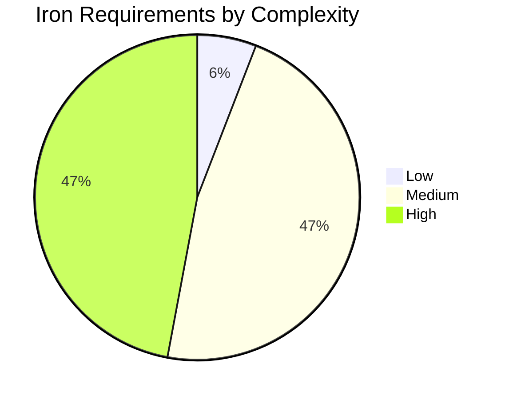

# Phase 1 Review: Spec Analysis Self-Validation

- Date: 2026-07-10
- Reviewer: Phase 1 -> 2 quality gate
- Source Spec: `docs/dse-input-spec.md`
- Verdict: **PASS**

## Review scope

Reviewed `iron-requirements.json`, `open-requirements.json`, `io_definition.json`,
`timing_constraints.json`, `domain-analysis.md`, `dca-tier-analysis.md`, `assumptions.md`,
and `dse-input-spec.md`. `docs/decisions/ADR-001-algorithm-selection.md` was absent at
review time, so the recommended stack in `domain-analysis.md` was used as the selection basis.

## Findings

```json
[
  {
    "id": "FINDING-001",
    "severity": "resolved",
    "area": "iron schema",
    "finding": "Iron entries used only `statement`, while the canonical contract requires `description`.",
    "action": "Added `description` to all 17 iron entries, preserving the traceable statement text."
  },
  {
    "id": "FINDING-002",
    "severity": "resolved",
    "area": "acceptance criteria",
    "finding": "Background-progress and watchdog criteria used non-numeric eventuality language; the baseline-count criterion claimed 15 values while listing 10.",
    "action": "Required Phase 2 to record numeric bounds before BFM acceptance and corrected REQ-P-003 to require the 10 listed baseline values."
  },
  {
    "id": "FINDING-003",
    "severity": "open",
    "area": "interface freeze",
    "finding": "io_definition.json correctly retains unspecified header and DCA widths as null. It is not a frozen RTL port contract.",
    "action": "Phase 2 must resolve OPEN-1-001 through OPEN-1-005 and replace applicable null widths/protocol placeholders before Phase 3 RTL/BFM interface freeze."
  },
  {
    "id": "FINDING-004",
    "severity": "advisory",
    "area": "baseline naming",
    "finding": "domain-analysis single-collective broadcast/gather endpoints and REQ-P-003 ag_bcast/ag_gather profiles are different schedule baselines.",
    "action": "Keep both profile names in Phase 2 reports; do not compare their cycle counts as though they were one baseline."
  }
]
```

## Requirement quality and classification

- 17 iron requirements: 12 functional and 5 performance; every entry has an ID, type,
  priority, complexity, source, description, measurable acceptance criteria,
  `violation_policy: user_escalation`, dependencies, ambiguities, and conflicts.
- Five open architecture items are correctly classified: each has three candidates,
  evaluation criteria, iron trace links, and a Phase 2 resolution target.
- Explicit source gaps remain open rather than being fabricated as iron constraints:
  calendar/header fields, flow control/buffers, mixed-traffic progress policy, reduction
  semantics, DCA contract, and watchdog parameters.

## Algorithm-comparison evidence

Quantitative comparison matrices and selection rationale exist:

- Calendar storage, isolation, buffering, multicast, and robustness: `domain-analysis.md`
  sections 1 through 6. They include storage bits, buffering capacities, schedule overhead,
  area-class anchors, and recommended mechanisms.
- Reduction tiers A/B/C: `dca-tier-analysis.md` includes reduce/allreduce cycle vectors for
  m=1..5 plus router/tile area-power classes, operation coverage, and rationale.
- Recommended fallback stack: double-buffered slot table, hybrid calendar/BG windows,
  zero-buffer calendar plus RTT-sized BG VC, atomic output-mask fork, Tier B integer/bitwise
  combine, and watchdog-to-XY escape. This is the required fallback because ADR-001 is absent.

## Consistency checks

- The 6×8 mesh, 512-bit flit, 2 GHz clock, H=7, V=9, and ramp=1 values agree across the
  requirement, timing, assumptions, and analysis artifacts.
- The optional DCA boundary is consistent: Tier C is evaluated but not selected by the
  recommended stack.
- `timing_constraints.json` intentionally avoids inventing internal router-latency,
  watchdog, or independent max-latency figures. Those omissions are traceable to iron/open
  ambiguity records.

## Self-validation

- Input-spec feature groups checked: 12
- Iron requirement entries: 17
- Open architecture decisions: 5
- Coverage: **12/12 feature groups**
- Suspect gaps: None at the Phase 1 contract level. Interface field widths and numeric
  service/recovery bounds are known Phase 2 closure items, not missing requirements.

## Ambiguity assessment

See `docs/phase-1-research/ambiguity-assessment.md`.

| Axis | Score |
|---|---:|
| Goal clarity (40%) | 0.18 |
| Constraint clarity (30%) | 0.42 |
| Acceptance-criteria clarity (30%) | 0.34 |
| **Weighted ambiguity score** | **0.30** |

The score is below the 0.50 gate threshold.

## Verdict

**PASS.** Phase 1 is sufficient for Phase 2 architecture work. This is not authorization to
freeze RTL interfaces: Phase 2 must close the listed OPEN items and ratify the recommended stack
in ADR-001 (or an equivalent decision record) before Phase 3.


