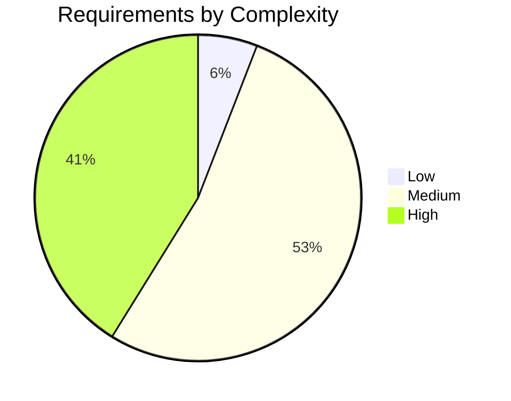

# Phase 1 Review: Spec Analysis Self-Validation

- Date: 2026-07-10
- Reviewer: spec-analyst
- Source Spec: `docs/dse-input-spec.md` (identical copy checked at `specs/dse-input-spec.md`)
- Verdict: INCOMPLETE

## Extraction summary

- Iron requirements: 17 (12 functional, 5 performance)
- Open Phase 2 research items: 5
- Clock domains: 1 (`noc_clk`, 2 GHz)
- Router ports: 5 mesh ports plus optional DCA interface
- Conflicts found: 0
- Ambiguities: 14 explicit unresolved items across calendar encoding/loading, flow control, timing, recovery, and reduction semantics.

## Coverage matrix

| Input section | Requirement coverage |
|---|---|
| System context | REQ-P-001, REQ-P-002 |
| REQ-CAL | REQ-F-001 through REQ-F-004 |
| REQ-BG | REQ-F-005, REQ-F-007 |
| REQ-MC | REQ-F-002, REQ-F-006 |
| REQ-ROB | REQ-F-007 through REQ-F-009 |
| Optional DCA | REQ-F-010, REQ-F-011, REQ-P-005 |
| P1/P2/P3 goals | REQ-P-003 through REQ-P-005 |
| Phase 2 dimensions | OPEN-1-001 through OPEN-1-005 |
| Phase 3 BFM expectation | REQ-F-012 |
| Out-of-scope boundaries | `assumptions.md` |

## Self-validation

- Source features/constraints identified: 22
- Iron requirement entries: 17
- Coverage: 17 requirement entries covering 22 source features/constraints
- Every requested P0 area is explicitly covered: calendar collectives, XY background, multicast, and robustness.
- Every open item has at least three candidates and specified evaluation criteria.

### Suspect gaps

The source requires a Phase 2 quantitative comparison and a recommendation, and a Phase 3 selected microarchitecture plus BFM skeleton. These cannot become settled Phase 1 iron constraints because no selected architecture, overhead limit, DCA interface contract, or validation threshold exists. They are retained as `OPEN-1-*` research work and ambiguities; human/Phase 2 resolution is required before RTL readiness.

## Ambiguity assessment

| Axis | Score | Evidence |
|---|---:|---|
| Goal clarity (40%) | 0.20 | Topology, supported collectives, P0 scope, flit size, and clock are explicit. |
| Constraint clarity (30%) | 0.55 | Header widths, VC/buffer depths, calendar table dimensions, watchdog timeout, router pipeline latency, and absolute PPA targets are absent. |
| Acceptance-criteria clarity (30%) | 0.50 | Schedule baselines are supplied, but allowable overhead and measurable background-progress/recovery bounds are not. |
| **Weighted ambiguity score** | **0.395** | `0.2*0.4 + 0.55*0.3 + 0.5*0.3` |

**Gate decision: CONDITIONAL PASS.** Phase 2 can compare candidates, but Phase 3 RTL cannot finalize interfaces or latency guarantees until the listed ambiguities are resolved.

## Requirement complexity distribution

